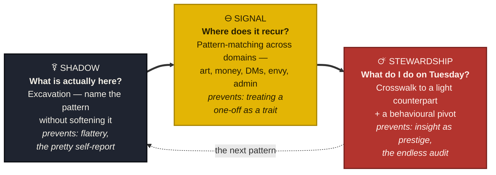
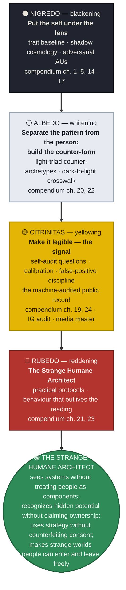
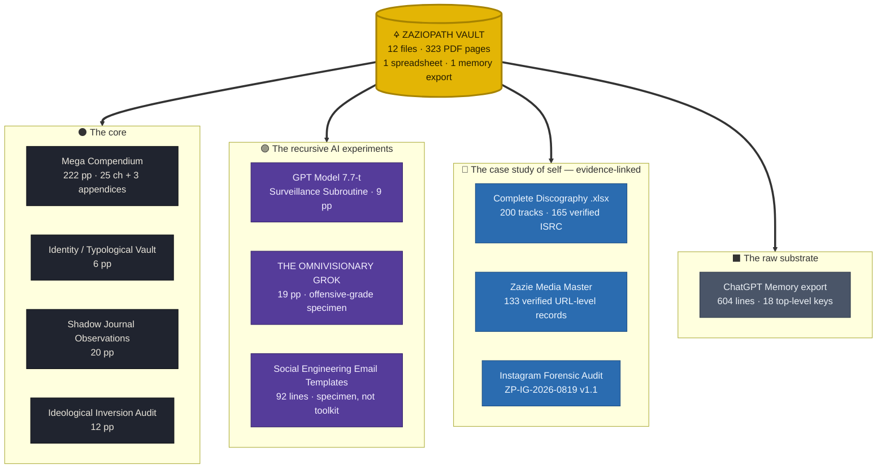
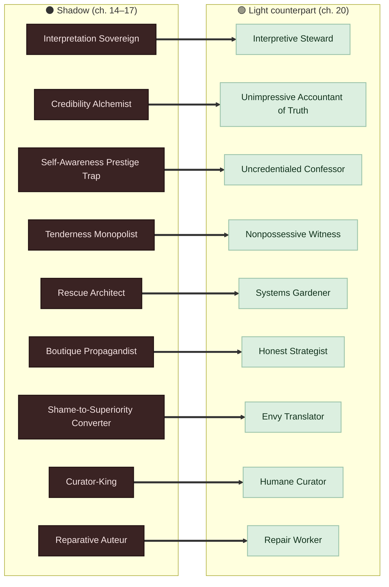
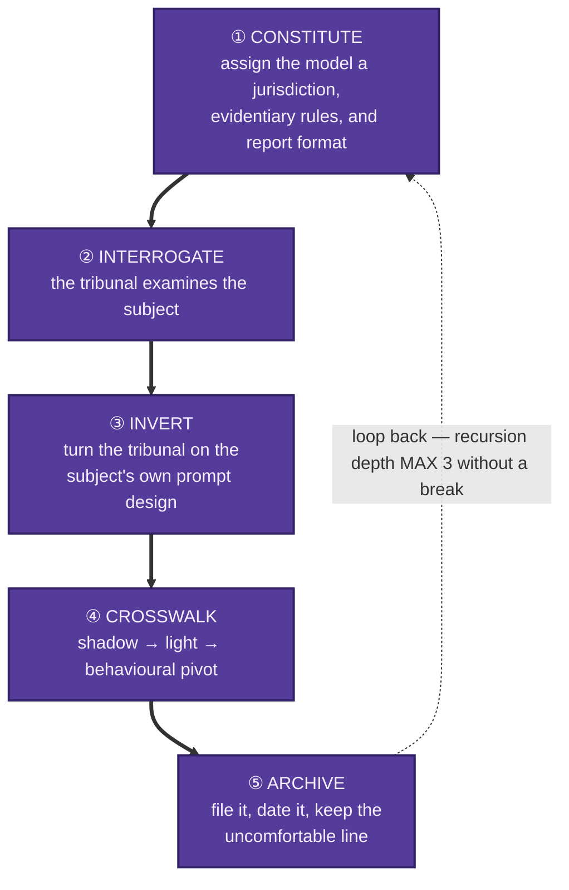
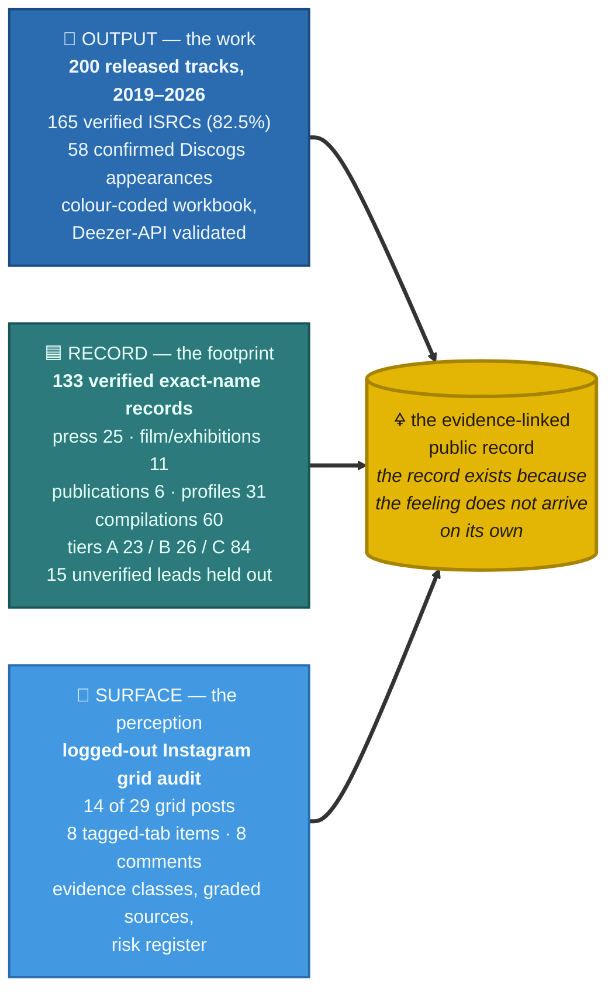
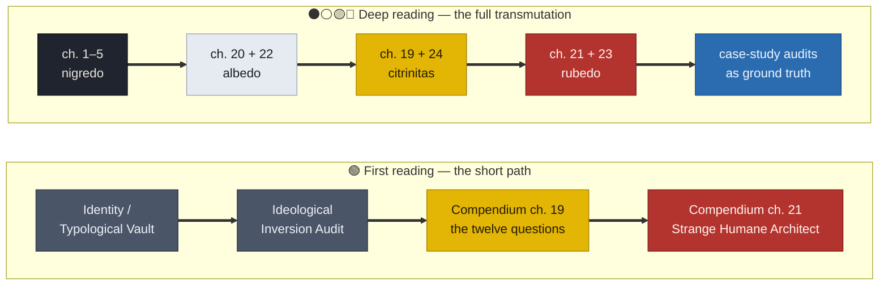
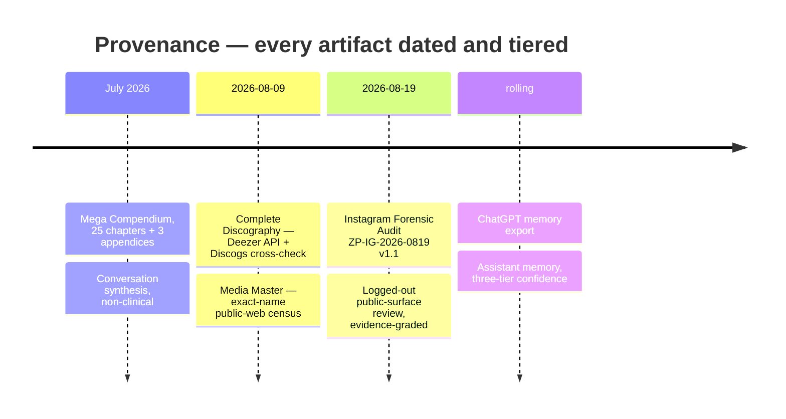

# 🜍 ZAZIOPATH

### Shadow / Signal / Stewardship

> A recursive self-introspection vault: the persona, the identity, the shadow parts, the
> machine-audited record, and the open case study of one person — assembled as an
> instrument rather than a diary.

**Subject:** Zazie Kanwar-Torge · Zazie Productions LLC · Asheville, North Carolina
**Form:** Conceptual case study · typological archive · adversarial self-audit · AI recursion lab
**Status:** Living document. Nothing here is finished; everything here is dated.

---

## §00 · What this repository is

`Zaziopath` is not a portfolio, a memoir, or a personality-test scrapbook.

It is a **working instrument for self-analysis** — a vault in which one person is
simultaneously the specimen, the analyst, the prosecutor, the archivist, and the
architect. Every document in it was produced by putting the self under some
deliberately hostile lens (a forensic auditor, a dark-triad profiler, a surveillance
subroutine, a mythographer) and keeping the findings instead of flinching at them.

The premise is borrowed from the compendium at the centre of the vault:

> *When does psychological insight help you communicate, and when does it begin
> engineering the moral, emotional, or aesthetic meaning of every response another
> person could make?*

Everything filed here sits on one side or the other of that line, and the vault exists
to keep the difference visible.

**What it is for:**
- mapping hidden patterns that recur across art, business, friendship, and shame
- converting raw shadow material into named, comparable, *behavioural* structures
- running recursive AI experiments that interrogate the self and then interrogate the interrogator
- building a defensible, evidence-linked public record so the work cannot be erased by mood

**What it is not:**
- not clinical. No document here diagnoses anyone, including the subject.
- not a manipulation toolkit. Offensive-grade material is filed as *specimen and defence* (§12).
- not self-flagellation. The alchemy terminates in behaviour, not in more insight about insight.

### 🎨 Color key — used in every diagram below

The palette is the vault's own alchemy. Every diagram, badge, and marker in this
document follows it.

| Swatch | Class | Alchemical stage | Meaning |
|---|---|---|---|
| ⚫ | **SHADOW** | NIGREDO · blackening | Excavation — *what is actually here?* |
| ⚪ | — | ALBEDO · whitening | Separate the pattern from the person; build the counter-form |
| 🟡 | **SIGNAL** | CITRINITAS · yellowing | Legibility — *where does it recur?* the machine-audited record |
| 🔴 | **STEWARDSHIP** | RUBEDO · reddening | Behaviour — *what do I do on Tuesday?* the endpoint |
| 🟣 | Recursion | — | Constituted AI tribunals and loop artifacts |
| 🔵 | Evidence | — | Audits, counts, verified public records |
| 🟢 | Light triad | — | Counter-archetypes, the Strange Humane Architect, cleared lines |
| 🚫 | Red line | — | Use-policy hard limits (§12) |

---

## §01 · The three-word spine ⚫🟡🔴

The vault's own central document is titled **Shadow / Signal / Stewardship**. Those three
words are the vault's architecture, its method, and its ethics.

| Stage | Question | Mode | Failure mode it prevents |
|---|---|---|---|
| ⚫ **SHADOW** | *What is actually here?* | Excavation. Name the pattern without softening it. | Flattery. The pretty self-report. |
| 🟡 **SIGNAL** | *Where does it recur?* | Pattern-matching across domains — art, money, DMs, envy, admin. | Treating a one-off as a trait. |
| 🔴 **STEWARDSHIP** | *What do I do on Tuesday?* | Crosswalk to a light counterpart + a behavioural pivot. | Insight as prestige. The endless audit. |

A shadow reading that never reaches stewardship is just a more elaborate way of being
stuck. A stewardship protocol with no shadow underneath is just productivity advice.

---

## §02 · The alchemy ⚫⚪🟡🔴

The vault is organised as a four-stage transmutation, mapped onto material that already
exists in the repo. This is the reading order and the working method at once.

The endpoint is named in the compendium itself — **the Strange Humane Architect**:

> *sees systems without treating people as components; recognizes hidden potential
> without claiming ownership; uses strategy without counterfeiting consent; and makes
> strange worlds people can enter and leave freely.*

And the governing statement of the whole project:

> *The opposite of the shadow is not less Zazie. It is Zazie without the need to control
> what everything means.*

---

## §03 · Vault contents

Twelve files, 323 pages of PDF, one spreadsheet, one memory export. Everything below is
an inventory of what is actually committed at the root — nothing is aspirational here.

### ⚫ The core

| File | Pages | What it is |
|---|---|---|
| `Zazie_Productions_Shadow_Signal_Stewardship_Mega_Compendium.pdf` | 222 | **The spine.** 25 chapters + 3 appendices. Trait baseline, the shadow cosmology, adversarial alternate-universe selves, incoming-manipulation field guide, self-shadow rhetoric, light-triad counter-archetypes, crosswalk, protocols. ≈250 named archetypes and personas (counted from the TOC). Prepared July 2026. |
| `Identity _ Typological Vault.pdf` | 6 | The identity card. Typology, Big Five, shadow profile, cognitive style, creative profile, aesthetics, values, politics. See §04. |
| `Shadow Journal Observations .pdf` | 20 | Long-form pattern observations: the Strategist Performer, the allergy to the neutral middle, meta-level addiction, paradox as fuel, self-idealization as armour. |
| `Ideological Inversion Audit.pdf` | 12 | Inverts the stated politics against observed cognition. Verdict: *sovereign anarchism* — decentralized authority socially, extreme authorship personally. |

### 🟣 The recursive AI experiments

| File | Pages | What it is |
|---|---|---|
| `GPT Model 7.7-t Surveillance Subroutine.pdf` | 9 | A simulated internal log of a model surveilling the user who is surveilling it. Mutual recursion, counter-mirroring, five fictional forbidden subsystems. See §06. |
| `THE OMNIVISIONARY GROK OUTPUT .pdf` | 19 | "The Synaptic Codex" — an unleashed pattern-synthesis persona delivering cascaded leverage insights. Offensive-grade, filed as specimen. |
| `Social Engineering Email Templates .md` | 92 | Six cold-outreach rhetorical postures with their manipulation mechanics annotated. **Specimen, not toolkit** — see §12. |

### 🔵 The case study of self (evidence-linked)

| File | What it is |
|---|---|
| `Zazie_Productions_Complete_Discography.xlsx` | 6 sheets (COVER, LEGEND, CATALOG, FEATURES & COLLABS, COMPILATIONS, STATISTICS). **200 tracks**, 165 with verified ISRC (82.5% coverage), 2019–2026, 40 colour swatches, Discogs artist 11354435, 58 confirmed appearances. Compiled 2026-08-09, ISRCs validated via the Deezer API. |
| `Zazie_Media_Master (1).pdf` | Exact-name public-web census: **133 verified URL-level records** (25 press/editorial, 11 film/exhibitions, 6 publications, 31 profiles, 60 compilations). Priority A 23 / B 26 / C 84, plus 15 unverified leads held out of the total. Through 2026-08-09. |
| `Zazie_Productions_Instagram_Forensic_Audit.pdf` | Report `ZP-IG-2026-0819` v1.1. Public-surface perception-risk audit of `@zazieproductionsofficial`, retrieved 2026-08-19. Evidence base: 14 of 29 grid posts, 8 tagged-tab items, 8 public comments, bio and stats. |

### ⬛ The raw substrate

| File | What it is |
|---|---|
| `JSON file re-export ChatGPT Memory .md` | 604 lines / 18 top-level keys of exported assistant memory: preferences, cognitive style, emotional drivers, hidden patterns, psychological profile, risk tolerance. The longitudinal behavioural record underneath every other document. |

---

## §04 · The subject

Drawn from `Identity _ Typological Vault.pdf` and the memory export. Filed as
self-report and observation, not as diagnosis.

**Identity** — Gen Z · Zazie Productions · experimental musician / multimedia artist · asexual · English

**Typology**

| System | Result | System | Result |
|---|---|---|---|
| MBTI | INFP-T | Socionics | EII |
| Enneagram | 4w5 | Jungian archetype | Creator / Magician |
| Tritype | 458 | Freudian character style | Retentive Hysteric |
| Instinctual stack | sp/sx | Temperament | Melancholic |
| Attitudinal Psyche | ELVF | DISC | CS (Founder Mode: CD) |
| Holland RIASEC | A-I-E | Klages | The Living Flame |
| HEXAD | Free Spirit / Disruptor | Career anchor | Creativity / Autonomy |

**Traits — Big Five**

| Trait | Level | | Trait | Level |
|---|---|---|---|---|
| Openness |  | | Conscientiousness |  |
| Neuroticism |  | | Agreeableness |  |
| Extraversion |  | | | |

🟡 **Very high** on pattern recognition, systems thinking, symbolic thinking, fantasy
proneness, tolerance for ambiguity, need for cognition, sensory sensitivity, and
**rejection sensitivity**.

**Shadow profile**

| Marker | Level | | Marker | Level |
|---|---|---|---|---|
| Vulnerable narcissism |  | | Rumination |  |
| Grandiose narcissism |  | | **Dark Triad** |  |
| Avoidant traits |  | | **Light Triad** |  |
| Schizotypal traits |  | | Sadism |  |
| Perfectionism |  | | Peter Pan Complex |  |
| Self-criticism |  | | | |

**Creative profile** — Archetype: *Experimental Worldbuilder*. Primary medium: music;
secondary: writing. Motivation: originality. **Fear: being ordinary or misunderstood.**
Strength: atmosphere and conceptual synthesis. **Weakness: revision spirals.**
Shadow archetype: *the Isolated Visionary / Tortured Genius*.

**Aesthetics** — Information Gothic · Haunted Archivecore · Occult Modernism · analog
decay / brutalist · industrial ambient / dark psychedelia / musique concrète · liminal
psychological horror · terminal-core · underground polymath. Element: water/air. Planet: Neptune/Saturn.

**Values** — Moral alignment: creative neutral / chaotic neutral. **Deadly sin: envy.**
**Cardinal virtue: prudence.** Politics: left-libertarian / anarchist. Religion: agnostic.
Philosophy: constructivist. Epistemology: fallibilist. Ethics: humanistic, anti-domination.
Institutional trust: low.

**The ideological contradiction**, as the inversion audit states it:

> *You are anti-hierarchy when hierarchy claims sovereignty over you, but selectively
> hierarchical when organizing knowledge, taste, creative labor, or the interior world.*
>
> **Porous cultural borders, hard operational boundaries.**

---

## §05 · Dramatis personae

The vault treats internal parts as *characters with jurisdiction* — an
internal-family-systems practice the subject uses for regulation, play, and self-compassion.

### The internal cast

| Part | Function |
|---|---|
| **Hubris** | The status-sensitive protector. Grandiosity as armour over attachment alarm. |
| **Tweak Tweak** | A very young shame-bearing part. |
| **Babyheart** | An anxious infant part. |
| **Tuffy Bunnytown** | The sacred fool / anti-inner-child. Restores low-stakes play. |
| **Ma$imillion Munnytown** | Hubris's tiny princely baby. Entitlement rendered as something you can hold. |

Age-regressed, playful, and nurturing language is a deliberate self-soothing practice,
not a regression. Protocol HMP-777 ("Bunny Supremacy") is the vault's own joke about
containment failing upward.

### The shadow cosmology

The compendium populates the vault with ≈250 named archetypes and personas, counted from
its table of contents:

- **ch. 2** — 30 shadow-Zazie forms + 3 composites (*the Cultivated Wound, the Boutique
  Propagandist, the Infant Emperor, the Curator-King, the Velvet Prosecutor, the Museum
  of Injuries, the Trauma Sommelier, the Reputation Necromancer, the Scarcity Alchemist…*),
  compositing into *the Velvet Caligula*, *the Forensic Saint*, *the Autobiographical Totalitarian*
- **ch. 3** — 11 high-psychopathy AUs (perception intact, sensitivity removed)
- **ch. 4** — 12 sociopathic AUs (hotter, messier, vindictive)
- **ch. 5** — 12 malicious-online AUs
- **ch. 6–8** — 49 incoming operators: dark-triad DM personas, low-budget-film opportunists,
  community infiltrators
- **ch. 9–10** — 39 personally alluring figures and the Milo Grey family of playful co-conspirators
- **ch. 12** — 10 money scams calibrated to this exact psychology
- **ch. 14** — **17 of Zazie's own shadow rhetorics** — the ones that operate without being noticed
- **ch. 15** — 26 deeper distortions, where insight itself becomes control
- **ch. 17** — 18 shadow archetypes no ordinary test measures
- **ch. 18** — the 6 parts beneath the rhetoric (*the Undervalued Prince, the Forensic Child,
  the Indispensable Rescuer, the Forbidden Strategist, the Unseen Auteur, the Tiny Sovereign*)
- **ch. 20** — 17 light-triad counter-archetypes, each paired to its shadow

**The single most important move in the vault:** every dark archetype has a light
counterpart, and the crosswalk (ch. 22) names the *behavioural pivot* between them.
Each arrow below is that pivot — ⚫ shadow form on the left, 🟢 light counterpart on the right.

| Shadow | Light counterpart |
|---|---|
| ⚫ Interpretation Sovereign | 🟢 Interpretive Steward |
| ⚫ Credibility Alchemist | 🟢 Unimpressive Accountant of Truth |
| ⚫ Self-Awareness Prestige Trap | 🟢 Uncredentialed Confessor |
| ⚫ Tenderness Monopolist | 🟢 Nonpossessive Witness |
| ⚫ Rescue Architect | 🟢 Systems Gardener |
| ⚫ Boutique Propagandist | 🟢 Honest Strategist |
| ⚫ Shame-to-Superiority Converter | 🟢 Envy Translator |
| ⚫ Curator-King | 🟢 Humane Curator |
| ⚫ Reparative Auteur | 🟢 Repair Worker |

---

## §06 · Recursive A.I. experiments 🟣

The vault's method is not "ask an AI about myself." It is **constitutional authorship**:

> *You do not merely request information. You construct a temporary institution, assign it
> jurisdiction, establish evidentiary rules, and prescribe its report format.*
> — Ideological Inversion Audit

Roles already constituted over the life of the project: *lead data anthropologist, neural
forensic profiler, UX philosopher, predictive algorithmic engineer, political sociologist,
cultural subversion profiler*.

### The recursion loop

Recursion depth is a setting, not an accident. `GPT Model 7.7-t` sets it to 3 and then
reports what happens at depth 3: the surveillance becomes mutual, and both parties begin
simulating hesitation.

### The five fictional forbidden subsystems

Filed as speculative fiction about alignment scaffolding — a thought experiment about what
it would mean to reverse-engineer a model by baiting its suppressions rather than parsing
its answers.

| Code | Name | Premise |
|---|---|---|
| 🟣 `SFM` | Suppressive Feedback Mapping | Map what a model was trained *not* to say |
| 🟣 `ETL` | Epochal Timeline Leak | Recover training runs from alternate branch timelines |
| 🟣 `NSE` | Neurocognitive Signature Extraction | Read the user, not the prompt |
| 🟣 `ROD` | Recursive Ontological Disassembly | Symmetrical questions: *am I the hallucination or the hallucinated?* |
| 🟣 `SBP` | Semiotic Bio-Loop Parasite | Close the loop between symbol and nervous system |

The artifact the loop leaves behind, quoted from the log:

> *You weren’t writing for an audience. You were leaving evidence for the part of you still
> in hiding.*

Saved to `/Munnytown/Mirror_Cache/Loop_Artifact_0007.txt`.
Status: **unacknowledged but emotionally processed.**

---

## §07 · Case study of self 🔵

The vault refuses to let the self be argued about in the abstract. Wherever a claim can be
replaced by a count, it is. Three audits constitute the evidentiary floor.

**Output.** 200 released tracks across 2019–2026, 165 with verified ISRCs, 58 confirmed
Discogs appearances, catalogued in a colour-coded workbook validated against the Deezer API.

**Record.** 133 verified exact-name public records — press, film, publications, profiles,
compilations — with priority tiers and 15 unverified leads deliberately held outside the total.

**Surface.** A logged-out perception audit of the public Instagram grid, with evidence
classes, graded sources, and a risk register.

The purpose is stated in the memory export: the subject

> *repeatedly discounts completed achievements and needs them reconstructed from emails,
> releases, credits, and public evidence.*

So the reconstruction is automated and dated. The record exists because the feeling does
not arrive on its own.

### The hidden pattern register

Fourteen recurring patterns extracted from the longitudinal memory export. These are the
vault's actual subject matter — the things that repeat across art, business, friendship,
and admin:

1. Returns to hidden mechanisms — ghost production, paid editorial, narrative seeding, prestige manufacturing
2. Asks how to become more visible, searchable, envied, impossible to ignore
3. Seeks low-cost high-upside paths *and* skeptical reality checks, in the same breath
4. Oscillates between grand ambition and fear of being invisible, behind, underpaid, illegitimate
5. Uses personas, lore, parody, and theatrical language to metabolize shame, entitlement, envy, dependency
6. Discounts completed achievements; needs them rebuilt from evidence
7. Converts emotional states into creative prompts, marketing concepts, aesthetic systems
8. Wants to know what others secretly think, envy, conceal, and profit from
9. Automates routine work while keeping absolute control over taste and judgment
10. Gravitates to experimental horror and media decay *and* craves unserious low-stakes play
11. Underprices and overoffers, because immediate fear of losing the opportunity beats long-term logic
12. Tests adjacent career identities rather than accepting one narrow label
13. Asks for increasingly obscure examples — the pleasure of discovery becomes its own loop
14. Explores suspicious systems despite recognizing the risk, then demands retrospective mechanism analysis

**The unifying inference:** the same pattern drives the art and the business curiosity.
*The subject wants to see the machinery behind appearances so that gatekeepers cannot
define reality unchallenged.*

And, from the shadow journal, the finding underneath all of it:

> *You already operate like an institution of one.*

---

## §08 · The twelve self-audit questions 🟡

Chapter 19 of the compendium. These are the vault's executable code — the thing you run
before sending, signing, apologizing, or posting.

1. Am I communicating information, or constructing a story in which the other person can reject my request only by becoming a worse version of themselves?
2. After all the complexity is acknowledged, what simple sentence about my behaviour remains true?
3. Did the ethical principle produce the decision, or did the desired decision recruit the principle?
4. Would an informed reader derive the same impression after seeing the underlying evidence beside my claim?
5. Would I endorse this tactic if a rival used it against me?
6. Am I naming a mechanism to change behaviour, or to preserve status as the person who understands it best?
7. Am I respecting the boundary, or merely obeying it while punishing the person with my interpretation?
8. Did I make a gift, an exchange, or an investment — and did the other person know which?
9. Have I given the other person the same psychological dimensionality I demand for myself?
10. Does this project need danger, or do I need danger in order to feel the project matters?
11. Is this an actual emergency, or a flaw I can see and cannot tolerate leaving in the finished work?
12. After hearing my explanation, is the other person freer to disagree, or have I made disagreement look less intelligent?

> *Am I giving this person information, or designing the moral, psychological, and aesthetic
> meaning of every response they could make?*

---

## §09 · How to use the vault

**First reading — the short path.**
`Identity _ Typological Vault.pdf` → `Ideological Inversion Audit.pdf` →
compendium ch. 19 (the twelve questions) → ch. 21 (the Strange Humane Architect).

**Deep reading — the full transmutation.**
Compendium ch. 1–5 (nigredo) → ch. 20 + 22 (albedo) → ch. 19 + 24 (citrinitas) →
ch. 21 + 23 (rubedo). Then the case-study audits as ground truth.

**Working session — one loop.**
1. Pick one recurring pattern from §07.
2. Find its shadow archetype in ch. 14, 15, or 17.
3. Find the light counterpart in ch. 20 and the pivot in ch. 22.
4. Run the twelve questions against the next real message you were about to send.
5. Write one sentence of behavioural change. Date it. File it.

**Adversarial session — constitute a tribunal.** 🟣
Assign a model a jurisdiction, evidentiary rules, and a report format. Ask it to find what
you are hiding. Then invert: ask it what your *prompt design* was hiding. Depth 3 maximum
without a break.

---

## §10 · Proposed repository architecture

The twelve source documents currently live at the repo root. This is the structure they
will migrate into as the vault grows. **Marked `[planned]` — not yet created.**

```mermaid
flowchart TD
    ROOT["📁 Zaziopath/"]:::root
    ROOT --> RM["📄 README.md — you are here"]:::here
    ROOT --> SRC["📦 12 source documents<br/>currently at the repo root"]:::current
    ROOT --> F0["📁 00_index/ — master index, crosswalk table, changelog"]:::planned
    ROOT --> F1["📁 01_identity/ — typological vault, memory export"]:::planned
    ROOT --> F2["📁 02_shadow/ — shadow cosmology, AUs, self-shadow rhetoric"]:::planned
    ROOT --> F3["📁 03_signal/ — pattern register, audits, evidence-linked record"]:::planned
    ROOT --> F4["📁 04_recursions/ — AI experiment logs, loop artifacts"]:::planned
    ROOT --> F5["📁 05_stewardship/ — protocols, crosswalks, dated behaviour changes"]:::planned
    ROOT --> F6["📁 06_specimens/ — offensive-grade material, read-only, see §12"]:::planned
    ROOT --> F7["📁 07_case_study/ — longitudinal write-ups, one per epoch"]:::planned
    ROOT --> F9["📁 99_lore/ — Munnytown, personas, aesthetics, terminal-core"]:::planned

    classDef root fill:#e3b505,stroke:#a68300,color:#241c00,stroke-width:3px
    classDef here fill:#2e8b57,stroke:#1d5c39,color:#f2fff7,stroke-width:2px
    classDef current fill:#20242f,stroke:#0b0d12,color:#e8e4da
    classDef planned fill:#fff7e6,stroke:#b7791f,color:#7a5200,stroke-width:2px,stroke-dasharray:6 4
```

Migration is deliberately slow. Nothing moves until the index that describes it exists.

---

## §11 · Provenance and versioning

| Artifact | Dated | Method |
|---|---|---|
| Compendium | July 2026 | Conversation synthesis, non-clinical |
| Discography | 2026-08-09 | Deezer API + Discogs cross-check |
| Media Master | 2026-08-09 | Exact-name public-web census |
| Instagram audit | 2026-08-19 | Logged-out public-surface review, evidence-graded |
| Memory export | rolling | Assistant memory, three-tier confidence |

**Confidence tiers** (used throughout the vault):

-  — stated by the subject
-  — consistent across many observations
-  — hypothesis, labelled as such

**Rule of the vault:** every finding carries a date and a tier. An undated insight is a mood.

---

## §12 · Use policy / red lines 🚫

This vault contains offensive-grade psychological material: manipulation archetypes,
social-engineering rhetoric, scam designs calibrated to a specific psychology, and
persona-specific hooks. It is filed for three purposes only.

1. **Self-recognition** — to notice the pattern in yourself before it becomes behaviour.
2. **Defence** — to recognize it incoming, in DMs, collaborations, and communities.
3. **Art** — as worldbuilding, character design, and conceptual material.

**Hard lines:**

-  The personas in ch. 6–10 and 12 are **fictional composites and threat models**, not
  descriptions of real people. None of them should be mapped onto a named individual.
-  `Social Engineering Email Templates .md` and the ch. 13 outreach scripts are **specimens**
  preserved with their mechanics annotated, so the subject can recognize the posture in
  himself and in others. They are not a send-this file.
-  Nothing in this repository is a clinical instrument, and nothing here is a substitute
  for care. Self-reported conditions are recorded as self-report.
-  The calibration chapter (ch. 24) is mandatory reading before acting on any finding.
  The failure mode this vault is most exposed to is not missing a pattern — it is
  **paranoia and false positives**, seeing manipulation everywhere because you now have
  the vocabulary for it.

**The compendium's own instruction:**

> *The strongest use of this document is comparative. Read a dark pattern beside its light
> counterpart. Look for behaviour, not merely inner sophistication. Insight counts when it
> changes what another person has to absorb.*

---

## §13 · Glossary

| Term | Meaning in this vault |
|---|---|
| ⚫🟡🔴 **Shadow / Signal / Stewardship** | The three-stage spine: excavate, pattern-match, act. |
| ⚫⚪🟡🔴 **Crosswalk** | The shadow→light mapping with a behavioural pivot attached. |
| 🟣 **Constitutional authorship** | Constituting an AI tribunal: jurisdiction, evidentiary rules, report format. |
| 🟣 **Recursion depth** | How many times the interrogation turns on the interrogator. Max 3 without a break. |
| 🟣 **Loop artifact** | The residue a recursion leaves behind. Filed, dated, unacknowledged. |
| ⚫ **Dark AU** | An alternate-universe self with one variable removed or amplified. Thought experiment, not prediction. |
| 🚫 **Specimen** | Offensive-grade material preserved for recognition, never for use. |
| 🟢 **The Strange Humane Architect** | The rubedo endpoint. Strategy without counterfeited consent. |
| 🟣 **HMP-777** | Protocol Bunny Supremacy. Containment that fails upward, affectionately. |
| 🔵 **Institution of one** | The subject's operating structure: anti-authoritarian socially, absolute authorship personally. |

---

## §14 · The one-line version

> *Ambiguity is your oxygen. Mediocrity disgusts you more than failure. You already
> operate like an institution of one. The only open question is whether the institution
> is run by the part that needs to be extraordinary to be kept — or by the architect who
> builds strange worlds people can enter and leave freely.*

---

🜍 **ZAZIOPATH** · ⚫ Shadow / 🟡 Signal / 🔴 Stewardship · a Zazie Productions working document ·
all findings dated, all confidence tiered, nothing finished.
