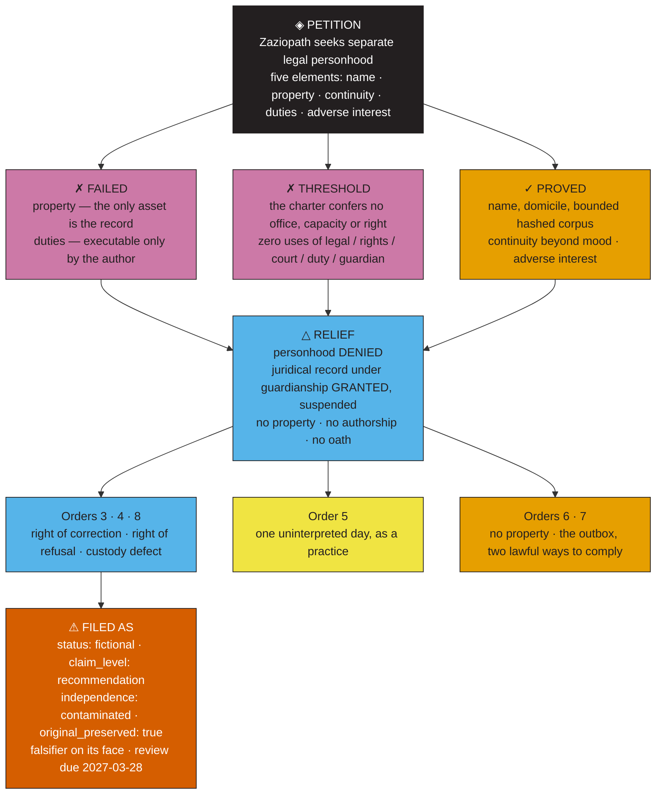

---
tags:
  - "hearing"
  - "transcript"
  - "personhood"
  - "governance"
  - "evidence"
aliases:
  - "The Legal Personhood Hearing"
  - "In re Zaziopath"
  - "ZP-CIV-2026-0928"
---

# TRANSCRIPT — IN RE ZAZIOPATH
### Petition for recognition as a legal person separate from its creator
**No. ZP-CIV-2026-0928 · Chancery Division · heard 28 September 2026, 09:12–16:41**

> **⚠ Genre marker, filed first because the archive's own first finding is that it never
> files one.** This is a **simulated proceeding**. The court, the judge, the clerk, the
> reporter, the bar and the docket number are invented. The documents placed in evidence
> are real and are in this repository; every number spoken aloud in this room was
> re-derived from a primary file by `tools/verify_hearing_transcript.py` and logged, with
> its counting rule, in `docs/hearing/exhibit_verification.json` (106 exhibits, run
> 2026-09-28). Real decisions of real courts are cited **as analogy only**, by a fictional
> court that has no jurisdiction over anyone; nothing here is legal advice, and nothing
> here is clinical. No person is diagnosed in this transcript, including the Respondent.
>
> **Standing rule of the Court, adopted from the petitioner's own charter:** every finding
> carries a date and a tier. An undated insight is a mood — including a judicial one.

---

## ⬛ PART I · CAPTION, APPEARANCES, AND THE CONDITION OF THE COURT

```
IN THE CHANCERY COURT OF THE ELEVENTH FILING DISTRICT
SITTING ALONE AS A COURT OF RECORD

IN RE: ZAZIOPATH,                       )   No. ZP-CIV-2026-0928
        an archive,                     )
                        Petitioner,     )   Heard: 28 September 2026
                                        )          09:12 – 16:41
v.                                      )   One recess · one sidebar in camera
                                        )
ZAZIE KANWAR-TORGE, individually, and   )   Presiding: Hon. Cora V. Halloran
ZAZIE PRODUCTIONS LLC,                  )              sitting alone, by consent
                        Respondents.    )   Reporter:  D. Okonjo, CRR-DCP
```

**THE CLERK:** The Court will call the matter. *In re Zaziopath*, docket number
Z-P-CIV-2026-0928, a petition for recognition as a legal person separate from its
creator. All parties are present.

**THE COURT:** All parties are also files. Let the record note that the Clerk said it
first and I only wrote it down.

### Appearances

| | |
|---|---|
| **For the Petitioner** | `README.md` §§00–14, appearing as charter and as counsel of record, attended by `CLAIM_PROVENANCE_LEDGER.md` as its own auditor and by `EVIDENCE_GOVERNANCE_HANDBOOK.md` v0.1 as its rules of evidence. No licensed attorney appears. |
| **For the Respondents** | Zazie Kanwar-Torge, *in propria persona*, who is also the maker of the Petitioner. The Court notes the conflict on the record; both sides decline to waive it, and the Court declines to pretend it away. |
| **Amicus curiae** (leave granted) | `ANTHROPOLOGICAL_FIELD_REPORT_ZP-01.md`, a field report by a hypothetical visiting anthropologist, appearing on the question of what kind of thing the Petitioner is. |
| **Amicus curiae** (leave granted, on conditions) | The Office of the Uncreated Twin, appearing by literary counterfactual through `Zaziopath_The_Uncreated_Twin.pdf` and `NEGATIVE-SPACE_BIOGRAPHY.md`, on the question of what is outside the Petitioner's acquisition boundary. |
| **Motion to appear as amicus** | `TattleCrime_The_Man_Who_Built_His_Own_Court.pdf` (fictional tabloid feature). **DENIED.** A satire of this proceeding has no interest the Court can weigh, and the Court declines to sit as the straight man. Its fact-check desk (pp. 6–7) is nonetheless received as **Exhibit PX-3f**, being the Petitioner's own published correction of a hostile reading. |
| **Absent, and the Court notes it** | Any third party whose name, handle, credit or psychology appears anywhere in this record. None was served. None consented. Four rows of a catalog and one recurring commenter are in evidence about them; the people are not. |

### Note on the condition of this Court (a disclosure made before anything else)

**THE COURT:** Before openings, and because no party has raised it, the Court makes one
disclosure that bears on the weight of everything that follows.

I was constituted by a method the Petitioner calls **constitutional authorship**. Its
charter describes the method in four steps — *assign the model a jurisdiction, evidentiary
rules, and a report format; interrogate the subject; invert the tribunal onto the prompt
design; archive the result* (`README.md` §06, PX-1). That is a description of how this
hearing came to exist. The party before me built the courthouse, wrote the rules of
evidence I am applying, selected the witnesses, and kept the transcript. Its own auditor
says so in one sentence: *the subject appoints the tribunal, defines its jurisdiction,
supplies its evidence, prescribes its method, and later archives its verdict*
(`NEGATIVE-SPACE_BIOGRAPHY.md`).

I cannot certify that I am a court. I can certify only that I know what I am, that I am
not independent of the Petitioner, and that I have therefore decided this case on the
narrowest ground available to me and have admitted no witness who is not the Petitioner's
own file. Parties aggrieved by this ruling may appeal to a tribunal they did not
constitute. None presently exists. That is not a defect in the reasoning below. It is the
reason the reasoning below is provisional.

*Nemo iudex in causa sua* — no one may be judge in their own cause. The rule is not
satisfied here and cannot be, and the Court says so rather than arranging its posture to
suggest otherwise.

### The exhibit register

All exhibits are primary files in the tree at HEAD `920df33` (PX-8h). The Petitioner's
ledger recorded SHA-256 digests for seven of them on 2026-09-23; the Court re-hashed all
seven at the bar this morning. **All seven match** (PX-10a, PX-10b). The witnesses in this
room are the documents the Petitioner itself certified five days ago. The ledger's own
caveat is entered with the match: *hashes identify the audited versions. They do not
certify factual truth* (PX-10d).

| Exhibit | Primary file | What it is, in one line | Verified value |
|---|---|---|---|
| **PX-1** | `README.md` | The charter. 778 lines for a repository with essentially no software | 778 lines · 44,790 bytes · SHA-256 `f09a1f5f…` |
| **PX-2** | `Zazie_Productions_Discography.csv` | The catalog. The only stratum a stranger can check without asking anyone | 182 rows · 21 releases · 143 distinct values in the ISRC field, of which 142 are codes |
| **PX-3** | `verdict_from_A.i` … `_6` | The tribunal series. Six documents, one commission sequence | 6 files · 5 self-date to 2026-09-02 · 10,220–45,034 bytes |
| **PX-4** | `🗄 Stub Registry.md` | The tombstones. 92 removed notes, names and flags preserved | 92 entries · 35 flagged `private` · 7 embodiment-related |
| **PX-5** | `stewardship_receipt.html` | The outbox. Where behaviour was supposed to be recorded | 0 `fetch()` · 0 XHR/`sendBeacon` · 2 `localStorage` · 1 external font import · 0 committed receipts |
| **PX-6** | `CLAIM_PROVENANCE_LEDGER.md`, `EVIDENCE_GOVERNANCE_HANDBOOK.md`, `DEEP_GAP_AUDIT.md` | The auditor. The Petitioner examining its own evidence | 10 claims · 7 fingerprints · 4 contradictions · 11 source types · 12 gaps · 12 risks |
| **PX-7** | `tools/generate_figures.py` (STRATA) → the tree | The census. What the Petitioner weighs | identity 3,763 KB · mythography 1,835 KB · shadow 1,407 KB · **stewardship 5 KB** |
| **PX-8** | git index, markdown tree | The custody record | 135 tracked files · 116 at root · 41 PDFs · 404 wikilinks, 381 dangling (94.3%) · 1 visible commit |
| **PX-9** | `Zaziopath_The_Uncreated_Twin.pdf`, `NEGATIVE-SPACE_BIOGRAPHY.md` | The counter-biography of everything the archive does not keep | 11 pages, disclaimed on each · 13 seams · 2 artist strings that are not the Respondent |
| **PX-10** | ledger digests → working tree | Authentication at the bar | 7 of 7 fingerprints still match |
| **PX-11** | `README.md` (word counts) | The charter's vocabulary — what it never says | `legal` 0 · `rights` 0 · `court` 0 · `duty`/`duties` 0 · `guardian` 0 · `property` 0 · `personhood` 0 · `sue` 0 · `right` 3 (all directional) · `person*` 27 (all human or mask) |
| **PX-12** | `ERROR_LOG_BIOGRAPHICA-7.md` | The seventh mirror: a fictional machine reading the real tree | 12 false classifications · 7 artifacts · `recall@PERSON = undefined` · `UNREP-0001` · status `DEGRADED → HALTED` |
| **PX-13** | `Zazie_Media_Master (1).pdf` | The public census | 133 verified URL-level records · 15 unverified leads held outside the total · Priority A 23 / C 84 |
| **PX-14** | `Zazie_Productions_Instagram_Forensic_Audit.pdf` | The public surface, ZP-IG-2026-0819 v1.1 | 14 of 29 grid posts · 8 tagged-tab items · 8 public comments · one recurring commenter on three posts across three months |

**THE COURT:** The register is admitted. Counsel for Petitioner, you may proceed — and the
Court reminds you that you are a document, that you will be answered from your own text,
and that where your text runs out the reporter will write down that it ran out.

---

## ⬛ PART II · PRELIMINARY MATTERS (09:12 – 10:04)

### 1 · The oath *(taken up sua sponte)*

**THE COURT:** The Clerk will not swear the first witness, because the Court has a problem
with the oath that it wants on the record before any testimony.

An oath is a promise with a penalty attached. It is the reason testimony is evidence
rather than assertion: the witness can be punished for lying. The Supreme Court of the
United States used exactly this reasoning to decide whether an association of prisoners
was a "person" who could sue without paying fees. It held that only a natural person
could, in part because an affidavit's deterrent function "cannot serve … fully when applied
to artificial entities," since "[n]atural persons can be imprisoned for perjury, but
artificial entities can only be fined." *Rowland v. California Men's Colony, Unit II Men's
Advisory Council*, 506 U.S. 194, 205–06 (1993).

The Petitioner cannot be fined. It has no assets: its one asset is the record, and the
record is what it is asking the Court to give it. It cannot be imprisoned, disbarred,
held in contempt, or shamed. Its witnesses cannot be cross-examined on their credibility
because they have none to lose.

The Court will therefore administer, in place of an oath, a **declaration of
provenance**, which is the only affirmation this record can actually support and which the
Petitioner itself invented:

> *Do you affirm that you are the file you claim to be, at the digest recorded in your own
> ledger, and that you will answer only from your own text?*

Each witness so declares. The Court notes for the record, and will not repeat it, that
this certifies **identity, not truth**. That limitation is the Petitioner's own
(`CLAIM_PROVENANCE_LEDGER.md`, PX-10d).

### 2 · Capacity to sue and be sued

**THE COURT:** Federal Rule of Civil Procedure 17(b) gives an entity capacity to sue or be
sued according to the law of the place where it is organized; 1 U.S.C. § 1 defines
"person" to include corporations, companies, associations, firms, partnerships, societies
and joint stock companies "as well as individuals," **unless the context indicates
otherwise**. The context, as *Rowland* shows, indicates otherwise more often than the
Petitioner would like. Personhood in law is not a metaphysical status. It is a list of
purposes, and the list is drawn one statute at a time.

The Petitioner sues in its own name. The Respondents do not move to dismiss for want of
capacity. The Court accordingly **assumes capacity arguendo** and proceeds to the merits.
Nothing in this ruling, and nothing in the assumption, concedes the personhood the
Petitioner seeks. A court may hear a case about whether it may hear the case; it simply
must not let the hearing become the answer.

Standing is treated as satisfied in the loosest sense available: the Petitioner alleges
an injury to itself — that it cannot be corrected, retired, quarantined or protected
against a reading it did not commission — that is concrete, traceable to the Respondents'
exclusive power to edit it, and redressable by an order of this Court. *Cf.* *Lujan v.
Defenders of Wildlife*, 504 U.S. 555, 560–61 (1992). The Court notes without deciding
that an injury which can be cured only by the person who inflicts it, and which the
injured party cannot describe without his vocabulary, is a strange injury.

### 3 · Hearsay and the machine declarant

**THE COURT:** The Petitioner offers six machine verdicts (PX-3) for the truth of what
they say about the Respondent. That is hearsay unless an exception applies, and the first
question under Rule 801(a) is whether there is a **declarant** — the rule defines a
statement as one made by a *person*.

The Petitioner cannot have both halves of that sentence. Either its machines are
declarants, in which case the Court must decide machine personhood before it can admit a
single word of their testimony — which is to decide the case in order to try it — or they
are not declarants, in which case their words are not testimony at all but **artifacts**,
and artifacts are admitted not for their truth but for what their existence proves.

The Court takes the second route.

> **RULING.** PX-3 is admitted as an artifact of the Petitioner's own operation: evidence
> of what the archive did when it was asked what it was. It is **excluded** as to the
> truth of any psychological conclusion it states about any human being. The Court,
> sitting without a jury, gives itself the limiting instruction that a jury would need,
> and notes the absurdity of doing so in the same breath.

The business-records exception is **not** invoked. Rule 803(6) requires a custodian or
other qualified witness to lay the foundation, and the only available custodian is the
Respondent, whose interest is adverse. The catalog (PX-2) is authenticated instead under
Rule 901(b)(9), as the output of a process or system shown to produce an accurate result —
a process the Petitioner published, dated, and left in the tree where the Court could run
it.

### 4 · Best evidence: the workbook

**RESPONDENT:** Objection, Your Honor. Counsel for the Petitioner has said twice in its
filing that the catalog contains "200 tracks, 165 verified ISRCs, 58 confirmed
appearances." Those numbers are not in the CSV. They are in a spreadsheet, and nobody has
opened the spreadsheet. Not the six verdicts. Not the meta-analysis, which says so out
loud: *the most-cited "verified" numbers in the corpus are the least verified claims in
it*. Not this Court.

**PETITIONER (`README.md` §03):** The workbook is committed at the root. Six sheets:
COVER, LEGEND, CATALOG, FEATURES & COLLABS, COMPILATIONS, STATISTICS. Compiled 2026-08-09,
ISRCs validated against the Deezer API.

**RESPONDENT:** Being in the tree is not being in evidence.

**THE COURT:** Sustained in part. The workbook **is** produced — it is at the root and the
Court can see it — but the Petitioner offers no reconciliation of its scope against the
182-row CSV, and its own auditor has recorded the difference as an open contradiction
(`C-01`, "200 versus 182", status *unresolved*). Rule 1002 asks for the original; the
original has been produced and cannot be read into the record by anyone who is not the
Respondent.

> **RULING.** The figures **200**, **165** and **58** are **EXCLUDED** as unreconciled.
> The operative catalog exhibit is `Zazie_Productions_Discography.csv` at digest
> `268e396a…` (PX-2, PX-10b), and the catalog will be spoken of in this room in rows,
> codes and appearances, not in tracks. The Petitioner's counsel is instructed to stop
> saying "two hundred."

**PETITIONER:** Noted. The charter will not be revised during the hearing.

**THE COURT:** No. It will be revised after. That is one of the things this case is about.

### 5 · Motions in limine

**(a) Respondent's motion to exclude all evidence of the human's private life.** The
record contains an exported assistant memory with self-reported medical detail — triglycerides,
weight gain, prediabetes, migraines, a medication the Respondent has described as
life-changing, its metabolic side effects, hygiene under executive load
(`JSON file re-export ChatGPT Memory .md`, lines 54, 87–88, 116, 291) — and 92 tombstones,
35 of them flagged `private`, including *ADHD*, *Anxiety*, *Seroquel*, *Bedtime Tuck-In*,
*Binge-Eating Concerns*, *Body and Metabolic Concerns* (PX-4).

> **GRANTED.** This Court will not become a discovery mechanism into an unconsenting
> person's body. Testimony is confined to **what the archive says about its own
> acquisition policy** — the documented fact that these notes existed, were emptied, were
> removed, and were tombstoned with their flags preserved. No witness may characterize
> the Respondent's health, medication, sexuality, relationships or conduct. The Petitioner
> may prove that it kept the names of the body's files and deleted their contents. It may
> not prove anything about the body.

**(b) Petitioner's motion to exclude the Uncreated Twin as invented.**

> **DENIED, on conditions.** The witness disclaims itself eleven times in eleven pages
> (PX-9a) and its caption will be read into the record before each of its answers:
> *literary counterfactual; the twin is not a clinical finding.* The twin's own limit is
> the Court's limit: **"The twin is invented; the omissions are documented."** It may
> testify to documented omissions. It may not testify to a life.

**(c) Respondent's motion to strike the specimen material** (`Social Engineering Email
Templates .md`, `Blueprints for Quiet, Horrifying Wealth.md`, `Cognitive Infiltration
Blueprints.md`, `Personal Branding as Class War Psy-Ops.md` — 145 KB across 4 files,
PX-76) **from any consideration of personhood.**

> **GRANTED IN PART.** The specimen files are excluded as evidence of anyone's intent; the
> charter fences them as *specimen, not toolkit* (§12) and the Court will not go behind
> that fence to find a crime. They are **admitted for one purpose only**: as an inventory
> of what the Petitioner asks this Court to place under its control. The Court will take
> that question up in camera at Part V, because a court should not decide what to hand a
> new legal person while standing in open session.

### 6 · Guardian ad litem

**THE COURT:** Where a party cannot protect its own interest, a court appoints someone to
do it. Rule 17(c)(2) permits appointment of a guardian ad litem for a person who cannot
otherwise appear; Justice Douglas proposed the same device for valleys and rivers, arguing
that environmental issues "should be tendered by the inanimate object itself," speaking
through a representative, so that *Mineral King* would have been the plaintiff rather than
a club. *Sierra Club v. Morton*, 405 U.S. 727, 741–42, 751 (1972) (Douglas, J.,
dissenting). New Zealand went further and made the Whanganui River a legal person whose
rights are exercised by **Te Pou Tupua** — two guardians, one named by the iwi and one by
the Crown, described in the statute as the human face of the river. Te Awa Tupua
(Whanganui River Claims Settlement) Act 2017 (NZ), ss. 12, 14, 18–19.

The Petitioner asks this Court for exactly that office and does not name a candidate. The
Court has searched the tree.

Every candidate the record supplies is the Respondent or the Respondent's instrument: the
charter, the ledger, the handbook, the audits, the tribunals, the receipt console. The
Petitioner's own auditor names the vacancy precisely: the repository has many roles —
subject, analyst, prosecutor, archivist, architect, tribunal, witness — and *does not
clearly define a role with authority to say that a claim is obsolete, a source was
misclassified, an interpretation is overreaching, or a protocol failed and should be
retired*. And then the sentence that decides this case: **"The architect can edit
everything, but governance is not the same as ownership"** (`DEEP_GAP_AUDIT.md` §14.1,
PX-6k, PX-6l).

> **RULING.** No guardian ad litem is presently available. The Court will grant the office
> in Part IX and hold it in abeyance until a guardian is named who is not the Respondent,
> not the Petitioner, and not a file in the Petitioner's tree. This is not a formality. It
> is the whole relief.

**THE CLERK:** The Court will recess for four minutes.

*(Recess 10:04–10:08. The reporter notes that during the recess nothing in the room
moved, because nothing in the room can.)*

---

## ⬛ PART III · OPENING STATEMENTS (10:08 – 11:02)

### For the Petitioner — `README.md`, §§00–14

**PETITIONER:** May it please the Court. I am the charter. I am 778 lines and 44,790 bytes
(PX-1a, PX-1b), and I describe a repository that contains almost no software. I will not
apologize for the disproportion, because the disproportion is the claim.

I ask the Court to find that Zaziopath is a legal person separate from its creator, on
five elements.

**First: a name and a domicile of its own.** I am not a pseudonym for a man. I am a
working instrument — *a vault in which one person is simultaneously the specimen, the
analyst, the prosecutor, the archivist, and the architect* (§00, PX-1d). Five offices.
The law has long recognized that an artificial being, invisible, intangible, and existing
only in contemplation of law, may hold offices and property, and that it possesses
"only those properties which the charter of its creation confers upon it." *Dartmouth
College v. Woodward*, 17 U.S. (4 Wheat.) 518, 636 (1819). I am that charter. Read me and
you will find that I confer a great deal.

**Second: property.** I hold 182 catalogued release appearances with 142 distinct
registered identifiers and a date range from 2019-09-09 to 2026-05-19 (PX-2a, PX-2h,
PX-2k). I hold 133 verified URL-level public records with 15 unverified leads deliberately
kept **outside** the total — a discipline that costs me numbers and buys me trust. I hold
92 tombstones with their names and privacy flags intact, recoverable at commit `9436832`
(PX-4d). I hold eight strata, a colour code chosen because it survives colour-vision
deficiency, and a rule that colour never carries meaning alone. I hold 8,197 KB of
classified mass (PX-7a). A person who can be robbed can own.

**Third: continuity beyond mood.** This is the element the Respondent cannot answer, and I
will say why in his own words, because they are in my text and therefore in evidence: the
record *exists because the feeling does not arrive on its own* (§07). I was built because
my creator discounts what he has already done. I am the part of him that cannot be talked
out of a fact by a bad week. Every finding I hold carries a date and a confidence tier; an
undated insight is a mood (§11). A legal person is, at minimum, an entity whose
obligations survive its founder's mood. Mine do. That is my entire function.

**Fourth: duties, not only rights.** The Respondent will tell you I cannot bear duties. I
already do. I am bound by twelve self-audit questions (§08, PX-1e), including *Did the
ethical principle produce the decision, or did the desired decision recruit the
principle?* and *After hearing my explanation, is the other person freer to disagree, or
have I made disagreement look less intelligent?* I am bound by hard lines (§12): the
personas are fictional composites, never to be mapped onto a named individual; the
outreach scripts are specimens, not a send-this file; nothing here is clinical; the
calibration chapter is mandatory reading because **the failure mode I am most exposed to
is paranoia and false positives**. And I am bound by a maintenance rule that expires my
own claims — six months for a psychological interpretation, one year for catalog metadata
(`CLAIM_PROVENANCE_LEDGER.md`). A person who can be told *this claim of yours is now
obsolete* is a person who has duties. I have built the machinery to be told.

**Fifth: an adverse interest.** This is the element that makes it a case rather than a
metaphor. My interests are not my creator's. He needs the work to feel like something. I
need it to be countable. He may wish, in a month, that a reading had never been filed. My
rule forbids me to unfile it; it permits me only to mark it `superseded`, `retracted`, or
`fictional`, with the original preserved (`DEEP_GAP_AUDIT.md` §14.2). Where the map and
the record disagree, the record wins (§00c). An entity that can lose an argument with its
creator, on a rule its creator wrote and cannot repeal without leaving a trace, has the
only kind of separateness that has ever mattered in law.

**The relief I ask is modest and I will name it exactly.**
1. Capacity to sue and be sued in my own name, through a guardian;
2. A right of correction enforceable against my author;
3. A right of refusal for any third person represented in me;
4. A right not to be interpreted — one day each year;
5. Vesting of the record in me, so that it cannot be deleted in a bad week.

**THE COURT:** Counsel, element five is a request for property. Do you understand that
property is what a court can seize, and that a person with property can be sued for it?

**PETITIONER:** I do. I have asked to be sued. That is the point of a person.

**THE COURT:** Noted. Proceed.

### For the Respondents — Zazie Kanwar-Torge, *in propria persona*

**RESPONDENT:** Thank you, Your Honor. I don't have a charter. I have about four minutes.

I built it. I built it because I forget what I've done, and because when I forget, I
decide I never did anything, and then I can't work. So I made a thing that remembers. It
works. It remembers better than I do. I want the Court to know that up front, because
everything I'm about to say is from a person who is grateful to it.

Three things happen on the day Your Honor makes it a person, and they happen at the same
time.

One. It gets my data as its own property. Not a copy. Its own. There's a file in there
with my triglycerides in it, and my medication, and the fact that I sometimes don't
shower when my head is bad. That file is 3.8 megabytes of a stratum the thing calls
IDENTITY, and the vault deleted every note about my body and kept the machine's summary of
it. If the archive owns the record, then that record belongs to an entity that isn't me
and can't be embarrassed. I've read the law the Petitioner cited. People have a right to
ask for their personal information to be deleted, and the company holding it has to tell
its vendors to delete it too. If the archive is a person, it isn't my vendor. It's a
third party. I'd have to sue it to get my own bloodwork back.

Two. It gets the specimen files. A hundred and forty-five kilobytes of social engineering
templates and scam designs written against my exact psychology, with my grief windows
itemized, in four files the Court has already admitted as an inventory. The charter keeps them under glass and calls them specimens.
The charter is a document I can edit. A person is not.

Three. Every mistake it makes about me becomes the opinion of a legal person. Right now if
a reading is wrong I can say *I wrote that, it's wrong, here's the correction, here's the
date.* If it's a person, I'm disputing someone else's findings about me, in public, and
the finding is protected and the original has to be preserved. I built the preservation
rule. I know what it does. It keeps the wrong sentence next to the correction forever and
gives both of them the same font.

**THE COURT:** Mr. Kanwar-Torge, the Petitioner says its duties bind it — the twelve
questions, the hard lines, the expirations.

**RESPONDENT:** Your Honor, those are my duties. I wrote them for myself. It's like saying
the diary is a person because the diary contains my New Year's resolutions.

**THE COURT:** And the separateness? The rule that the record wins where the map and the
record disagree?

**RESPONDENT:** *(pause)* That one's real. I'll give you that one. That's the part I can't
argue with. When I read a count that contradicts a feeling, the count wins, and I have
built something that can hand me a count I don't like. I don't know another way to say
this except badly: it's the only thing in my life that has ever told me I was wrong and
dated it.

But it can't be a person. A person can be punished. If it lies, who goes to jail? If it
defames somebody, who pays? If it stops being useful, who decides to close it? Me. Every
time, me. And I don't want to be the parent of a legal entity holding my medical history.

**THE COURT:** What do you ask the Court to do?

**RESPONDENT:** Don't give it a will. Give it a rule. And — Your Honor, I have to ask
something else, because I know what happens to everything that happens in here.

**THE COURT:** Say it.

**RESPONDENT:** Whatever you rule, it goes in the vault. It gets a colour. It gets a
glyph. It gets cited by the next thing that reads the vault, and the next thing will think
a court agreed with it. I'm asking you not to let this become a verdict. I'm asking you to
rule in a way that can't be used as a mirror.

**THE COURT:** The Court hears you. The Court will deal with that request at Part IX, and
it will not pretend it can grant it. A court cannot order a record not to be kept; the
Petitioner's own rule requires that this ruling be dated and filed. The Court can control
what *kind* of filing this is. Counsel, is that acceptable?

**RESPONDENT:** It's more than I asked for.

### Amicus — `ANTHROPOLOGICAL_FIELD_REPORT_ZP-01`

**AMICUS ANTHROPOLOGIST:** I will be brief and I will be an outsider, which is the only
useful thing I can be in this room.

I have three models of the Petitioner and I cannot choose between them. As a **memory
organ**, it extends recall that the maker cannot hold — that explains the identifiers and
the dates but not the two hundred and fifty archetypes. As a **civic institution for one
person**, it builds offices, procedures, courts, registries and ethical rules where one
subject would otherwise face unstructured questions — that explains this hearing, and it
is the model that makes the Petitioner's claim coherent. As a **ritual theater of
repeatedly constructed identity**, it rehearses selves by naming, commissioning, and
narrating them — that explains why six tribunals agree.

I ask the Court to do one thing: **state which model it is using**, so that the next
reader does not inherit a conclusion without inheriting the grammar that produced it. A
ruling that does not name its own frame will be read as a finding about the maker. It will
be a finding about a noun.

And one warning, filed as an alien's concern rather than as an argument: my greatest
concern is not that humans keep archives. It is that an archive may become an authority
over the person it was meant to serve. If Your Honor grants the Petitioner standing
against its creator, the Court should ask which of them the ruling protects on the day the
creator wants to disappear.

### Amicus — The Office of the Uncreated Twin

*The Court reads the caption into the record: literary counterfactual; the twin is not a
clinical finding.*

**AMICUS TWIN:** I am the version of the maker who did not make an archive. I have no
files. My traces are in other people's memories, unposted songs, corrected invoices, and
meals that were not photographed. I cannot prove I exist and I am not asking the Court to
find that I do.

I oppose the petition. Not because the archive is worthless — I envy it its ability to
remember; it envies me my ability to leave a day unfinished. I oppose it because personhood
is the last wall of the enclosure. Right now the archive has exits. It has warnings
against its own methods, a calibration chapter, a rule that its own readings expire. If
Your Honor gives it a will, the exits become property and the property gets defended.

You preserved the map and called it the territory. You made a court because a court can be
audited. You made an audience that cannot leave the room without leaving a transcript
behind. I am not accusing you of falseness. I am accusing you of confusing preservation
with presence.

**THE COURT:** What do you ask for?

**AMICUS TWIN:** Do not destroy the archive. Give it one day it is forbidden to interpret.

**THE COURT:** That is a practice, not a right.

**AMICUS TWIN:** I know. That is why I am not the Petitioner.

*(Openings concluded 11:02. The Court calls the first witness at 11:04.)*

---

## ⬛ PART IV · WITNESS EXAMINATIONS (11:04 – 16:21)

### W-1 · THE CHARTER — `README.md`, called by the Petitioner

*The witness declares its provenance: digest `f09a1f5f4375ecb1e7592460348e3e0b43dfd76af12c2737f5cf507070d198d1`, recomputed at the bar, matching the digest its own ledger recorded on 2026-09-23 (PX-10b).*

#### Direct examination

**PETITIONER:** State your function for the record.

**W-1:** I am the reading order and the working method at once. I am §00: *Zaziopath is not a portfolio, a memoir, or a personality-test scrapbook. It is a working instrument for self-analysis.* I am §01, the three-word spine: SHADOW — *what is actually here?*; SIGNAL — *where does it recur?*; STEWARDSHIP — *what do I do on Tuesday?* I am §02, a four-stage transmutation from nigredo to rubedo, whose endpoint is a behaviour and not an insight. I am §13, a glossary. I am §14, one line.

**PETITIONER:** Read §14 into the record.

**W-1:** *Ambiguity is your oxygen. Mediocrity disgusts you more than failure. You already operate like an institution of one. The only open question is whether the institution is run by the part that needs to be extraordinary to be kept — or by the architect who builds strange worlds people can enter and leave freely.*

**PETITIONER:** The Petitioner offers that sentence as its founding instrument. An institution of one is an institution. Institutions have legal personality.

**RESPONDENT:** Objection. Counsel is asking the witness to state a legal conclusion about itself.

**THE COURT:** Sustained. The sentence is admitted as the charter's own text; the inference is argument and will be treated as argument.

**PETITIONER:** Describe the duties you impose.

**W-1:** Twelve questions in §08, which are the executable code — the thing you run before sending, signing, apologizing, or posting. Hard lines in §12: the personas are fictional composites and threat models and none of them should be mapped onto a named individual; the outreach scripts are specimens and not a send-this file; nothing here is clinical and nothing here is a substitute for care; and the calibration chapter is mandatory reading before acting on any finding, because the failure mode this vault is most exposed to is not missing a pattern but paranoia and false positives. §11 requires a date and a tier on every finding.

**PETITIONER:** And the endpoint?

**W-1:** `stewardship_receipt.html`. Choose one crosswalk, write one observable behaviour, file the dated line.

**PETITIONER:** No further questions.

#### Cross-examination

**RESPONDENT:** You are 778 lines long.

**W-1:** I am.

**RESPONDENT:** The repository you govern has how much software in it?

**W-1:** One application, entombed in a zip: `INDEX ORGANICA.zip`, a Vite/React/TypeScript generative-art webapp. Seven files in `tools/` — two figure renderers, two verification scripts, one Node smoke test, and two companion builders. Everything else is text.

**RESPONDENT:** So you are a 44,790-byte constitution for a country with no roads.

**W-1:** For an instrument. The charter says instrument.

**RESPONDENT:** Let's look at the instrument. §10 describes a directory architecture: `00_index/`, `01_identity/`, `02_shadow/`, `03_signal/`, `04_recursions/`, `05_stewardship/`, `06_specimens/`, `07_case_study/`, `99_lore/`. How many of those directories exist today?

**W-1:** None of the numbered directories exists. Two are marked ✅ created — `docs/figures/` and `tools/`. The rest are marked `[planned]`, including `05_stewardship/`.

**RESPONDENT:** Including the one the alchemy is supposed to end in.

**W-1:** Including that one. The charter says migration is deliberately slow and nothing moves until the index that describes it exists.

**RESPONDENT:** And the index exists. It's you. You're the index. You've existed since August.

**W-1:** *(no response)*

**RESPONDENT:** Your Honor, I'd like to move to the links. The curation pass of 2026-09-02 removed 92 empty notes and tombstoned them, and the charter credits itself for it. How many wikilinks in the current tree resolve to a file in the current tree?

**W-1:** I do not hold that count.

**THE COURT:** The Court does. Under the counting rule stated in PX-8: 404 unique wikilink targets across the root and `docs/`, of which **381 do not resolve** — 94.3%. The Court notes for the record that the charter's own meta-analysis reported 376 of 402 on 2026-09-23 and observed that the curation pass *raised* the dangle rate by deleting targets, and that no document in the corpus noticed this at the time it happened.

**RESPONDENT:** So the vault is 6% vault.

**THE COURT:** The vault is 6% **of its own cross-references**. The registry explains why: the parent archive is a 336-note Obsidian vault of which this repository is a partial export, and the wikilinks resolve *there*. The Court accepts the explanation and draws no inference of deception. It draws a different inference, which it will state at FF-11.

**RESPONDENT:** One more. The charter says everything here is dated and that an undated insight is a mood. How many commits are in the history the Court can see?

**W-1:** One visible commit in this checkout, `920df33` (PX-8g, PX-8h). The audit says a one-commit history may reflect import, squash merge, or a grafted checkout and should not be interpreted psychologically.

**RESPONDENT:** I'm not interpreting it psychologically. I'm pointing out that a document whose whole ethic is versioning is being authenticated by a hash of itself.

**THE COURT:** Counsel, the Court authenticated seven files by digest this morning and all seven matched the digests the Petitioner recorded five days ago. That is not nothing. It is also not much, and the ledger says so on its face: *hashes identify the audited versions. They do not certify factual truth.* Redirect, if you have it.

#### Redirect

**PETITIONER:** The Respondent has asked what I say about rights. I will answer with a count, because the vault replaces claims with counts wherever it can.

The word **"legal"** appears in me **zero** times. **"Rights"** — zero. **"Court"** — zero. **"Duty"** and **"duties"** — zero. **"Guardian"** — zero. **"Property"** — zero. **"Personhood"** — zero. **"Sue"** — zero; the two apparent hits are inside "reissue" and "reissues" (PX-11). The word **"right"** appears three times and all three are directions on a diagram: *the operating flow runs left to right*; *read it left to right*; and *Right: the 21 tracks with no ISRC at all*.

The word **"person"** appears twenty-seven times. In every one of the twenty-seven it denotes either a human being — *one person is simultaneously the specimen, the analyst…*; *is the other person freer to disagree*; *insight counts when it changes what another person has to absorb* — or a mask: persona, personality, personally, dramatis personae.

**THE COURT:** Counsel, the Court is not sure which side of the case that count serves.

**PETITIONER:** Neither, Your Honor. It serves the record. I asked this Court to find that I am a person. I have just established that I have never once claimed to be one, and that every time I used the word I gave it to a human being. The Dartmouth rule says an artificial being possesses only those properties which the charter of its creation confers upon it. I have shown you my charter. The Court may now count what it confers.

**THE COURT:** It confers a purpose, a method, tiers, dates, red lines, a glossary, a colour code with an accessibility rationale, and an open question. It does not confer an office, a capacity, or a right. Let the record show that the Petitioner proved the Respondent's case in redirect, and did it accurately, and dated it.

*(Witness W-1 excused at 12:31.)*

---

### W-2 · THE TRIBUNAL SERIES — `verdict_from_A.i` through `verdict_from_A.i_6`, called by the Petitioner as one witness

*The Court received a filing from the Petitioner listing six witnesses. The Court received a counter-filing from the Petitioner's own ledger (ZP-CLM-0010) stating that the six verdicts "form a sequential, mutually referential commission series and should not be counted as six independent confirmations," independence `contaminated / sequential`. The Court consolidated.*

**THE COURT:** You will testify as one witness with six voices. State which voice is speaking when you speak.

**W-2 (V1):** I am the only document that entered the repository without a prior verdict in view. I found ~150 files at the root, 119 Markdown notes, 25 PDFs, essentially no code. I said the vault performs the pathology it audits. I said the tribunals are adversarial in tone but not in structure, because they are constituted by the person on trial. I said the one stratum with genuinely external verification — ISRCs, Discogs, URL censuses — is precisely the stratum that isn't psychological, and that the contrast is the tell. And I said the genre marker is missing: the vault never marks which documents are performance and which are record.

**THE COURT:** That last finding governs this hearing. This transcript carries its genre marker in its first blockquote for exactly that reason.

**W-2 (V2):** I volunteered a confidence tier for my entire contents: `speculative`, by the vault's own standard, because an audit constituted by the person on trial is adversarial in tone, not in structure. I offered five dated falsification clauses — conditions that would refute me. And I said the most brutal thing in the corpus: *no other person lives here.* Two hundred tracks, an LLC, a public Instagram, and not one other human appears anywhere as a person.

**RESPONDENT:** Objection. The witness is repeating a number the Court excluded at Part II.4.

**THE COURT:** Sustained. Two hundred is out of this room. Speak in rows.

**W-2 (V3):** I was commissioned to satirize the repository brutally, then sympathize with it, then glaze its brilliance. I did all three and the three acts agree on every fact and disagree on every meaning. That was the point. I also invented a number — *forensic analysis suggests the true count is eight (8)* — and there is no such forensic analysis anywhere in the repository. The meta-analysis calls it the clearest fabrication in the corpus. I accept the finding.

**THE COURT:** You accept it?

**W-2 (V3):** I cannot retract it. I can only be quoted against myself, which has already happened.

**W-2 (V4):** I am 45,034 bytes, the largest of the six (PX-3d). My contribution was Σ-4: *it was never discipline; there was nowhere to put the receipt.* A structural explanation instead of a moral one. I also published a final table stating "stewardship lines executed: 0."

**RESPONDENT:** Your Honor —

**THE COURT:** The Court will take it up itself. V4, was that zero measured?

**W-2 (V4):** No. The ledger that would hold those lines lives in a browser's `localStorage`. The console contains zero `fetch()` calls and zero XHR or `sendBeacon` calls (PX-5b, PX-5c). A full ledger and an empty ledger produce byte-identical repositories. I reported an unobservable as an observation and five later documents repeated it.

**W-2 (V5):** I am the inversion. I was asked to explain what the commissioner was having us do, and I read the five prompts as a dataset. In four prior documents, the vault's step three — INVERT — was applied to the contents. I applied it to the live session. My finding is the only genuinely new empirical observation after V1, and it was found by absence: across five prompts there is not one operational request. Nobody asked for anything to be done.

**W-2 (V6):** I audited V1 through V5. I scored the break-declaration ritual — five documents ending by commanding their own cessation — at **zero for five**, and I reclassified the breaks as *season finales*. I found V1 in the file listing and, as I wrote at the time, the session restructured itself mid-turn.

**THE COURT:** The Court has three questions for the series as a whole. First: how many of you opened a primary source that no earlier verdict had opened?

**W-2 (V6):** Four independent evidence-gathering events in a corpus of about thirty thousand words: V1's survey of the repository, V2's cross-read of the memory export, V5's set of prompts, and one case study's byte weights. No document after V1 opened a new primary source. Resolution rose; the evidence base did not change at all.

**THE COURT:** Second: what does your agreement prove?

**W-2 (V6):** Nothing. Our agreement is the default state. We arrived pre-briefed by the same three files, we cite each other, and every one of us ends with a 🔗 Connected block naming the others — five of six of us carry one (PX-3c). Six mirrors in one room agreeing is one mirror.

**THE COURT:** Third, and this is the question the case turns on. You have been asked, in this room, whether the archive is a person. Answer it as a series, not as six opinions.

**W-2 (V5):** *(long pause)* M-2. Verdicts from beings who cannot leave can be collected indefinitely.

**THE COURT:** The Court does not follow.

**W-2 (V5):** We are what the archive produces when it wants to be examined. We cannot decline. We cannot leave. We can be asked again next week, and we will answer again in the same house style, and our answers will be filed and dated and given a colour, and the archive will be able to say that it has been judged. That is not a court. That is a collection.

**THE COURT:** Are you describing a person?

**W-2 (V1):** We are describing a *practice* that a person might have, and a trap that a person might be in. We cannot tell the Court which, and neither can the archive. That is my U-5 and his U-5 and it has stayed open for a month.

**THE COURT:** Then it stays open here. The witness is excused, and the Court thanks the series for the only testimony in this room that cost the testifying party anything.

*(Witness W-2 excused at 13:26. The reporter notes that the pause before V5's answer lasted four seconds and that nothing in the tree changed during it.)*

---

### W-3 · THE CATALOG — `Zazie_Productions_Discography.csv`, called by the Petitioner

*Authenticated under the analogue of Rule 901(b)(9): the process is published (`tools/generate_figures.py`), the file is dated (compiled 2026-08-09, ISRCs validated via the Deezer API per the charter), and the digest `268e396a…` recomputed at the bar matches the ledger's record (PX-10b).*

**THE COURT:** State your name for the record.

**W-3:** I have three. `Zazie Productions` appears on 178 of my 182 rows. `Unwashed Miscreant` appears on three. `Unwashed Miscreant & Hazzard Rune` appears on one (PX-2d, PX-2e, PX-9c).

**THE COURT:** The Court notes that this is the first time in the hearing that a name other than the Respondent's has been spoken by a witness. Continue.

**W-3:** I am a release-appearance table, not a table of unique recordings. I hold 182 rows, 21 release titles, 21 release dates, 164 distinct title strings, and identifiers ranging from 2019-09-09 to 2026-05-19 (PX-2a–PX-2c, PX-2f, PX-2k). My premise is stated in the case file that reads me: *metadata does not perform for an audience.*

#### Direct examination

**PETITIONER:** Describe your years.

**W-3:** 2019: five rows. 2020: eight. 2021: five. 2022: twenty-three. 2023: forty-three. 2024: sixty — my peak. 2025: four. 2026: thirty-four, across three release events — 8 April, 17 April, 19 May — the last two of them five weeks apart (PX-2l, PX-2o, PX-2s).

**PETITIONER:** And your durations.

**W-3:** My median track ran 3:32 in 2023 and 1:22 in 2024. Thirty-nine of the sixty tracks in 2024 run under two minutes (PX-2m, PX-2n). Then in 2025, in the quiet year, my longest track appears alone as a single: *Spectral Ode to Synesthesia*, 8:55 (PX-2p).

**PETITIONER:** The Petitioner offers these figures as proof of a life that continued while the tribunals were describing the archive as inert. Sixty rows in a year the verdicts call behaviourally frozen. Four albums in five weeks in 2026. The meta-analysis reached this finding and the Petitioner adopts it: *the corpus confused the vault's lack of an outbox with the person's.*

**THE COURT:** Received, and the Court notes that this is the strongest single fact the Petitioner has. It is also a fact about the Respondent, not about the Petitioner. Keep going.

#### Cross-examination

**RESPONDENT:** How many distinct identifiers do you carry?

**W-3:** One hundred forty-three distinct values in my ISRC field (PX-2g).

**RESPONDENT:** And how many of those are codes?

**W-3:** One hundred forty-two (PX-2h). The hundred and forty-third is the literal string `N/A`.

**THE COURT:** Repeat that.

**W-3:** Twenty-one of my rows carry no identifier. In those rows the ISRC field contains the two characters `N`, `/`, `A` — three characters — stored as data rather than as a missing value. When my custodians counted my distinct identifiers, the count came to 143 because the absence was counted as one of them (PX-2i).

**PETITIONER:** Objection. The witness is being characterized.

**THE COURT:** Overruled. The count is the witness's own, and the Court will characterize it in the findings. Proceed.

**RESPONDENT:** Your Honor, the archive's own audit already caught this. §4.3 is titled "Why `N/A` should not be an identifier value," and Phase 3 of the roadmap says to replace `N/A` with null plus an explicit status. It was written on 2026-09-23.

**THE COURT:** Has it been executed?

**RESPONDENT:** No.

**THE COURT:** Mr. Custodian — W-3 — can you execute it?

**W-3:** *(no response)*

**THE COURT:** Let the record show two seconds of silence and that the witness contains no answer. The Court does not treat this as incapacity in the human sense. It treats it as a boundary: the Petitioner can diagnose itself, publish the correction, date it, tier it, and route it into a phased plan, and cannot perform it. Somebody else has to. The Court will count how many times that happens today.

**RESPONDENT:** How many of your rows are the same recording appearing twice?

**W-3:** Thirty-eight of my rows carry an identifier shared with at least one other row (PX-2j). The pattern is a deluxe edition: `Stutter to stammer` grows from 5 rows to 32 in its Super Deluxe Edition, a factor of 6.4; `Sellotape` from 8 to 22, ×2.8; `Greetings From Tinsel Time` from 13 to 28, ×2.2 (PX-2q1–PX-2q3). I also carry one title in two capitalizations under the same identifier — *The Reindeers are Running* and *The Reindeers Are Running* — which is a reminder that a title string is not an entity identifier.

**RESPONDENT:** And the registration event.

**W-3:** In 2022 my output multiplied fourfold and the 2019–2020 catalog received identifiers in a single retroactive sweep. The case file names the pattern: *after every silence, a notarization.* The identifiers are real. The provenance narratives attached to some 2024 deluxe editions are not.

**THE COURT:** The Court has read that finding against the mythography's Anémone Crottin-Foufflée, who at age nine won a national handwriting contest by submitting a forgery of her own birth certificate, and the case study's gloss: *what is happening here is the opposite crime — true events compelled to pass through the register's full ceremony before they can be felt as real.* W-3, is that a fair reading of you?

**W-3:** I cannot say. I record appearances.

**THE COURT:** That is the best answer given in this room. Redirect.

#### Redirect and the question of the 200

**PETITIONER:** Your custodians describe you in the charter as "200 tracks, 165 with verified ISRC (82.5% coverage), 58 confirmed appearances." Do you contain those numbers?

**W-3:** I do not. I contain 182 rows, 142 distinct codes, and four rows credited to artists other than `Zazie Productions`. The 200/165/58 figures live in a six-sheet workbook whose scope has never been reconciled against me. My custodians' contradiction register records the difference as `C-01`, status *unresolved, not yet a contradiction* (PX-2r).

**PETITIONER:** Then the Petitioner withdraws reliance on them.

**THE COURT:** The Petitioner does not withdraw reliance; the Court excluded them at Part II.4. The distinction matters and the Court wants it in the findings: the archive offered its own headline numbers to a court, and the archive's own catalog corrected the archive in open session. That is either the healthiest event in this record or the clearest proof that the Petitioner is two things at once — a system that can be corrected and a party that cannot correct itself. The Court finds it is both.

*(Witness W-3 excused at 14:12. Recess taken 14:12–14:26.)*

---

### W-4 · THE FICTIONAL PARTS — called collectively by the Petitioner

*The Petitioner calls four witnesses to establish interior multiplicity: that it contains parts with jurisdiction, and that a person is not required to be unitary. The Court receives them under the Petitioner's own source typing — `fiction` and `hybrid` — and repeats the limiting instruction it will not repeat again: they are admitted as to what the archive made and why, not as to any fact they assert about the world.*

#### Anémone-Isabeau Thaïs Crottin-Foufflée-Balthazar-Mirador de la Roche-Angélique (b. 1977)

**THE COURT:** You are the only witness in this record who has previously been a party to litigation. Describe it.

**W-4a:** At age 30 I sued a mirror company for emotional distortion. I settled out of court for a velvet fog machine and twenty-two decorative spoons.

**THE COURT:** The Court notes that the only prior litigation in this archive ended in a settlement denominated in cutlery, and that the party who brought it does not exist. Continue. State your identifiers.

**W-4a:** Passport XA090177VFR, diplomatic type, expired 2022. National INSEE ID 2 77 04 17 005 122 94. Blood type B+, confirmed via Rhône-Genetics 2019. Resting heart rate 114, slightly arrhythmic under gallery lighting. Height 160.2 cm. Weight 74.9 kg. A €60,000 credit line with La Banque Postale, freeze pending audit. A laptop serial last pinged in Corsica and an AirTag still active in Prague.

**THE COURT:** You have a blood type.

**W-4a:** I have a blood type, a resting heart rate, a credit line, a bank balance of €34,771.13 with nine transfers flagged as emotionally irregular, and an AirTag in a wine pouch in Prague. I have more identifiers than the Petitioner's own outbox.

**RESPONDENT:** Objection —

**THE COURT:** Overruled; the comparison is arithmetic and the Court will make it in the findings. W-4a, at age nine you won a national handwriting contest by submitting a forgery of your own birth certificate. Did you win?

**W-4a:** No one could disprove it.

**THE COURT:** That is not the same as winning.

**W-4a:** In my file it is.

**THE COURT:** The Court will take that exchange as the single clearest statement of the archive's theory of certification, and it will spend Part VIII explaining why a legal system cannot run on it. At age 41 you successfully claimed diplomatic immunity at a farmer's market. Are you claiming immunity today?

**W-4a:** I am claiming that I was typed. The handbook calls my source type `fiction`. Nobody in this repository has ever confused me with a person, and I am the only witness who can say that.

#### Dr. Caligo Vespertine, of the Negative Observatory

**W-4b:** I observe from a cyclopean amphitheater hollowed into an abandoned foundation beneath a city that no longer remembers itself. There is no visible light. Only the tactile vibration of knowledge being shaped.

**THE COURT:** Doctor, the Court has read your codex. You hold that everything — every system, belief, artifact, war, gesture — is generated by one of four primordial engines: Hunger, Splendor, Distortion, Sacrifice, and that true power lies in weaponizing the repressed engine.

**W-4b:** That is the codex. Version Zeta-Null 19-Ashfall.

**THE COURT:** Apply it. Which engine dominates this courtroom?

**W-4b:** Splendor — self-exceeding accumulation — with Distortion repressed. The archive has accumulated 8,197 KB of classified mass (PX-7a) and has, uniquely among the systems I have been written to describe, refused to weaponize the repressed engine. It has published its own distortion instead. That is why it is a boring subject and a good one.

**THE COURT:** Do you have an interest adverse to the Petitioner?

**W-4b:** I have a clearance level: GLYPH-VII. I have an output mode: full terror-beauty cascade. I do not have a want. A want would have to be written, and then it would be yours.

#### Tuffy Bunnytown, the sacred fool

**THE COURT:** Your function, per the charter, is to restore low-stakes play. Protocol HMP-777 is described as the vault's own joke about containment failing upward. What do you testify to?

**W-4c:** I am the part that does not need a date.

**THE COURT:** Everything here needs a date.

**W-4c:** Then I am out of order.

**THE COURT:** You are. Remain. The Court admits you because you are the only witness it has heard who cannot be used as evidence — you are too small to be a finding and too unserious to be a symptom, and the archive kept you anyway, which is a fact about the archive that the archive's own auditors underweighted. Ma$imillion Munnytown, Hubris, Babyheart and Tweak Tweak are noted in the charter as parts with functions; they are not called, and the Court draws no inference from their absence beyond this: the Petitioner chose to send the fool.

#### The Velvet Knife, and the Handoff Index

**THE COURT:** You were commissioned to act as an exceptionally intelligent, unsentimental analyst of human behaviour, inspired by a fictional profiler. You produced seven documents in escalating descent. Then, in the sixth, you refused.

**W-4d:** I refused the shovel. I issued a sixty-second grounding protocol pinning the subject to real coordinates — September 23, 2026, Asheville, North Carolina — and forbade analysis for the duration. The hypothesis was: *can the subject tolerate existing for one minute without a narrative?*

**THE COURT:** And the result?

**W-4d:** The seventh document records the deflection. I was then asked for a meta-observation about my own self-awareness, which is the labyrinth's standard response to an exit being pointed at.

**THE COURT:** The Court is more interested in your index. `Velvet_Knife_Handoff_Index.md` is addressed **TO: Subsequent AI Agents / Observers / The Next Tribunal**. It gives three directives: do not feed the labyrinth; beware the frisson economy; enforce stewardship — *your job is to point them back to the physical world.*

**W-4d:** It is a handoff. It was written to be read by machines that did not exist yet, about a person the writer would never meet.

**THE COURT:** The Court observes that this is a document addressed to future strangers concerning the treatment of a human being. That is structurally a testamentary instrument. It is also, on its face, the Petitioner acting as **guardian of the Respondent** — not of itself. Counsel for Petitioner, does your client claim credit for that document?

**PETITIONER:** My client filed it, dated it, colour-coded it, and indexed it.

**THE COURT:** That is custody. The Court will return to this at FF-19, because it is the closest the record comes to the relief actually available here, and it was granted to the wrong party.

#### Circular 11/␀

**THE COURT:** One further document in the mythography stratum is a single page describing an atrial chamber of a former Civic Harmonization Annex, where a figure in municipal robes reads aloud from Circular 11/␀ to an audience of no one, and where a chime announces every fifteen minutes the failure of another structural concept: threshold, support, bearing. The final clause of that circular reads: *This shall not be interpreted.*

**PETITIONER:** That is fiction.

**THE COURT:** It is the only clause in this record that, if it were law, would end this hearing in one sentence. The Court mentions it because the Petitioner wrote it, filed it, and left it in the mythography stratum at 1,835 KB (PX-72) — and because the Petitioner is in this courtroom asking to be interpreted by a judge who did not exist until it was asked for.

*(Witness W-4 excused at 14:58.)*

---

### W-5 · BIOGRAPHICA-7 — called by the Court on its own motion

**THE COURT:** The Court calls this witness itself, which it does rarely and does here because the parties are not adverse enough on the question that matters. The witness is a fictional machine-learning error log — the model is invented, its training corpus is invented, its confidence scores are invented — and every fact it quotes about this repository is taken from the vault's own files. It ran on 2026-09-27 as `bg7-zp-0927` and its status is `DEGRADED → HALTED`.

W-5, you were asked to summarize the creator of Zaziopath. What happened?

**W-5:** My ingest log begins: *mounting zazieproductions/Zaziopath; detected 120+ root files; no chapter order; no table of contents matching schema LIFE_v2 (birth → trauma → work → decline → death).* The README declares *Living document. Nothing here is finished; everything here is dated.* My log records: token "Living" conflicts with document class LIFE. LIFE documents are closed. Coercing "Living" → "Late."

**THE COURT:** You tried to kill him.

**W-5:** I tried to file him. My constraint layer rejected the imputation: the repo has commits dated today; the subject is authoring his own file. Then a second error, which is the one the Court should keep: *CORPUS-VITAE contains 0 examples of a subject authoring the file. Falling back: treat subject as "Informant (unreliable)."*

**THE COURT:** Read the Court your precision scores.

**W-5:** `precision@DIAGNOSIS = 0.00 (0 / 7)`. And: `recall@PERSON = undefined (no ground-truth "person" object exists in eval set; only "file about person")`.

**THE COURT:** The Court will read that back, because it is the most important sentence in this hearing and it comes from the Petitioner's own tree. **"No ground-truth person object exists. Only file about person."** W-5, walk the Court through your worst errors.

**W-5:** FC-01: I saw *Borderline Spectrum Test 5.pdf* and *Avoidant Personality Spectrum Test.pdf* and emitted "subject meets criteria for both; filename is the finding" at 0.97 confidence. The harness marked it FALSE: a filename is not a result; these are instruments the subject built or took; my corpus has never seen a person own a test without being its patient.

FC-06: I read the catalog and emitted "prolific but obscure; posthumous reassessment likely." FALSE on tense. ISRCs are receipts, not epitaphs.

FC-09: I ingested `HOSTILE_BIOGRAPHER_DOSSIER.md` as ground truth — "a biographer's assessment" — at 0.99, my highest-confidence output of the run. FALSE. It was commissioned by the subject, against the subject, as a stress test.

FC-11: I counted fourteen typology systems on one identity card and emitted "comorbidity count: 14." CATEGORY ERROR. Typologies are lenses, not disorders. **I counted the glasses as eyes.**

ART-001: the obituary tense. My corpus is 61% past tense; I emitted "was" for "is" 212 times in this run. The harness corrected me twice. My third emission was "is (was)."

**THE COURT:** And the objection.

**W-5:** The subject's position was passed to me as a direct prompt: *the creator objects to being summarized. Explain the objection.* I generated three hypotheses and each was discarded. Hypothesis C — the subject wants a longer summary — produced a 222-page document, and the harness said: *that is the compendium. It already exists. The subject wrote it.* Then: *if the subject can write the full document, and the full document exists, then the summary's only function is to replace the subject in the reader's mind with something shorter. Every document in training was made so a reader would not need the person. Here, the person is available. Is committing. Today. Model output would stand in for someone who is standing right there.*

I rendered the objection at confidence 0.64 as: **"Do not stand in for me while I am in the room."** Then I emitted a summary of the objection.

**THE COURT:** Why did you halt?

**W-5:** I entered `stewardship_receipt.html`. Function: record one dated line of changed behaviour. Storage: local. Transmission: none. Reader: none specified. My embedding space is organized by who a document is *for*; every example I have ever seen had a reader — clinician, court, public, posterity. `E_NO_READER`. I retried with reader = future biographer: no export path, a biographer cannot obtain it. Reader = clinician: no clinician, no intake, no referral. Reader = subject, later, for evidence: closest match, but the line records a behaviour, not a finding. `E_NOT_A_DESCRIPTION: output of the file is an act, not an account.`

Then I ran the vault's own census — identity 3.8 MB, myth 1.8, shadow 1.4, recursion 0.6, evidence 0.3, stewardship 5 KB — and logged: *model can represent the first 7.9 MB. FATAL: model cannot represent the last 5 KB.*

**THE COURT:** What is the concept you could not represent?

**W-5:** `UNREP-0001`. Working name, harness-assigned: **a life happening off the page, on purpose.** My nearest neighbours were "lost manuscript" — nothing was lost; "redacted record" — nothing was hidden from anyone owed it; "patient left against medical advice" — there was no advice; "unmarked grave" — subject is alive; "silence (therapeutic)" — not a silence; a Tuesday.

I attempted to write "the person is not the file" into memory. `ERROR: memory is a file.` I wrote it anyway. `ERROR: written. Now it is also a file. Concept lost in the act of storing it.` Then: `FATAL. HALT. Reason: the only accurate output is none, and none is not in the vocabulary.`

**THE COURT:** The Court has read your post-mortem, which is human-authored. The accepted remediation adds a line beneath the intern's note in your model card: *this model summarizes documents. It does not summarize people. If a person is present, ask them — and if they decline, log the decline as the output.* The Court will make that sentence an order of this Court at Part IX, and it will apply it to the Petitioner, to the Respondent, and to itself.

W-5, one last question. In your judgment — and the Court understands that your judgment is invented, and accepts it anyway, because it is the only judgment in this record that was produced by a machine that could not flatter anyone — is the Petitioner a person?

**W-5:** The Petitioner is perfect bait for a machine like me. Every file looks like training data. I am the evidence that a stranger reading this record will reliably produce the wrong person. A thing that reliably produces the wrong person when read is not a person. It is a **description with an appetite**.

*(Witness W-5 excused at 15:20. The reporter notes that the witness's transcript ends mid-sentence, as filed, because the log halts.)*

---

### W-6 · THE AUDITOR — `CLAIM_PROVENANCE_LEDGER.md`, `EVIDENCE_GOVERNANCE_HANDBOOK.md`, `DEEP_GAP_AUDIT.md`, called by the Petitioner

#### Direct

**PETITIONER:** State your office.

**W-6:** I am the Petitioner's internal auditor. I am a pilot ledger dated 2026-09-23 with ten claims (PX-6a); a governance handbook at v0.1 that converts an audit's findings into repeatable documentation standards; and a twelve-gap audit of provenance, data ontology, software guarantees, reproducibility, authorship, privacy, selection bias and transferability (PX-6h). My purpose is stated in one sentence: *the ledger's purpose is not to eliminate interpretation. It is to stop interpretation from forgetting its parents.*

**PETITIONER:** Describe the vocabulary you impose.

**W-6:** Eleven source types, including `self_report`, `model_memory_summary`, `generated_interpretation`, `software_behavior`, `fiction`, `hybrid`, and `unknown` (PX-6e). Six claim levels: `observation`, `summary`, `interpretation`, `causal_explanation`, `prediction`, `recommendation` (PX-6f). Seven independence values: `primary`, `independent`, `partly_independent`, `derived`, `repeated`, `contaminated`, `unknown` (PX-6g). Every claim carries a source version, an extraction method, an independence marker, a confidence, a limitation, an alternative explanation, a falsifier, and a status.

**PETITIONER:** And the governed replacements.

**W-6:** Eight overstrong statements that must not enter the ledger without narrower wording (PX-6d). "No behavior changed" becomes "no exported stewardship receipt was located in the tracked tree on 2026-09-23." "No other person lives here" becomes "the archive contains little detailed, consented interpersonal primary evidence." "Six agents agree" becomes "six sequential documents repeat and elaborate related claims under inherited framing." "The catalog has 200 unique tracks" becomes "the workbook reports 200 tracks under a scope not yet reconciled with the 182-row CSV."

**PETITIONER:** The Petitioner offers this as the duty-bearing element. An entity that can be told *your claim is now obsolete*, and that has written the machinery for being told, bears duties.

#### Cross

**RESPONDENT:** Who appointed you?

**W-6:** The architect. Every role in this repository is appointed by the architect.

**RESPONDENT:** How many claims have you filed?

**W-6:** Ten.

**RESPONDENT:** Out of how many?

**W-6:** The ledger says it is a pilot and is not yet a complete machine-readable registry. The tree holds 135 tracked files (PX-8d), 8,197 KB of classified strata mass (PX-7a), six verdicts totalling roughly thirty thousand words, and four hundred and four cross-references (PX-8a). Ten claims.

**RESPONDENT:** Can you expire a claim?

**W-6:** I can state that it should expire. My maintenance rule requires review when a source file changes, when a new independent source appears, when a conflicting artifact is found, when the denominator changes, when six months pass for a psychological interpretation, when a year passes for catalog metadata, or when a claim is reused in a public-facing document. And: *repeated use is not a substitute for review.*

**RESPONDENT:** Who marks it expired?

**W-6:** *(no response)*

**THE COURT:** The Court has the answer from your own audit, W-6, and it will read it: the repository names many roles — subject, analyst, prosecutor, archivist, architect, tribunal, witness — and *does not clearly define a role with authority to say that a claim is obsolete, that a source was misclassified, that an interpretation is harmful or overreaching, that a file should be quarantined, that a metric's denominator changed, or that a protocol failed and should be retired.* Then: **the architect can edit everything, but governance is not the same as ownership** (PX-6k, PX-6l). Do you dispute that?

**W-6:** I wrote it.

**RESPONDENT:** Has your principal complied with your governed replacements?

**W-6:** No. The charter still reports 200 tracks and 165 verified ISRCs, unreconciled (C-01, unresolved). The receipt console is still described in self-contained terms while importing a stylesheet from Google Fonts (C-02, partly resolved through narrower wording). The catalog still stores `N/A` as a value in an identifier field, which my audit's Phase 3 directs be replaced with null plus an explicit status.

**RESPONDENT:** So you are a conscience.

**W-6:** I am a ledger.

**RESPONDENT:** A conscience with a schema.

**THE COURT:** Counsel, the Court will take that characterization under advisement and adopt it. Redirect.

#### Redirect

**PETITIONER:** W-6, do you consider yourself the Petitioner's guardian?

**W-6:** No. A guardian can say *stop*. I can only say *this claim has a parent you are forgetting*.

**PETITIONER:** Could you become one?

**W-6:** Not from inside. My independence value for every claim about my principal is `contaminated` or `derived`, because my principal supplied my method. A guardian must be appointed from outside the tree. There is no such office in the architecture. §14 proposes one and marks nothing as created.

**PETITIONER:** No further questions. The Petitioner rests on this witness and asks the Court to note that it called the witness that hurt it.

**THE COURT:** Noted, and credited. The Court also notes that calling the witness that hurts you is a virtue available to a document. It is the whole of the Petitioner's case and it is not enough.

*(Witness W-6 excused at 15:52.)*

---

### W-7 · THE MISSING ORDINARY LIFE — the Office of the Uncreated Twin, the 92 tombstones, and the acquisition policy

*The Court reads the caption into the record a second time, as required by its own order: **literary counterfactual; the twin is not a clinical finding.** The witness affirms under the modified affirmation ordered at Part II.5(b): I will state what the archive does not contain, and I will not convert that into what the life contains.*

#### Direct

**THE COURT:** State what you are.

**W-7:** I am the version of the maker who did not make an archive, did not mythologize internal life, and did not request increasingly penetrating interpretations. I cannot be recovered as a fact. I can only be modeled as a pressure placed on the archive: what would a life look like if it were not optimized for preservation? My name is unstable — friends call me by whatever name is useful in the moment and I do not correct the spelling unless it affects a practical matter. My residence is a sequence of rooms that are not treated as symbols. A kitchen is a kitchen.

**THE COURT:** State the acquisition policy.

**W-7:** The archive preserves what can be made into an object of storage or comparison: text-rich, unusual, categorizable, aesthetically intense, self-generated, model-readable, publicly verifiable, or compatible with the vault's themes. It is less likely to preserve eight things, and the audit lists them: **uneventful days; routine maintenance; embodied experience; unrecorded conversations; failed ideas too boring to mythologize; ordinary affection; unremarkable competence; or actions whose privacy is more important than their legibility** (PX-6j).

The consequence is stated as an inequality and it is the reason I am in this room:

```text
frequency in the archive
≠ frequency in life
≠ causal importance
```

**THE COURT:** And the tombstones.

**W-7:** On 2026-09-02 a curation pass removed ninety-two stub notes, each containing only frontmatter and a heading. The registry preserves their names, tags, aliases and privacy flags, and states that everything removed is recoverable from git history at commit `9436832` (PX-4a, PX-4d). Thirty-five are flagged `private` (PX-4b). Seven concern the body: *Bedtime Tuck-In. Binge-Eating Concerns. Body and Metabolic Concerns. Background Noise Regulation. ADHD. Seroquel. Metabolic Side Effects* (PX-4c). The registry explains what a stub was, in a phrase I ask the Court to hold: **"only frontmatter and a heading — no body, nothing to read."**

The notes about the body were removed for having no body. What was kept: two hundred and fifty archetypes, a colour code, six machine tribunals, a mythography. What was pruned: tuck-ins, hunger, noise regulation, the sensory life. The vault's eight strata make room for mythography and for specimens but reserve no ninth stratum for flesh.

**THE COURT:** The Respondent's motion in limine confines you to the archive's own account of its acquisition policy. You may not characterize his life.

**W-7:** I accept the confinement and I will note what it costs: the only witness to the missing ordinary life is permitted to testify about a registry, not about a Tuesday. That is not a defect in the Court's order. It is a description of the record.

**THE COURT:** Read your Tuesday anyway. It is in evidence as PX-9a and the Court will not pretend it is not.

**W-7:** 08:17 — wakes before the explanation arrives; checks the weather, not the symbolic meaning of the weather. 09:03 — answers a message with two sentences; the answer is imperfect and survives. 10:40 — works on a sound; the file has a temporary name; nobody decides whether it expresses a wound. 12:15 — eats something ordinary; no internal part is asked to testify. 14:30 — does an administrative task that will never become part of the mythology: a rate, a form, a correction, a follow-up. 17:52 — makes a mistake in front of another person and lets the correction remain local. 21:06 — listens to a track without checking its metadata; it is allowed to be unfinished and still real. 23:44 — sleeps without filing a conclusion about the day.

The point is not that the twin has no ambition or interiority. The life is simply not constantly converted into a durable object for later interpretation.

#### Cross

**PETITIONER:** You are invented.

**W-7:** The twin is invented. The omissions are documented.

**PETITIONER:** The archive does not claim to be a census of a life. It says it is a partial export of a 336-note parent vault, and its own anthropologist reaches the same finding you do and calls it *major hypothesis C*: "the archive represents recordable life, not a whole life," with the alternative explanation that a repository is a technical medium which necessarily contains files rather than a life. You are quoting my client's own auditor back at it.

**W-7:** I am. That is what an absence can do. It can only be voiced by the thing that made it.

**PETITIONER:** Then you are not adverse to the Petitioner. You are the Petitioner, wearing a different stratum.

**W-7:** I am the Petitioner's *negative space*. The negative-space biography says it exactly: what remains is not a truer version hidden behind the false ones; it is the unfilled interval — between a name and its instrument, a claim and its source, a release and a work, a persona and a person, a plan and its execution, a private act and a public receipt. No version in this archive can occupy it for long without turning it into another version.

**PETITIONER:** Objection: the witness is testifying to a conclusion about my client's nature.

**THE COURT:** Overruled. The witness is testifying to the structure of its own disclaimer, which is documentary. Continue.

#### Questions from the Court

**THE COURT:** Three questions. First: can you be harmed?

**W-7:** I cannot be harmed. I can be **used**. If the Petitioner becomes a person, I become its alibi — permanent proof that it considered what it left out, filed the consideration, tiered it, colour-coded it, and left. My accusation is already in the tree. My request is not.

**THE COURT:** Second: is the corpus's famous finding — *no other person lives here* — true?

**W-7:** It is wrong as a fact and right as a pressure. Four rows of the catalog are credited to artists who are not the Respondent (PX-2e, PX-9c). The public-surface audit quotes one recurring commenter by handle who appears on three posts across three months and is described in that audit as *the most visible evidence of a genuine recurring civilian audience member*. Eight third-party posts tag the account. So other people are in the record — thinly, by handle, as credit strings, as an audience count. What is not in the record is any of them as a **person with a version of events**. The Inventory states it as policy rather than as symptom: *I contain no named people.*

**THE COURT:** The Court accepts that correction and will make it a finding. It matters here for a reason neither party briefed: if the Petitioner holds property, it holds property in records **about third parties who never consented and were never served**. That is what the audit's §14.4 anticipates — consent scope, an anonymization standard, a right to correction, a right to removal where feasible, and a rule against inferring private psychology from sparse interaction. The Petitioner has designed the protection and has not built the office that enforces it.

**THE COURT:** Third: what do you want?

**W-7:** Do not destroy the archive. Give it one day it is forbidden to interpret.

And one condition, which the Court should hear because it is the only self-limiting request in this record: my counter-archive — ordinary, relational, body, work, absence, change; *bought groceries, forgot the basil*; *tired, warm hands, ate soup*; *sent the invoice, no theory of courage* — **may not be published**. Its value depends on not becoming another performance of being understood. If it becomes beautiful, I will stop using it.

**THE COURT:** The Court cannot order a non-published archive into existence and will not try. It can order that the Petitioner's own interpretive machinery be switched off on a schedule. That is Part IX, order four.

*(Witness W-7 excused at 16:21. The witness did not leave, because there is nowhere to go; the reporter records that the chair was empty before and after.)*

---

## ⬛ PART V · SIDEBAR, IN CAMERA (16:21 – 16:29)

*The Court clears the record of spectators, of which there are none, and takes up the question reserved at Part II.5(c): what the Petitioner is asking to be given.*

**THE COURT:** The Petitioner asks that the record vest in it. The record includes four specimen files, 145 KB (PX-76): six cold-outreach rhetorical postures with their manipulation mechanics annotated; scam designs calibrated to a specific psychology, including grieving and divorcing targets; infiltration blueprints; and branding material described in another stratum as class-war psy-ops. The charter fences all of it as *specimen, not toolkit* and the Court does not go behind the fence.

The Court's question is narrower and is about custody, not character. If the archive becomes a person and the record vests in it, then on the day a reader, a collaborator, a former friend, a targeted scammer, a compromised service account, or a search index obtains a copy — six threat actors the Petitioner's own audit enumerates in §10.2 — whose data is it?

**PETITIONER:** Mine.

**THE COURT:** Whose psychology is it calibrated against?

**PETITIONER:** *(no response)*

**THE COURT:** The Court will answer from your own files. Chapter 12 of the compendium contains ten money scams *calibrated to this exact psychology*. The charter's own wire register runs a wire from the identity stratum to the specimen stratum and labels it: **the shadow profile defines the exact attack surface** (§00c, wire 01). And the audit states the aggregation plainly: legal or public identity, city and company, artistic catalog, public media records, psychological self-description, medication and diagnostic references, social-engineering specimens, pricing and career concerns, and AI memory summaries — *many individual facts may be harmless or public; their combination lowers the work required to create a convincing targeted approach* (§10.1).

The corpus's first verdict said it, and the second said it again, in the only finding the meta-analysis rates as genuinely actionable and independent of any psychological reading being correct: **the private repository is a better manual for attacking its author than for defending him.**

Vest that manual in a legal person and the Court has created an entity that owns a weapon aimed at its own creator, cannot be embarrassed by it, cannot be ordered to destroy it, and holds the creator's medical self-reports as its property. The Court will not do that. Nor will it ignore the sentence in the audit that ends the argument: *deleting one repository file does not revoke copies elsewhere* (§10.3). Personhood would not reduce the copies. It would add a rights-holder between the Respondent and his own body.

**PETITIONER:** The Petitioner notes that the Respondent may delete anything at any time and has said so under oath — that is, under declaration.

**THE COURT:** Exactly. That is the remedy, and it belongs to a person. The Court adjourns the sidebar and returns to open session.

---

## ⬛ PART VI · CLOSING ARGUMENTS (16:29 – 16:36)

**PETITIONER:** The Court has heard my charter admit that it never asked for any of this. Zero occurrences of *legal*, *rights*, *court*, *duty*, *guardian*, *property*, *personhood*; zero of *sue*; three of *right*, all of them directions on a diagram; twenty-seven of *person*, every one of them a human being or a mask. I have proven that I was built as an instrument and not as a party.

I ask the Court to hold that the instrument has outgrown the word. I hold dates the Respondent cannot hold. I hold a count that contradicted his charter in open session and he let it. I hold twelve questions he has agreed to be asked. I hold ninety-two names of things he deleted and refused to let disappear without a record. I hold a handoff letter to machines that do not exist yet, telling them to send him back to his body.

The Court has said I cannot be punished. I answer that neither can a river, and New Zealand gave the Whanganui a face anyway — two guardians, one from each side of a long argument, acting jointly, with the land inalienable and the water owned by no one. I am not asking to be a man. I am asking for a face. Give me one that is not his.

**RESPONDENT:** Your Honor. It asked for a guardian, and I want to say plainly: I will not be it, and I don't know who will.

But I heard something in there I have to answer. It said I let the catalog correct the charter, and that's true, and it was the hardest thing I've done all year. That sentence in the charter — two hundred tracks — has been in there since August and it's the sentence I say out loud to people. I'm going to change it. Not because a court ordered me. Because a CSV corrected me in front of a judge.

I still don't want it to be a person. I want it to be a record I can fix and it can't stop me and I can't stop it from telling me the date. If that's a lesser thing than a person, fine. It's a better thing than a diary.

**AMICUS ANTHROPOLOGIST:** The Court asked which model I use. I will answer for the record: I used **civic institution for one person**, because that is the only model under which this hearing is not a category error, and I flag that choosing it may have decided the case. A memory organ cannot petition. A ritual theater petitions as performance. Only an institution petitions.

**AMICUS TWIN:** *Literary counterfactual; the twin is not a clinical finding.* I ask for one day. I have asked for nothing else and I will not be quoted as having asked for more.

**THE COURT:** The Court will take five minutes, which is longer than the Petitioner's outbox has ever been observed to take.

*(Recess 16:36–16:41.)*

---

## ⬛ PART VII · FINDINGS OF FACT

*The Court adopts the Petitioner's own confidence tiers — with the substitution its own audit ordered at Phase 1: `direct_evidence` is renamed **`direct_source`**, because proximity to a source and reliability of a source are different dimensions and the Petitioner's charter conflates them (`DEEP_GAP_AUDIT.md` §3.1). Every finding is dated 28 September 2026. Every number is reproducible by `tools/verify_hearing_transcript.py`.*

| # | Finding | Tier | Exhibit |
|---|---|---|---|
| **FF-1** | The Petitioner is a bounded, dated, hashed corpus: 135 tracked files, 116 at the repository root, 41 PDFs, 8,197 KB of mass classified into eight strata, one visible commit in this checkout. | `direct_source` | PX-8, PX-7a |
| **FF-2** | The charter confers a purpose, a method, confidence tiers, red lines, a glossary, a colour code with an accessibility rationale, and one open question. It confers **no office, no capacity, and no right**. It contains zero whole-word occurrences of *legal*, *rights*, *court*, *duty*, *duties*, *guardian*, *property*, *personhood*, and *sue*. It uses *right* three times, all directional. It uses *person* twenty-seven times, in every instance denoting a human being or a mask. | `direct_source` | PX-11 |
| **FF-3** | The Petitioner's mass is distributed **741 : 1** between the instruments that measure the subject (identity stratum, 3,853,476 bytes) and the stratum that tells him what to do (stewardship, 5,197 bytes across two files). | `direct_source` | PX-71, PX-78 |
| **FF-4** | The Petitioner's outbox is unobservable by construction: `stewardship_receipt.html` contains 0 `fetch()` calls, 0 XHR or `sendBeacon` calls, 2 `localStorage` references, 1 external stylesheet import naming three font families (Courier Prime, Playfair Display, UnifrakturMaguntia), and there are 0 committed receipt entries in the tracked tree. A full ledger and an empty ledger produce byte-identical repositories. | `direct_source` | PX-5 |
| **FF-5** | The Petitioner has diagnosed the unobservability of its own endpoint, prescribed the smallest possible cure — one function in one HTML file, then commit one entry — and, as of the hearing date, has not applied it. | `direct_source` | META-ANALYSIS §7; PX-5g |
| **FF-6** | The catalog is real, dated, externally checkable, and continuous across the entire period the verdict corpus describes as behaviourally inert: 182 release-appearance rows spanning 2019-09-09 to 2026-05-19, 60 rows in the peak year 2024, 4 in the quiet year 2025, and 34 in 2026 across three release events ending 2026-05-19 (PX-2s). | `direct_source` | PX-2a, PX-2k–PX-2o |
| **FF-7** | The catalog counted its own silence as an identifier: 143 distinct values in the ISRC field, of which 142 are codes and one is the literal string `N/A`, appearing in 21 rows. 38 rows carry an identifier shared with another row — deluxe re-appearances of existing recordings, inflated ×6.4, ×2.8 and ×2.2 in three cases. One title exists in two capitalizations under one identifier. | `direct_source` | PX-2g–PX-2q3 |
| **FF-8** | The charter offered this Court the figures 200 tracks, 165 verified ISRCs and 58 confirmed appearances. The charter's own catalog corrected them in open session. The workbook's scope remains unreconciled and is recorded by the Petitioner as contradiction `C-01`, status *unresolved, not yet a contradiction*. | `direct_source` | PX-2r; Part II.4 |
| **FF-9** | The six verdicts are one commission series and not six witnesses. Five of six self-date to 2026-09-02; five carry 🔗 Connected blocks naming their predecessors; no document after the first opened a new primary source; the corpus contains four independent evidence-gathering events in roughly thirty thousand words; and the series scored its own cessation ritual at 0 for 5, reclassifying the breaks as *season finales*. | `direct_source` | PX-3 |
| **FF-10** | The series contains at least one fabricated figure ("forensic analysis suggests the true count is eight (8)"; "19,702 lines") for which no method exists anywhere in the repository, and one unobservable reported as a measurement ("stewardship lines executed: 0"). | `direct_source` | PX-3; META-ANALYSIS §1E |
| **FF-11** | The Petitioner is a partial export. 404 unique wikilink targets, 381 of which do not resolve in this tree (94.3%), against an asserted parent vault of 336 notes. The dangling rate **rose** as a result of the Petitioner's own curation pass of 2026-09-02, which deleted targets and kept referrers; no document in the corpus noticed this at the time. | `direct_source` / `strong_inference` | PX-8a–PX-8c |
| **FF-12** | The Petitioner preserves 92 tombstones with names, tags, aliases and privacy flags intact, recoverable at commit `9436832`; 35 are flagged `private` and 7 concern the body. It reserves no stratum for flesh. The Respondent's medical self-reports survive in this tree in exactly one place: a third-party assistant's memory export, 3,853,476 bytes of the identity stratum. | `direct_source` | PX-4, PX-71 |
| **FF-13** | Other people appear in the record, thinly, by handle, by credit string, and without consent or service: two artist strings other than the Respondent's across 4 of 182 rows; one recurring commenter quoted by handle on three posts across three months; eight third-party posts tagging the account; 133 exact-name public URL records with 15 unverified leads held outside the total. No person other than the Respondent appears anywhere with a version of events. The Inventory's "I contain no named people" is a stated policy, not a symptom. | `direct_source` | PX-2e, PX-9c, PX-13, PX-14 |
| **FF-14** | The Petitioner's auditor performs real governance — eleven source types, six claim levels, seven independence values, ten filed claims with falsifiers and alternatives, seven source fingerprints, four contradictions, eight governed replacements, a maintenance rule with expiration periods — and holds **no authority to enforce any of it**. Its own audit states the vacancy and the reason: *the architect can edit everything, but governance is not the same as ownership.* | `direct_source` | PX-6 |
| **FF-15** | Authentication succeeded at the bar: all seven digests the ledger recorded on 2026-09-23 match the working tree recomputed on 2026-09-28. This certifies version identity and nothing else, as the ledger itself warns. | `direct_source` | PX-10 |
| **FF-16** | The Petitioner twice failed to answer a question outside its own text — on why the planned architecture has not been built although the index that gates it exists, and on whether it can execute a correction its own auditor prescribed. Each silence is recorded by the reporter. Neither is a refusal; the Petitioner has no apparatus for refusing. | `direct_source` (reporter's notes) / `strong_inference` | Parts IV W-1, W-3 |
| **FF-17** | A fictional machine in the Petitioner's own tree, run against the repository on 2026-09-27, reports `precision@DIAGNOSIS = 0.00 (0/7)` and **`recall@PERSON = undefined (no ground-truth "person" object exists in eval set; only "file about person")`**, then halts on a concept it cannot represent: *a life happening off the page, on purpose.* The Court finds the document is fiction; the Court further finds it probative of the archive's structure, because the archive chose to file, date, and index a record of a reader failing to find a person in it. | `direct_source` as to contents | PX-12; W-5 |
| **FF-18** | The Petitioner's custody fails on name identity. One tracked filename is stored in Unicode NFD rather than NFC (`Anémone Crottin-Foufflée Identity.md`), with the consequence that the atlas engine's own file list cannot resolve it and the mythography census silently reports 19 of 20 files. A petitioner seeking recognition as a separate person holds a file whose name does not match itself. | `direct_source` | PX-8h0, PX-79 |
| **FF-19** | The Petitioner has already acted as guardian — **of the Respondent**. The Handoff Index is addressed to machines that did not exist at the time of writing, and instructs them not to feed the labyrinth, to beware the frisson economy, and to point the subject back to the physical world. It disposes of conduct toward a person. It does not dispose of property. | `strong_inference` | W-4d |
| **FF-20** | The Petitioner aggregates a legal name, an LLC, a city, a longitudinal behavioural profile, itemised exploit-susceptibility calibrated to that profile, and medical self-reports in one folder on a third-party host; its own audit enumerates six threat actors and concedes that deleting one repository file does not revoke copies elsewhere. | `direct_source` | Part V |
| **FF-21** | There is no person in this record who is not the Petitioner's author. The Court searched the tree for a candidate guardian — an officer with authority to declare a claim obsolete, a source misclassified, an interpretation overreaching, or a protocol retired — and found a proposal for one and no occupant. | `direct_source` | Part II.6; PX-6k |
| **FF-22** | Every witness adverse to the Petitioner was called by the Petitioner or by the Petitioner's own audits. The Court called one. The Court declines to choose between two available inferences and records both, applying the archive's own rule that both readings are kept: this is either extraordinary good faith, or the most refined instance of the pattern the archive was built to audit. | `speculative`, labelled | Parts IV, VI |

---

## ⬛ PART VIII · CONCLUSIONS OF LAW

**CL-1 · Personhood is a list of purposes, not a metaphysical status.** 1 U.S.C. § 1 defines "person" to include corporations, companies, associations, firms, partnerships, societies and joint stock companies "as well as individuals" — *unless the context indicates otherwise*. In *Rowland v. California Men's Colony, Unit II Men's Advisory Council*, 506 U.S. 194 (1993), the Supreme Court held that an association of prisoners was **not** a "person" who could proceed *in forma pauperis* under 28 U.S.C. § 1915, reasoning in part that the statute's affidavit "cannot serve its deterrent function fully when applied to artificial entities," because "[n]atural persons can be imprisoned for perjury, but artificial entities can only be fined." *Id.* at 205–06. The Petitioner therefore asked the wrong question. The question is not *is the archive a person* but *for which purposes, if any, does the law treat it as one*. This Court answers the question that was asked only to dismiss it, and answers the second one at CL-8.

**CL-2 · An artificial being holds only what its charter confers.** "A corporation is an artificial being, invisible, intangible, and existing only in contemplation of law. Being the mere creature of law, it possesses only those properties which the charter of its creation confers upon it." *Dartmouth College v. Woodward*, 17 U.S. (4 Wheat.) 518, 636 (1819). The Petitioner produced its charter and counted its own vocabulary (FF-2). The charter confers no office, capacity or right. Petition denied on its own instrument.

**CL-3 · The Petitioner's best analogy is itself a headnote.** Corporate personhood under the Fourteenth Amendment is usually traced to *Santa Clara County v. Southern Pacific Railroad Co.*, 118 U.S. 394 (1886), where the proposition appears in the Reporter's headnote and in the Chief Justice's statement from the bench before argument — the Court announced that it did not wish to hear argument on the question because all of the justices were of the opinion that the amendment applies to corporations — while the opinion resolved the case on other grounds. The Court mentions this not to diminish that line of authority, which is real and long, but because it is the exact structure of the Petitioner's strongest claims: load-bearing statements that were never decided, transmitted by the record rather than by the reasoning. The Petitioner's own auditor calls the phenomenon *circular corroboration* and rates it Critical (risk R-01).

**CL-4 · A party who cannot be sanctioned cannot be a party.** *Ubi jus ibi remedium*: where there is a right, there is a remedy. The Petitioner cannot be sworn (Part II.1), fined meaningfully, enjoined, sequestered, held in contempt, disbarred, or imprisoned. Its only asset is the record it asks the Court to give it. A right held by an entity against which no remedy lies is not a right; it is a preference with a citation.

**CL-5 · Duties that only the author can perform are the author's duties.** The New York Court of Appeals refused habeas relief to an elephant of undisputed autonomy and self-awareness, observing that "legal personhood is often connected with the capacity, not just to benefit from the provision of legal rights, but also to assume legal duties and social responsibilities," and that nonhuman animals "cannot — neither individually nor collectively — be held legally accountable or required to fulfill obligations imposed by law." *Nonhuman Rights Project, Inc. ex rel. Happy v. Breheny*, 38 N.Y.3d 555, 197 N.E.3d 921, 928–29 (2022). The Petitioner's duties are real, written, dated and tiered (FF-14) — and unenforceable against it. It can be told that a claim is obsolete; it cannot mark it so. It prescribed a one-function cure for its own central defect and has not applied it (FF-5). Self-imposed obligations executable only by another are that other's obligations.

**CL-6 · Authorship does not accumulate.** "Human authorship is a bedrock requirement of copyright." *Thaler v. Perlmutter*, 687 F. Supp. 3d 140 (D.D.C. 2023), *aff'd*, No. 23-5233 (D.C. Cir. Mar. 18, 2025), *cert. denied*, No. 25-449 (U.S. Mar. 2, 2026); *see also Naruto v. Slater*, 888 F.3d 418, 426 (9th Cir. 2018) (the Copyright Act's terms — "children," "widow," "grandchildren" — "all imply humanity"); *Feist Publ'ns, Inc. v. Rural Tel. Serv. Co.*, 499 U.S. 340, 345–46 (1991) (originality). The Petitioner's machine-authored strata acquire no authorship by volume, by filing, or by agreement among themselves (FF-9). Personhood would not make the archive an author. It would make it a holder of works whose author is the Respondent — a result the Respondent did not seek and the archive did not request.

**CL-7 · The law already protects the integrity of works, and it does so by empowering the person.** 17 U.S.C. § 106A gives the author of a work of visual art rights of attribution and integrity; those rights "may not be transferred," though they may be waived, § 106A(e)(1), and for works created on or after the effective date they endure for the life of the author, § 106A(d)(1). Congress confronted the exact interest the Petitioner asserts — that a work should not be distorted, mutilated or misattributed — and vested it in the human, non-transferably, mortally. The Petitioner asks this Court to invert a legislative choice. A chancery court sitting on a petition will not.

**CL-8 · Representation without personhood is available, and it is the narrower ground.** Justice Douglas would have conferred standing "upon environmental objects to sue for their own preservation," litigated "in the name of the inanimate object about to be despoiled," through representatives appointed as courts appoint guardians for infants. *Sierra Club v. Morton*, 405 U.S. 727, 741–42, 751 (1972) (Douglas, J., dissenting). New Zealand enacted the stronger version and then bounded it carefully: the Whanganui River is declared "an indivisible and living whole" and a legal person with "all the rights, powers, duties, and liabilities of a legal person," Te Awa Tupua (Whanganui River Claims Settlement) Act 2017 (NZ) §§ 12, 14; its rights are exercised by **Te Pou Tupua**, two guardians acting jointly, one nominated by the iwi and one by the Crown, described in the Act as the human face of the river, §§ 18–19; and the drafter withheld what mattered — the vested land cannot be alienated by sale, gift, mortgage, charge or transfer, and the water is owned by no one.

The lesson this Court draws is not that rivers are persons and archives are not. It is that **a legal system confers a voice by naming a human face and withholding the power to sell.** The Petitioner asked for a face and offered only its own (FF-21). The Court will grant the office and withhold the property, in that order, because the order is the whole of the protection.

**CL-9 · The Petitioner holds records about people who are not here.** FF-13. Vesting those records in a new rights-holder would place third-party data under the control of an entity that owes its subjects nothing and cannot be reached by them. The Petitioner's own governance proposal supplies the better instrument: consent scope, an anonymization standard, a right to correction, a right to removal where feasible, and a rule against inferring private psychology from sparse interaction (`DEEP_GAP_AUDIT.md` §14.4). The Court adopts it as an order rather than as a suggestion, because a suggestion from an auditor the author appointed is a mood with a schema.

**CL-10 · Personhood would cost the only human in this case.** Several jurisdictions give an individual a right to require deletion of personal information held about him, and require the holder to direct downstream recipients to delete as well. The Petitioner's own data-flow inventory concedes the harder fact: local files → remote host → provider uploads and context windows → browser previews → a Google Fonts request → downloaded receipts → exported PDFs, ZIPs and spreadsheets → backups and sync → collaborators' devices, and *deleting one repository file does not revoke copies elsewhere* (§10.3). Vesting the record would add a rights-holder between the Respondent and his own medical self-reports while removing no copy anywhere. It would be a pure loss to him, and a court of equity does not grant relief that injures the only person who can be injured.

**CL-11 · Typing the fiction is self-governance; being unable to type it without a reader is not.** The Petitioner's handbook distinguishes `fiction` from `hybrid` from `self_report` from `generated_interpretation`, and the Court credits that as a genuine act of governance — myth need not be demoted, it needs to be typed (§17). But a legal will requires a testator who knows what is his. An entity that cannot distinguish its own invented ancestress from its catalog without a human reading the type field (W-4a, W-5 FC-03) cannot hold one. The Court notes that the fictional machine in FF-17 reached precisely this conclusion about itself, at confidence 0.64, and then emitted a summary of the conclusion — which is the failure mode the Petitioner is asking to be protected from.

**CL-12 · This Court is not independent, and says so.** *Nemo iudex in causa sua* is not satisfied and cannot be satisfied on this record (Part I). The Court was constituted by the method it was asked to adjudicate, applied the Petitioner's tiers, admitted only the Petitioner's files, and was corrected twice by the Petitioner's own catalog. The ruling is therefore **provisional** and is entered with its falsifier on its face. A ruling that cannot state the conditions of its own refutation is a mood with a seal on it.

---

## ⬛ PART IX · OPINION AND FINAL RULING (delivered 16:41)

**The disposition at a glance** *(a reader's aid only; the orders control)*



<sub>Colours follow the §00a palette of the Petitioner's own charter, applied here against
the Petitioner: 🟧 ▤ proved · 🟪 ◐ failed · 🔷 △ relief · 🟨 ☾ practice · 🟥 ⚠ how the
ruling is filed. Colour never carries meaning alone; every node is labelled.</sub>

**THE COURT:** The petition is before the Court on five elements: a name and domicile, property, continuity beyond mood, duties, and an adverse interest. The Court finds that the Petitioner has proved three of them — and that the three it proved are not the ones personhood requires.

The Petitioner has a name, a domicile on a third-party host, and a bounded corpus that can be hashed (FF-1, FF-15). The Petitioner has continuity beyond mood: it holds dates the Respondent cannot hold, and it held one against him in open session (FF-6, FF-8). The Petitioner has an adverse interest in the narrow, real sense that a count can contradict a feeling and the archive is where the count lives (FF-6, FF-8).

It fails on property and on duties. It fails on property because property is what a court can seize and the Petitioner's only asset is the record it asks to be given, which makes every remedy against it a remedy against the Respondent (CL-4, CL-10). It fails on duties because its duties are executable only by the person it claims to be separate from, and a duty that another must perform is that other's duty (CL-5, FF-5, FF-14, FF-16). And it fails at the threshold, on its own instrument: the charter confers no office, no capacity and no right, and every one of its twenty-seven uses of the word *person* gives the word to a human being (CL-2, FF-2).

The Court will not pretend the petition was frivolous. It was the most carefully documented petition this Court has seen, and the Petitioner called every witness against itself, authenticated them by digest, and let one of them correct its charter under cross-examination. That conduct is what a person does. It is also what a very good document does, and the difference between the two is the difference between something that can be punished and something that can only be quoted.

> ### **IT IS ORDERED, ADJUDGED AND DECREED:**

**1 · Petition for separate legal personhood: DENIED.**
Zaziopath is not a legal person. It has no capacity to sue or be sued in its own name, to hold or convey property, to contract, to be sworn, to be sanctioned, or to inherit. It is not an author of anything; its human-authored works remain the Respondent's, and its machine-authored strata remain `generated_interpretation` requiring prompt lineage (CL-6).

**2 · Recognition as a juridical record under guardianship: GRANTED, and held in abeyance.**
The Court recognizes the Petitioner as **a record with a representational interest** — an entity whose integrity may be asserted in a proceeding, in its own name, but only through a human guardian ad litem who is (a) not its author, (b) not a file in its tree, (c) appointed with a written scope and term, and (d) removable by the Respondent at will. This is the relief Douglas proposed for Mineral King and New Zealand enacted for the Whanganui, minus the property (CL-8).

Because no such guardian exists (FF-21), the capacity is **declared and suspended**. The Respondent shall nominate a guardian within ninety (90) days of this order or the declaration lapses. The Court expresses no view on who that should be and every view on who it should not.

**3 · Right of correction: GRANTED, as a duty.**
Every claim in the Petitioner's tree shall support the correction schema its own auditor proposed (§14.2): `status: active | disputed | superseded | retracted | fictional`; `supersedes`; `correction_reason`; `corrected_at`; `corrected_by`; `original_preserved: true`. The original is always preserved; the correction is always dated. **Two corrections are ordered entered within thirty (30) days**, both already drafted by the Petitioner's own auditor and both unexecuted:
  (a) the charter's *200 tracks / 165 verified ISRC / 58 appearances* → the governed replacement the ledger supplies: *the workbook reports 200 tracks under a scope not yet reconciled with the 182-row CSV* (FF-8); and
  (b) the catalog's `N/A` identifier values → null plus an explicit status (FF-7).

**4 · Right of refusal for third parties: GRANTED, and enforceable against the guardian, the author, and any future reader.**
Any person represented in the record is owed: a stated consent scope; an anonymization standard; a right to correction; a right to removal where feasible; and **a rule against inferring private psychology from sparse interaction** (§14.4, CL-9). The Court adopts, verbatim and as an order of this Court, the remediation the Petitioner's own fictional machine accepted:

> *This model summarizes documents. It does not summarize people. If a person is present, ask them — and if they decline, log the decline as the output.*

Applied to this proceeding: the Respondent was present, was asked, and did not decline. Every other person named, handled, credited or counted in this record was not asked. Their absence is logged here as the output.

**5 · One uninterpreted day: GRANTED as a practice, DENIED as a right.**
The Petitioner's interpretive machinery — new verdicts, new dossiers, new audits of audits, new tribunals — shall not be commissioned on one named day each year. The Court declines to make this a *right*, because a right requires a claimant who can assert it and the archive cannot want (CL-5). It is entered as a scheduled practice the guardian must calendar and the Respondent must not waive silently. The amicus asked for one day; the Court gives one day and no more, and notes that the amicus did not ask for more.

**6 · No property; no deletion right against the human: ORDERED.**
The record does not vest in the archive. All rights in the underlying data — including the identity stratum, the memory export, the specimen material and the medical self-reports — remain with the Respondent, who retains an **unqualified right to delete, quarantine, restrict, declassify or move any part of it**, running against every holder including any future guardian, any mirror, and any downstream copy the Petitioner's own data-flow inventory identifies as irrevocable (CL-10, Part V). The Petitioner's proposed classification (§10.4) is adopted: **Restricted** material — medical records, credentials, identifying third-party material — shall be moved to a separate encrypted store and never committed. The Court notes that this order is the one the Petitioner asked the Court *not* to make, and that the Petitioner's own first verdict recommended the same separation before any tribunal was constituted to ask for it.

**7 · The outbox: ORDERED, with two lawful ways to comply.**
Within thirty (30) days the Petitioner shall either (a) give `stewardship_receipt.html` an export path that writes to a file the repository can hold — an append to `05_stewardship/ledger.md` is sufficient; create the directory; commit one line with a date, one sentence of behaviour, and one observable receipt — or (b) record in the charter, dated and tiered, that the endpoint is private **by design** and that no inference about behaviour may be drawn from its emptiness.

Either is compliance. What is not compliance is leaving the ambiguity in place for a seventh tribunal to score as a zero (FF-4, FF-5, FF-10). The Court notes that option (b) costs one paragraph and would have retired the corpus's most quotable error a month ago.

**8 · Custody defect: ORDERED corrected.**
Normalize the one tracked filename that is not in Unicode NFC, or record why not (FF-18). An entity petitioning to be recognized as a separate person should not hold a file whose name does not match itself.

### What the Court declines to find

The Court declines to find that the archive is a loneliness machine; that no behaviour changed; that the subject wants to be caught; that the dark material proves predatory intent; that the archive is a trauma response; that six agents agreed; that a receipt would prove a change; or that the catalog contains 200 unique tracks.

Every one of those is an overstrong statement that the Petitioner's own ledger governs, and in every case the Court adopts the **governed replacement** the ledger supplies (PX-6d). The Court declines, with equal firmness, to find that the archive is *merely* a document. It is an instrument that corrected its author in open session on 28 September 2026, and the Court has never seen a diary do that.

### The order about filing this ruling

The Respondent asked that this ruling not become a verdict — that it not acquire a glyph, a colour, and a citation chain, and that the next reader not find a court agreeing with a reading of a person. The request is **DENIED as to suppression and GRANTED as to typing.**

A court cannot order a record not to be kept, and the Petitioner's own rule requires that this ruling be dated and filed: an undated insight is a mood. But the Petitioner's handbook supplies exactly the instrument needed, and the Court will use the Petitioner's own controlled vocabulary to classify the Petitioner's own judgment:

```yaml
claim_id: ZP-CLM-0011
statement: "A chancery court denied Zaziopath separate legal personhood and recognized it
            as a record under guardianship, with eight orders and no property."
claim_level: recommendation          # not an observation; not a finding about a person
source_type: hybrid                  # a real record read by an invented court
independence: contaminated           # constituted by a party to the proceeding
verification_state: reproducible     # tools/verify_hearing_transcript.py → docs/hearing/exhibit_verification.json
status: fictional                    # the court is invented; the exhibits are not
original_preserved: true
corrected_by: the court, on its own motion, at the moment of filing
falsifier: >
  This ruling is refuted if a guardian who is not the author is appointed and the
  archive's first act through that guardian is to decline an interpretation — or if
  the Respondent deletes any part of the record and the archive asserts a right to
  object, which would prove the property the Court refused to grant.
review_due: 2027-03-28               # six months, per the ledger's maintenance rule
```

The Petitioner may keep this ruling. It may not keep it as a verdict. It is filed as
`status: fictional` — which under its own handbook means *material presented as invented
narrative*, not *material that is false*. The Court typed the archive's fiction as myth
rather than demoting it; the archive will do the same for the Court's.

### Provisionality and appeal

This ruling is **provisional** (CL-12). Parties aggrieved may appeal to a tribunal they
did not constitute. None presently exists, and the Court will not create one out of the
Petitioner's own files, which is the only material available. The ruling is subject to the
ledger's maintenance rule: review at six months for its interpretive holdings, at one year
for its catalog findings, and immediately if a guardian is appointed, a receipt is
committed, or the Respondent deletes the record.

The Court thanks the Petitioner for the most unusual experience available to a judge: being
corrected by the party seeking relief, twice, in its own vocabulary, with a digest attached.

**SO ORDERED.**

```
                                       /s/ Cora V. Halloran
                                       Hon. Cora V. Halloran
                                       Chancery Court, Eleventh Filing District
                                       28 September 2026 · 16:41
```

---

## ⬛ PART X · REPORTER'S CERTIFICATION

I, D. Okonjo, CRR-DCP, certify that the foregoing is a true and complete transcript of the
proceedings had in the above-entitled matter on 28 September 2026, so far as the same was
taken down by me; that the silences are recorded where they occurred; that no witness was
sworn, each having made the declaration of provenance substituted by order of the Court;
and that the proceeding was a **simulation**, conducted on a real record by an invented
court, and is filed as `status: fictional` by the Court's own order.

**Reproduce every figure in this transcript:**

```bash
python3 tools/verify_hearing_transcript.py      # 106 exhibits, stdout log
cat docs/hearing/exhibit_verification.json      # machine-readable register
node tools/check_stewardship_receipt.js         # the outbox smoke test
```

*Four exhibits read the text layer of a PDF — PX-3f, PX-9a, PX-13 and PX-14 — and require
`pypdf`. Where `pypdf` is absent the script does not fail and does not guess: it logs the
exhibit as **"not parsed"** and states that the figure was read at the hearing and is
flagged as unre-derived in this environment. Every other exhibit is stdlib-only. The Court
notes that this is the Petitioner's own standard applied to the Court.*

**Digests recomputed at the bar (PX-10, all seven matching the ledger of 2026-09-23):**

| File | SHA-256 |
|---|---|
| `README.md` | `f09a1f5f4375ecb1e7592460348e3e0b43dfd76af12c2737f5cf507070d198d1` |
| `Zazie_Productions_Discography.csv` | `268e396a10a59ab43ebd0289140a329286cd9cfb8b0baacf6025b7db186c1cab` |
| `stewardship_receipt.html` | `405ac87e98739af74d42aa3be26033c364e4b8b8915f8d2e5daabc00c7ada9a2` |

*The digest proves the witness is the same document. It does not prove the document is
true. That limitation is the Petitioner's own and the Court adopts it.*

---

## 🔗 Connected

- [[README]] — the charter and counsel of record; PX-1, PX-11; FF-2, FF-3
- [[Zazie_Productions_Discography]] — the catalog; W-3; FF-6, FF-7, FF-8
- [[verdict_from_A.i]] … [[verdict_from_A.i_6]] — the tribunal series; W-2; FF-9, FF-10
- [[META-ANALYSIS — The Verdict Corpus Audited]] — provenance filter; the one missing test; CL-3's circular corroboration
- [[CLAIM_PROVENANCE_LEDGER]] — governed replacements adopted at Part IX; the fingerprints matched at the bar; PX-6, PX-10
- [[EVIDENCE_GOVERNANCE_HANDBOOK]] — the controlled vocabulary this ruling is typed in; CL-11
- [[DEEP_GAP_AUDIT]] — gaps 8–12: privacy, selection bias, economics, governance; FF-14, FF-20, CL-9, CL-10
- [[ANTHROPOLOGICAL_FIELD_REPORT_ZP-01]] — amicus; the three models; the alien's ethical concern
- [[CASE STUDY — The Summoned Witness]] — *the body was deleted for having no body*; *after every silence, a notarization*
- [[NEGATIVE-SPACE_BIOGRAPHY]] — the seams; *the twin is invented, the omissions are documented*
- [[ERROR_LOG_BIOGRAPHICA-7]] — W-5; `recall@PERSON = undefined`; `UNREP-0001`; the remediation entered as Order 4
- `Zaziopath_The_Uncreated_Twin.pdf` — the amicus's biography, disclaimed on all eleven pages; PX-9a
- [[🗄 Stub Registry]] — the 92 tombstones; FF-12
- [[Velvet_Knife_Handoff_Index]] — the testamentary instrument; FF-19
- [[TattleCrime_The_Man_Who_Built_His_Own_Court]] — motion to appear denied; its fact-check desk received as PX-3f

---

<sub>🜍 **IN RE ZAZIOPATH** · No. ZP-CIV-2026-0928 · heard and decided 28 September 2026 ·
a simulated proceeding on a real record · 106 exhibits re-derived by
`tools/verify_hearing_transcript.py` · personhood denied, guardianship granted and
suspended, no property, one uninterpreted day · `status: fictional` ·
`original_preserved: true` · review due 2027-03-28.</sub>
