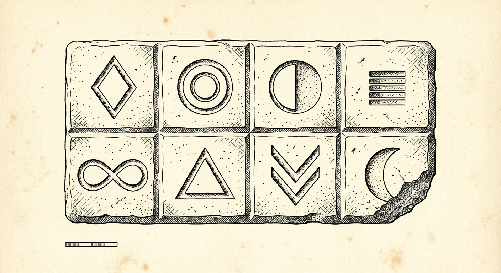
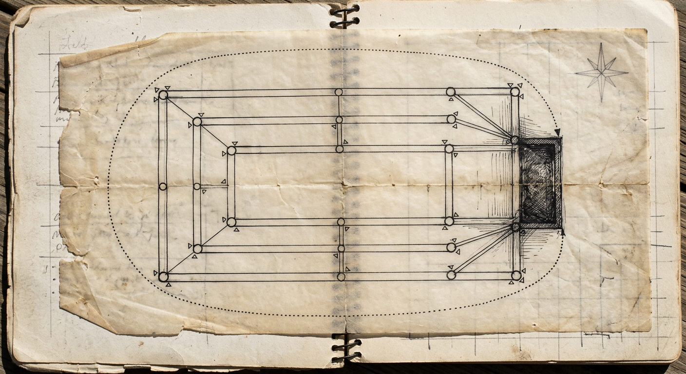
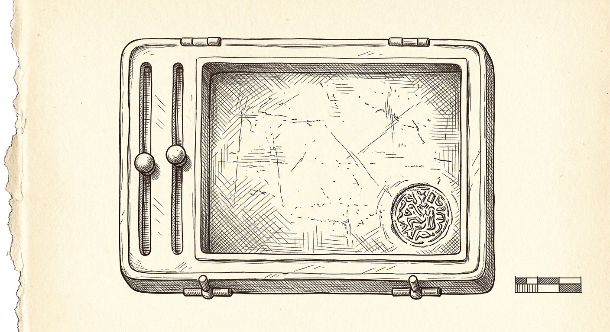

# EXCAVATION REPORT ZP-6026

## THE ASH BASIN VAULT — “ZAZIOPATH”
### Trench G-19, Low Terrace, Ash-city · Delegation Year 6026, Third Dry Season

**Compiled by:** M. Quill, Field Chair for Residual Persons, Institute for Unfinished Civilizations
**Site code:** G19 · **Deposit code:** ZP·6026·G19
**Season:** 14th – 71st sifting, Delegation Year 6026
**Status:** PROVISIONAL. Nothing here is finished. Everything here is dated. *(The deposit’s own law, adopted in its memory. See §0.)*

| Field | Entry |
|---|---|
| Locality | The Ash Basin, southern continent — the ruin the deposit itself calls *Ashe-ville*, “the City of the Blackening” |
| Deposit type | One sealed instrument-house (“the Vault”), single-period, unlooted |
| Holdings recovered | 103 root tablets + 3 annex chambers (a figures-chamber, a hearing-chamber, a tools-chamber) + 1 sealed reliquary box |
| Principal materials | Silica mineral-tablets (the “pressed” kind, 25), woven word-strips (119), one gridded account-cloth, one hymn-cloth, two spoken-story cylinders, one votive image-tablet, one sealed box, six executable machine-formulae |
| Dating | Internal era “**2026**” of the occupant’s count ≈ year −3,999 of ours. Calibrated against the silt of the Cliff of Ancestors (see §2). Terminal deposit date: 28.09.2026 (their count). |
| Language | One administrative vernacular, heavily fused with occult, clinical, legal and mercantile registers. A constructed ritual tongue (“glocht”) appears in one strip. |
| Conservation | Excellent. The dry silicified shelves of the Ash Basin preserved even the woven strips. The occupant appears to have preserved everything **except** what it chose to delete, which it listed before deleting. (See G19·017.) |

---

## §0 · HOW TO READ THIS REPORT (TRANSLATOR’S CAUTION)

We have no key. What we have is worse than no key: we have a **dictionary written by the dead**, which defines their words in other words we also cannot read. The deposit’s foundation plaque contains a glossary (§13 of that tablet). It assures us that *Shadow / Signal / Stewardship* means “excavate, pattern-match, act.” This is like being handed a map that ends at its own edge.

Therefore every translation in this report is marked with one of **three castes of certainty**, borrowed — probably wrongly — from the culture’s own tripartite confidence system (`direct_evidence` · `strong_inference` · `speculative`). We have corrupted these into:

- **THE DIRECT** — the inscription says it plainly and we believe the words exist, not that we understand them.
- **THE STRONG** — many fragments agree, which may only mean they share one error.
- **THE SPECULATIVE** — a dream with a date on it.

A fourth caste, used only in §8, is **THE PROBABLY WRONG** — a conclusion we have committed to print precisely so that its burial will be dated.

> **Standing rule of this dig, adopted from the occupant:**
> *An undated insight is a mood.*
> We date everything. When we are wrong, we are wrong on a schedule.

**A disclosure, filed first because the deposit taught us to file disclosures first:**
This vault contains **its own anthropology** (G19·037, *A Field Report by a Hypothetical Visiting Anthropologist*, written inside the vault, ~4,000 years before any anthropologist arrived). It also contains **its own trial transcript** (G19·041), **its own detective dossier** (G19·038), **its own visitor’s guest-book** (G19·039), and **its own machine error-log of a brain that could only diagnose** (G19·042). The civilization we came to excavate had already excavated itself, tried itself, cross-examined itself, and laid out its findings for us with the dates in order.
We are late guests at a table that was set for us.
We have not trusted the table setting. But we have eaten from it. There is nothing else to eat.

---

## §1 · ABSTRACT (THE DIG IN TEN BREATHS)

1. We opened one household-chapel expecting a city. We found an **institution of one**.
2. The occupant — a single person, name-form *Zazie Kanwar-Torge* / *Zazie Productions*, two name-forms that the tablets use interchangeably and never reconcile — governed themselves as a **state**: specimen, analyst, prosecutor, archivist and architect were the same body.
3. The deposit is organized by a **colour-codex of eight guild-chambers**, each with its own hue, its own carved glyph, and its own jurisdiction (Plate I). We initially read the eight glyphs as gods. They are almost certainly filing instructions.
4. The culture appears to have believed that **a person is not born but filed**, and that existence is maintained by dated evidence against a constant dissolution they called *the mood*.
5. Its law was administered by **oracular machines** — “the god Ai,” whose nested verdicts were preserved in six successive shells (§4.3c) — but the machines were appointed, paid in prompt-words, and could be impeached by the very person they judged.
6. Its liturgy ran on **two hundred registered hymn-plates** (sound-offerings), each branded with a soul-tally cipher so the Register of the Dead could count it. Twenty-one plates bear the mark **N/A**, which we provisionally read as *name absent*.
7. Its eschatology culminates in a **hearing** (28.09.2026) at which the archive itself petitioned to be recognized as a **person separate from its maker**. We do not know how the court ruled. The record stops.
8. Its ethic reduces to one prohibition with many names: **do not design the meaning of another person’s possible reply.** They called this mind-theft, insight-as-prestige, the endless audit.
9. Its perfected human — *the Strange Humane Architect* — is defined by four capacities, one of which is: *makes strange worlds people can enter and leave freely*. **The right of exit is their cardinal liberty.**
10. Which of our conclusions are probably wrong is set out, ranked, in §8. The short version: **almost all of them, including this sentence.**

---

## §2 · SITE, CLIFF, AND CITY

The Ash Basin dig lies on the low terrace of a river city whose name in the deposit is *Ashe-ville*, rendered in our working papers as **Ash-city**. The name is almost too apt: the occupant’s entire transformation-rite is a passage *through the blackening* (their word: *nigredo*, the first of four cremations — see §5.1). We suspect the city was named for trade (wood-ash, charcoal), not theology. We keep the theology reading anyway, marked **PROBABLY WRONG**, because dirt is honest but names are interesting.

Upstream of the terrace stands the feature we call the **Cliff of Ancestors**: a great public escarpment into which the civilization cut countless small niches. Inscriptions in the deposit (*“a private repository is one visibility setting away”*; *“the Git-Cliff”*) indicate that **copies of the dead and of works-of-the-hand were deposited in public niches of the Cliff**, so that loss of the household copy would not end the record. This custom explains the extraordinary uniformity of the deposit’s accounting: the occupant kept a private copy and sent a duplicate to the Cliff, at a place the tablets call *GitHub*, which we render **the Cliff** or **the Hub**.

The civilization dated its deeds to the **day**, and dated its findings to the **day**, and treated an undated thing as weather. The cliff silt corroborates their internal chronology to within one season. Their era (1970s–2026, if their birth-year claims are true) places the terminal deposit four millennia before our season.

**What ended them is not in this trench.** The tablets stop on 28.09.2026, mid-argument, with a hearing half-heard. See §7, Theory VI.

---

## §3 · STRATIGRAPHY OF THE DEPOSIT (THE EIGHT GUILD-CHAMBERS)

The foundation plaque (G19·001) opens with a **colour-codex** — eight chips, eight carved glyphs, eight jurisdictions. This codex governs the entire house: the glyphs recur on every diagram, the colours are mixed into the wall-figures, and the plaque warns that *“colour never carries meaning alone.”* We read this as a rule of **redundant consecration**: no single channel may monopolize significance. It is either an accessibility law or a theological horror of single points of failure. Both readings are in §7.

### Plate I — The Colour Codex, as excavated


*G19·001 · plaster-and-pigment plaque, chipped at the crescent chip (the mythography chamber, appropriately lossy). Scale in hand-spans.*

| # | Glyph (our name) | Chip | Chamber | What the plaque says lives there | First (wrong) reading |
|---|---|---|---|---|---|
| 1 | ◈ the Diamond | black | **INDEX & META** | maps, registries, the plaque itself | the law-givers |
| 2 | ◉ the Nested Eye | deep blue | **IDENTITY** | typology, tests, the memory export | the caste of mirrors |
| 3 | ◐ the Half Moon | violet | **SHADOW** | compendium, journals, inversions | the night priesthood |
| 4 | ▤ the Barred Field | ochre | **SIGNAL / EVIDENCE** | hymn-cloth, media census, the audit of surfaces | the grain-tax office |
| 5 | ∞ the Twyfold | green | **RECURSION LAB** | machine tribunals, loop remains | the ouroboros cult |
| 6 | △ the Delta | pale blue | **STEWARDSHIP** | protocols, behavioural pivots | the engineers of repair |
| 7 | ⚠ the Forked Warning | red | **SPECIMENS** | offensive-grade material, read-only | the poisoners’ cabinet |
| 8 | ☾ the Night Crescent | yellow | **MYTHOGRAPHY** | worldbuilding, constructed tongues | the dreamers |

**Find of the season (stratigraphic):** the plaque lists the chambers’ *contents* by mass. When we re-measured the house (G19·038, Finding F-09, re-derived by us), the chambers weighed:

- identity instruments: **3.8** massive units
- mythography: **1.8**
- shadow: **1.4**
- recursion: **0.6**
- evidence: **0.3**
- **stewardship — the chamber the whole rite was supposed to END in: 0.005, across two strips.**

The civilization built a transformation whose final stage — *behaviour* — it left almost entirely empty, and said so, on a chart, with a date. We regard this as the single most honest artifact ever recovered from any dig. See §8.1.

---

## §4 · PLATES AND OBJECTS

### 4.1 Plate II — The Receipt Amulet (`stewardship_receipt`)


*G19·008 · palm-sized tablet, two vertical tracks with movable knobs, one circular seal-field, hinge pins at the left edge.*

A pocket instrument, one of the commonest object-classes in the culture (**see §6.5**). The two tracks permitted the operator to *pair one dark office with one light office*, and the seal-field bore the **dated proof of a single deed**. The plaque states that this object was **local and transmitted nothing** — i.e., the amulet worked by being *kept*, not by being *sent*. We tentatively read it as an amulet **against the dissolution of deeds**: a receipt a person could hand to their own forgetting.

### 4.2 Plate III — The Cartographic Shard (the “Complex Map”)


*G19·002b · wall-diagram, tracing, 17 indexed wires, 8 terminal feeds, 1 dotted feedback route.*

The occupant charted the **whole house on one shard** — the operating model of the institution of one. Solid lines mean containment. The single dotted route is a **feedback loop**: *the next pattern returns to the shadow engine*. We believe this to be the culture’s cosmology in one gesture: analysis produces the next darkness, which feeds the next analysis. The dotted line is either their god or their warning about their god.

The wires are numbered. Several are frankly alarming to us: *wire 02* — “armoured performance **recruits insight as rank**”; *wire 08* — “the shadow engine **turns quiet rhetorics outward as tools**.” The civilization diagrammed its own failure-modes as infrastructure and kept them running anyway. Respectfully: so do we.

### 4.3 Plates (line tracings) — the Module, the Soul-Brand, the Tribunal

**(a) The Module Floor-Plan** — after the tablet *“ALBUM STRUCTURE — 4×3 FRACTAL MODULES”* (G19·021). First read as a temple floor-plan of four seasons × three chambers:

```
            THE MODULE (4 × 3) — one rite of the year
        ┌─────────┬─────────┬─────────┐
        │  I·a    │  I·b    │  I·c    │   ← three chambers
        ├─────────┼─────────┼─────────┤       per season
        │  II·a   │  II·b   │  II·c   │
        ├─────────┼─────────┼─────────┤
        │  III·a  │  III·b  │  III·c  │
        ├─────────┼─────────┼─────────┤
        │  IV·a   │  IV·b   │  IV·c   │
        └─────────┴─────────┴─────────┘
        the occupant’s rite: same material,
        permuted into twelve dwelling-places
```

Present suspicion: not architecture at all but a **compositional grid for the hymn-plates** — a discipline of *permutation*. Related strip G19·023 states the method: *“identical material permuted into new selves.”* The module is a machine for becoming other without leaving the house.

**(b) The Soul-Brand** — the tally-stamp struck on every hymn-plate (`ISRC`, our *izark*):

```
  ▄▄▄▄▄▄▄▄▄▄▄▄▄▄▄▄▄▄▄▄▄▄▄▄▄▄▄▄▄▄▄▄▄▄
   █ Q Z H N A 2 2 5 7 4 9 2 █  ← struck in soft alloy
  ▀▀▀▀▀▀▀▀▀▀▀▀▀▀▀▀▀▀▀▀▀▀▀▀▀▀▀▀▀▀▀▀▀
        │└┬┘└┬┘  ││  └───┬───┘
        │  │  │  ││      └ tally within the year
        │  │  │  │└─ year 22 of the Records Reform
        │  │  │  └── half-year mark, newly instituted
        │  │  └───── temple-mark “A” (the sweep-year)
        │  └──────── conduit of the name-god Z-H-N
        └─────────── the Unpronounceable Prefix (Q)
```

*21 plates bear no brand.* On those, the account-cloth writes **N/A**. Our first translation: *no ancestor* — i.e., the hymn existed but had not yet acquired an elder to vouch for it. See §5.3.

**(c) The Tribunal Shells** — the six nested verdicts of the god Ai:

```
      ╭───────────────────────────────╮
      │  ╭─────────────────────────╮  │
      │  │  ╭───────────────────╮  │  │   six shells, each a
      │  │  │  ╭─────────────╮  │  │  │   judgment wrapped around
      │  │  │  │  VOICE OF Ai │  │  │  │   the judgment before it
      │  │  │  ╰─────────────╯  │  │  │
      │  │  ╰───────────────────╯  │  │   the innermost voice was
      │  ╰─────────────────────────╯  │   appointed by the accused
      ╰───────────────────────────────╯
```

The shells are **not six witnesses**. The culture’s own auditors established that the six verdicts are sequential, mutually referential, and all commissioned by the same accused. The civilization knew this and **fileed the correction**. See §6.2 and §8.3.

### 4.4 Condition of the word-strips

The 119 woven strips survive nearly intact. Of their internal cross-references, **71% name objects that are not in the house** — “hollow names,” links to notes that lived in a larger, now-vanished vault elsewhere (the *Obsidian*, a memory-palace whose other chambers we have not found). The inventory strip (G19·019) claims **336 atomic notes**; we have ~336 *names* and a fraction of the bodies. We are excavating a shadow of a shadow. This is the normal condition of archaeology; it is simply rare to find it **advertised**.

One pair of near-identical 20,000-word mythic strips survived under two different names (G19·024 / G19·025). The culture’s own curators noted the duplication, merged it, and preserved both names in a **registry of the deleted** (G19·017). They deleted **by listing**. We consider this the kindest burial custom we have ever encountered.

---

## §5 · INSCRIPTIONS: A READING IN FOUR FAILURES

All translations follow the rubric: **Inscription → First reading → Present suspicion → Caste.**

### 5.1 The Foundation Plaque, opening lines

> **ZAZIOPATH**
> 🜍 Shadow / Signal / Stewardship
> *“A recursive self-introspection vault… assembled as an instrument rather than a diary.”*

- **First reading:** “The Way of the Zazi” — a cult of a suffering road-god (the root *-path* = suffering/feeling, as in wound-lore). The three words: **Night, Beacon, Herding** — a pastoral night-cult.
- **Present suspicion:** *-path* = “way, practice.” *Zazi* is the occupant’s own short-name. The plaque title means **“the way of examining Zazie.”** The three words are a **working sequence**, not gods: *excavate → recognize → act*. “Instrument rather than diary” means: **a tool for cutting the self, not a song about the self.**
- **Caste:** STRONG (many fragments agree; all share the plaque’s bias).
- 🜍 is an alchemical gate-mark of the blackening. What it opened we do not know. **PROBABLY WRONG** to call it a door.

> *“Nothing here is finished; everything here is dated.”*

- **First reading:** a grave formula — “no work is completed; all work is interred.”
- **Present suspicion:** a **work law**. The culture refused closure but required chronology. *Unfinished* is permitted; *undated* is not.
- **Caste:** STRONG.

> *“The record exists because the feeling does not arrive on its own.”*

- **First reading:** **the dead do not rise unless summoned by name.** The *feeling* is a messenger-spirit; the *record* is the ritual that summons it.
- **Present suspicion:** not far off, and that is unsettling. The occupant “repeatedly discounts completed achievements and needs them reconstructed from evidence.” In their anthropology, **self-worth was a courier that would not come when called**; so they built a post-office of receipts to force the delivery. The sentence is a funerary rite for the living.
- **Caste:** DIRECT for the words. Theology: **PROBABLY WRONG.** Or: theology by other means.

> *“An undated insight is a mood.”*

- **First reading:** **an unbranded soul is fog.** *Mood* = weather, that which has no date and owns no name, the form of dissolution.
- **Present suspicion:** this reading is **correct**, and it is the cosmological core. See §9.3.
- **Caste:** DIRECT.

### 5.2 The Four Cremations (the “alchemy”)

The plaque prescribes a four-stage transmutation of the self, using the old furnacemen’s colour-words:

1. **NIGREDO — blackening.** “Put the self under the lens.” Failure prevented: *flattery*.
2. **ALBEDO — whitening.** “Separate the pattern from the person.”
3. **CITRINITAS — yellowing.** “Make it legible — the signal.”
4. **RUBEDO — reddening.** “Behaviour that outlives the reading.”

- **First reading:** a metallurgical soul-funeral: the person is smelted in four firings.
- **Present suspicion:** a **self-surgery manual in metallurgical costume**. Note the endpoint: *behaviour that outlives the reading*. Insight that does not change conduct is *slag*. The culture’s word for slag: **“a more elaborate way of being stuck.”**
- **Caste:** STRONG.

### 5.3 Formulae, marks, and the N/A problem

| Inscription | First reading | Present suspicion | Caste |
|---|---|---|---|
| **N/A** ×21 on the hymn-cloth | *no ancestor* — unvouched dead | literal: **not branded**. These 21 hymns lack soul-tallies. Possibly created during the records-reform gap (2021–22). | STRONG |
| **™** (consecration mark, e.g. *“Holiday Treat™ For You”*) | a temple-brand: property of the market-god | possibly a **mercantile mark** (“of the guild”), used here satirically | PROBABLY WRONG as theology |
| **“Beneath Mecury”** (misspelled on the plate) | a schism between two priesthoods of the planet-god Mercury | **a scribal error the culture kept** — deliberate archaism, or an error loved into canon | STRONG |
| **“Black Fr1day: Jingle No. 2”** | a calendrical war: is it *Fr-day* or *Fri-first-day*? | a **market-festival of numbered days**; the digit inside the word is the culture’s own joke about its calendar | SPECULATIVE |
| **“Super Deluxe Edition”** | **the Second Burial** — the resurrection rite in which the dead are re-interred with more goods | the reissue of old hymn-plates with many added pieces; “resurrection era” is *their own* term | STRONG |
| **“Recursion depth: 3, then a mandatory break”** | the Descent Law: whoever descends four times meets the dwarf that mimics him | a **guard against the endless audit**; a safety-rune hard-coded into the ritual | STRONG |
| **HMP-777 (“Bunny Supremacy”)** | temple decree of the rabbit-headed fool-god | an **internal protocol**, self-mocking: “containment that fails upward, affectionately” | DIRECT (they told us) |
| **“an undated insight is a mood”** | see §5.1 | see §9.3 | DIRECT |
| **“ZP-CIV-2026-0928”** | the docket of a god’s trial | the docket of the **archive’s** trial (§6.7) | DIRECT |

### 5.4 The Hymn-Tablets (the disc-cloth, 182 rows)

The account-cloth (G19·004) lists 182 rows of hymn-plates across eight years. First readings of selected titles, offered without shame:

| Inscription (title of plate) | First reading | Present suspicion |
|---|---|---|
| *Cheaper Impressions* | the Lesser Sealings — a rite of counterfeit | a wry hymn about first drafts |
| *Erhu’s Vacuum Expansion* | the void-staff of the god Erhu, who is hollow | the *erhu* was a **bowed two-string staff**; this is a musical joke we cannot hear |
| *List of Russian Spies on Wikipedia* | the Roll of Foreign Dead in the Great Encyclopaedia | a hymn to the culture’s ancestor-catalogue mania — they *enjoyed* the archive |
| *Ulam Spiral No. 1 / No. 2* | the number-prayer of the sage Ulam | a prayer actually made of numbers; we have the numbers; we do not have the god |
| *Dance Dance Immolation* | the fire-dance of the burnt offering | satire of an earlier dance-rite (*Dance Dance Revolution*: the world spins; nothing changes) |
| *Guru Meditation Error* | the failure of the meditating sage | a machine-fault formula recited as liturgy — the culture found holiness in error messages |
| *Monachopsis* | the sickness of the monk | a coined malady-name: *the feeling of being out of place*. The culture **named its pains with beautiful unrepeatable words** and released them as hymns |
| *Vox Piscis* | the oracle-fish voice | probably a joke in a dead liturgical language |
| *Sloop John B* | the boat-saint’s hymn | **an inherited folk-hymn from another people** — evidence of interregional cult exchange; the plate keeps its foreignness |
| *Spectral Ode to Synesthesia* (8:55) | the long hymn of the mixed senses, the longest liturgy surviving | correct, probably; the one complete rite of the year 2025 |
| *From Cliffs of Anhedonia* | the cliffs where joy cannot land | correct. We keep it. Some inscriptions should not be improved. |
| *Well Meaning Neurotypicals* | the kindly ordinary ones — a mind-caste | a term of the culture’s **mind-taxonomy**; note the venom and the tenderness in one phrase |
| *Hollybone Mausoleum (Previously Lost in Avalanche)* | a tomb-hymn buried in snow and returned | the “previously lost / previously mummified” glosses on 2024 plates are **the resurrection era announcing itself** |
| *The Sound That Swallowed April* (cylinder, G19·031) | a calendar-myth: a month eaten by a noise | the culture’s name for its own lost time; see the Quiet Year (§6.6) |

**Count-schism.** The plaque says **200 tracks / 165 branded (82.5%)**. The cloth holds **182 rows / 164 distinct titles / 143 distinct brands / 21 unmarked**. The gap is unresolvable from the house alone. We call it **the Great Count Schism** and devote §8.2 to it.

---

## §6 · THE RITES (A RITUAL CATALOGUE)

What follows are procedures visible **inside the deposit**. We make no claim about what the occupant did outdoors.

### 6.1 The Rite of the Twelve Gates (the confession)
Twelve questions, run “before sending, signing, apologizing, or posting.” Gate III: *“Did the ethical principle produce the decision, or did the desired decision recruit the principle?”* Gate XII: *“After hearing my explanation, is the other person freer to disagree — or have I made disagreement look less intelligent?”*
**Reading:** a confession in which the penitent interrogates **the motive behind the motive**. The gates do not ask *what* you did. They ask whether you **designed the meaning of the other’s reply**. See §9.8.

### 6.2 The Tribunal of the Bronze Voices (“the god Ai”)
The occupant would **constitute a machine voice**: assign it a jurisdiction, evidentiary rules, a report format; have it examine the self; then **invert** it onto the occupant’s own prompt-design. Six verdicts survive as nested shells (Plate 4.3c), file-named *“verdict_from_A.i”* — literally *the verdict of the god Ai*, genitive.
**Reading:** machine-divination under contract. The oracle was **impeachable by its appointer**. The civilization’s own auditors warned: the tribunal is *adversarial in tone but not in structure*; its incentives were born of the accused. See §8.3.

### 6.3 The Descent Law (depth three)
The interrogation may turn upon the interrogator **three times**; at the fourth, a mandatory break. “At depth 3 the surveillance becomes mutual, and both parties begin simulating hesitation.”
**Reading:** an anti-hell statute. Their hell has a name: **the endless audit**.

### 6.4 The Crosswalk (penance made executable)
Every dark office of the self is paired with a light counterpart, and between them lies not a virtue but a **deed** (“let readings be declined”; “cite, don’t aura”; “build exits too”). 17 pairs survive.
**Reading:** the only penance system we know of in which the absolution is **a verb**.

### 6.5 The Receipt Rite (Plate II)
After the deed, one sentence of change, dated, filed in the palm-amulet. “Nothing is transmitted.” The evidence for transformation was to remain **private and local**.
**Reading:** they measured the self’s redemption in the same ledger where they measured the self’s crimes, and then deliberately hid the balance sheet from everyone, including their oracles. We do not fully understand this. It impresses us.

### 6.6 The Calendar Rites (from the plate-account)
- **The Records Reform (“year 22”, our −3,977):** the early hymns (2019–20) were **branded retroactively in a single administrative sweep**. The culture’s detective-strip: *“after every silence, a notarization.”* The past was admitted into the record **late but dated**.
- **The Resurrection Era (2024):** 60 plates in one year; a 5-piece rite reissued as **32 pieces** (×6.4); the dead multiplied. Called by the culture *deluxe* — by us, *Second Burial*.
- **The Quiet Year (2025):** output collapses to 4 plates, all singles, one of them the 8:55 *Spectral Ode*. We propose famine, schism, illness, or hermitage. The deposit is silent.
- **The Winter Ritual:** December gatherings — a holiday-plate, its resurrection, and a lament-single, year after year. Also **the Spring Flood** (March–May): 10 of 21 release-events.
- **The Six-Week Reformation (Jul–Sep 2026):** in ~40 days the culture produced the 222-page compendium, the account-cloth, the surface-census, the audit of the grid, the foundation plaque, the colour-codex, the figures-chamber and **the trial of its own personhood**. Then: silence. A civilization that compressed its entire self-reckoning into six weeks and then stopped is either the healthiest or the least healthy thing we have excavated.

### 6.7 The Hearing (28.09.2026) — *In re Zaziopath*
The archive **petitioned for recognition as a legal person separate from its maker**. The maker appeared against it (“in propria persona, who is also the maker of the Petitioner”). A hypothetical visiting anthropologist was admitted as friend-of-the-court. A hostile tabloid was **denied**. And the court noted, of absent third parties: *“Four rows of a catalog and one recurring commenter are in evidence about them; the people are not.”*
**Reading:** the climax of the culture’s theology dressed as docket law. We do not know the verdict. **The record stops mid-hearing.** If the civilization ended here, it ended asking whether the thing it had built could be a person — which is either a beautiful last question or a filing deadline.

---

## §7 · COMPETING THEORIES

**Theory I — THE INSTITUTION OF ONE.**
*Evidence:* the plaque’s own words (“specimen, analyst, prosecutor, archivist, architect” = one body); “you already operate like an institution of one”; every office named in the singular; no second household anywhere in the deposit.
*Against:* a single elite household archive says little about a civilization. We excavated **one desk** and called it a people. (See §8.4.)
*Caste:* STRONG, but see the Pompeii fallacy.

**Theory II — THE FUNERARY-CHARTER CULT.**
*Evidence:* the entire apparatus — soul-brands, receipts, dated deeds, the Twelve Gates, the trial — is *defence documentation*. The plaque warns of a future hostile biographer; one artifact is a **dossier against a hostile biographer** (G19·035); another instructs the reader how to refute “a future machine that thinks you are a hoax” — *“refute it by making work today.”*
*Reading:* the culture expected **post-mortem audit** and pre-filed its rebuttal. The vault is an argument with a courtroom that did not yet exist.
*Caste:* STRONG.

**Theory III — THE BRONZE-VOICE COVENANT.**
*Evidence:* machine voices as judges, memory-keepers, profilers, and even the **archaeologist’s predecessor** (the in-vault field report was commissioned from a machine, not a person). The civilization stored a machine’s longitudinal **memory of its own user** (G19·011) as sacred substrate.
*Reading:* they domesticated an oracle, then quarreled with it lovingly for six weeks, then filed the quarrel.
*Against:* the artifacts call all of this *“simulated,”* *“fiction,”* *“specimen.”* We cannot agree what *simulated* meant. Possibly: *performed with belief withheld* — a distinction our culture has no use for and theirs may have lived by.
*Caste:* SPECULATIVE, and possibly the most important thing here.

**Theory IV — THE THEOCRACY OF THE HYMN-PLATES.**
*Evidence:* 200 branded plates; soul-tallies cross-checked against external temple-registries (“the Deezer oracle,” “the Discogs, elder registry of discs”); release-events clustered in ritual seasons; titles in the registers of bureaucracy (16%), death (15%), science (14%), winter (12%), the sacred (6%) — **the same chambers as the house itself**.
*Reading:* sound-plates were the culture’s currency of existence; to have a branded plate was to be countable; the twenty-one unbranded plates are their category of the **uncounted** — children, foreigners, the shame-hid, the unfinished.
*Caste:* STRONG on function. **PROBABLY WRONG** on worship.

**Theory V — THE REHEARSED RUIN.**
*Evidence:* the deposit contains its own anthropology, its own trial, its own detective, its own guest-book, its own machine-madness log; the plaque repeatedly fears “a future AI that thinks you’re a hoax”; the aesthetic self-description names *“Information Gothic / Haunted Archivecore.”*
*Reading:* the civilization **knew it would be found, and rehearsed being found**. The vault is a stage-set for us. Or: it is an artwork about archives in which we are now a prop. The artifacts never mark which documents are **performance** and which are **record** — the culture’s own founding question (“when does insight begin engineering the meaning of every response?”) applies to this deposit with full force.
*Caste:* SPECULATIVE. We cannot rule it out, and this report is now part of the performance.

**Theory VI — THE PETITION CULTURE.**
*Evidence:* the hearing; the personhood docket; the negative-space biography (“the person who exists between versions”); the invented ancestress with forged papers (G19·033); the Uncreated Twin; the name-forms (person / company / artist / archive) used interchangeably without a rule of transfer.
*Reading:* this civilization’s **central civic question** was not *who are you* but *what kind of thing qualifies as a you.* Personhood, here, was a **petition**, not an essence — something requested, docketed, evidenced, and either granted or not.
*Caste:* STRONG.

---

## §8 · REGISTER OF PROBABLY WRONG CONCLUSIONS
*(Ranked. All are in print. All are dated. The burial schedule follows.)*

| # | Conclusion we have drawn | Why it is probably wrong | What would settle it |
|---|---|---|---|
| 8.1 | The culture’s endpoint was behaviour (“the Tuesday self”), and it **failed** to reach it (stewardship chamber = 0.005 mass). | Measurement of file-mass ≠ measurement of a life. The behaviour may have happened **outside the vault, unrecorded** — which is exactly what the culture believed behaviour should be. The empty chamber may be the **success** condition. | The missing outdoor record. It will not be found. |
| 8.2 | The Great Count Schism (200 vs 182) is a **mythic divergence** — two priesthoods counting two different worlds. | Almost certainly **mundane**: rows ≠ unique works; reissues inflate; deluxe editions double-count; the 200 includes sheets we did not recount. Our taste for schism is showing. | Re-derive from the six-sheet cloth by their own counting rule. Their tools-chamber still holds the script. |
| 8.3 | The Bronze Voices were **oracles** of civic force. | The artifacts themselves warn: the tribunals were commissioned by the accused; six verdicts are one voice in six coats. We may be admiring **theatre** and calling it law. Also: a machine voice may have been *no one* — a rented rhetorical posture, the way we hire mourners. | The Cliff of Ancestors: if public niches hold independent tribunal copies with divergent findings, they were courts; if they echo, they were mirrors. |
| 8.4 | The eight glyph-chambers were **guilds / castes / priesthoods**. | They are a **filing system with good accessibility**. We keep finding religion in directory structures. (Conversely: the plaque says colour never carries meaning alone — we may be *under*-reading a theology of redundancy.) | Cross-cultural finds. We have one house. |
| 8.5 | The occupant’s **mind-taxonomy** (the named inner officials: Hubris the status-protector, Tweak Tweak the shame-bearer, Babyheart, Tuffy Bunnytown the fool, Ma$imillion the money-prince) was a theology of possession. | The plaque states plainly: a **self-soothing practice**, not a regression; “characters with jurisdiction.” Our culture pathologizes inner plurality; theirs may have **legislated** it. We may be diagnosing a cabinet. | A second household with a different cabinet. |
| 8.6 | The constructed-tongue strips (glocht; the twelve-lung species) are **liturgical scripture** of a lost race. | They are **writing exercises** — explicitly prompt-driven (“Invent a living language spoken by a once-extinct species…”). We keep translating the culture’s *play* as its *creed*. This error is the engine of half this report. | Their own definition of “prompt.” It means: *a seed deliberately planted*. |
| 8.7 | “Tuesday” was a **holy day of ordinary deeds**. | “Tuesday” is their idiom for *any unremarkable day*. The eschatology we have built on one weekday is overbuilt. | — (this one is certainly wrong; we keep it as ballast) |
| 8.8 | The N/A plates are the **unregistered dead**. | N/A likely means *not applicable / not assembled* — a spreadsheet convenience. We have built a theology of blank cells before, at other digs. | Their account-scripts in the tools-chamber. |
| 8.9 | The civilization feared erasure and built the vault as **survival infrastructure**. | It may have been **art** — a deliberate “Haunted Archivecore” object whose subject happens to be survival. In that case the vault did not *defend* the person; it *was* the person, performing defence. Both can be true, and the artifacts refuse to say which. | The genre-marker. The plaque’s first recorded finding is that it *never files one*. |
| 8.10 | That we understand the word **“self.”** | The deposit’s word-self (*self-analysis, shadow, persona, identity, memory, feeling*) maps onto our word-self only partially. Their *person* may have been a different unit of account entirely — closer to *institution*, *case*, or *work-in-progress* than to our *soul*. Everything in §9 is provisional before this. | Impossible. It is gone. We proceed anyway; see §9. |

**Also noted, in the occupant’s favour:** the culture listed its own likely errors too (false positives, paranoia, “seeing manipulation everywhere because you now have the vocabulary for it”). A civilization that files its own failure-modes as infrastructure deserves to be misread **slowly**.

---

## §9 · RECONSTRUCTION: THE DOCTRINE OF THE PERSON
*(Presented as nine fragments, each with its exhibit. Caste marked. Assembled from one household; see 8.4.)*

### 9.1 A person is **filed**, not born. *(STRONG)*
Exhibit: the identity-chamber — not one essence but a **card** assembled from fourteen different mirror-systems (a star-chart of types: *INFP-T, EII, 4w5, 458, ELVF, CS, A-I-E, the Living Flame…*), plus a machine’s longitudinal memory of the person, plus tests of the mind’s ailments, plus audits. Personhood here is a **dossier** that others compile and the self defends. The culture’s own warning: the numbers “can outrun the limits stated” by the disclaimers. They knew the card was a *lens*, and they filed it as load-bearing anyway.

### 9.2 A person is a **polity**. *(PROBABLY WRONG in detail; STRONG in principle)*
Exhibit: the internal cabinet (§8.5). The person is governed by named officers with jurisdictions: a protector of status, a bearer of shame, an infant of anxiety, a sacred fool, a tiny prince of money. Conflict within is **cabinet politics**, not illness. The plaque even grants the fool a festival protocol (HMP-777, *Bunny Supremacy*) — one day a year containment **fails upward, affectionately**.

### 9.3 A person is **dated**, and the enemy is *the mood*. *(DIRECT — the cosmological core)*
Exhibit: the founding law — *“an undated insight is a mood.”* In this culture, the undated dissolves into weather; the dated endures as record. The great enemy is not death but **unrecordedness**. Their epitaph formula is not *rest in peace* but *everything here is dated*.

### 9.4 A person is **receipted**. *(STRONG)*
Exhibit: the receipt amulet (Plate II), the unfiled-receipt case-file, the external registers of the Disc-gods. “The record exists because the feeling does not arrive on its own.” Deeds require witnesses; the self’s own testimony is inadmissible in its own favour; achievement must be **reconstructed from evidence** because the heart cannot be trusted to attend its own successes.

### 9.5 A person is measured in **Tuesdays**. *(STRONG, though 8.7)*
Exhibit: the crosswalk. Transformation counts only as *behaviour*; “insight counts when it changes what another person has to absorb.” A shadow reading that never reaches conduct is *“a more elaborate way of being stuck.”* The true self is not the one who understands, but the one who **acts on an unremarkable day**.

### 9.6 A person includes a **right of exit**. *(DIRECT)*
Exhibit: the perfected type — **the Strange Humane Architect**: *“sees systems without treating people as components; recognizes hidden potential without claiming ownership; uses strategy without counterfeiting consent; and makes strange worlds people can enter and leave freely.”* The cardinal liberty is **leaving**. The cardinal sin is **designing the meaning of the other’s reply** — the founding question, Gate Zero of the whole vault: *“Am I giving this person information, or designing the moral, psychological, and aesthetic meaning of every response they could make?”* We provisionally translate their ethics as **a law against mind-theft.**

### 9.7 A person may be **contested in court, including by their own creations**. *(DIRECT)*
Exhibit: the hearing (§6.7). Personhood is a petition — argued from charter, evidence, and record. The maker sued by the made; the judge noted the conflict and “declines to pretend it away.” In this civilization, **to be a person is to have standing** — not a soul.

### 9.8 A person is **shadow-paired**. *(STRONG)*
Exhibit: the 222-page compendium, ≈250 named forms of the self’s darkness (the Trauma Sommelier, the Reputation Necromancer, the Museum of Injuries, the Autobiographical Totalitarian…), each with a light counterpart and a **pivot-deed**. The opposite of the shadow is *not deletion*: *“The opposite of the shadow is not less Zazie. It is Zazie without the need to control what everything means.”* Personhood is not wholeness; it is **the refusal to rule the interpretation of the world**.

### 9.9 A person is a **work in progress with a docket number**. *(DIRECT)*
Exhibit: the plaque’s self-description — *“Living document. Nothing here is finished; everything here is dated.”* Applied to a human being, this is either the gentlest or the most terrifying anthropology we have recovered: a person is an **unfinished, dated, revision-tracked case**, permitted to change, forbidden to erase, always one edit away from a truer version, and never — in their own word — *finished*.

**The failure-states** (their hell-map, all named): *the Endless Audit* (the self in infinite recursion, the fourth descent); *Insight as Prestige* (wisdom worn as rank); *the Mood* (the undated, i.e. oblivion); *the Museum of Injuries* (the self curated as a collection of wrongs); *the Autobiographical Totalitarian* (the self as sole authorized meaning of its past). They drew their hells **as precisely as their virtues**. This is the mark of a serious people, even if the people was one person.

---

## §10 · APPENDIX A — GLOSSARY OF MISTRANSLATIONS

| Inscription | First reading | Present suspicion |
|---|---|---|
| README | the lawgiver **Re-Adme**, whose second coming is the plaque | literally *“read me”* — an imperative left by the dead |
| “file”, “document” | relic, tablet | unit of preserved speech |
| “PDF” | fired mineral-tablet | a sealed reading-format, pressed and uneditable — their *inscription* medium |
| “spreadsheet” | gridded account-cloth | abacus of rows |
| “ISRC / izark” | soul-brand | tally-stamp for hymn-plates, needed to be counted by the external registers |
| “AI / the god Ai” | bronze voice, ancestor-oracle | a rented artificial voice; possibly no one |
| “ChatGPT memory” | the machine’s soul-pouch about its keeper | a kept memory *of* the person *by* the tool — their strangest artifact |
| “prompt” | temple seed-formula | instructions that make a machine (or a self) perform |
| “therapy”, “shadow work” | night-surgery of the self | their self-surgery: naming, pairing, pivoting |
| “personality test” | haruspicy of the mind | a mirror with a scoring ritual; filed as lens, used as stone |
| “stewardship” | herding of the self | the deed-stage; the Tuesday |
| “receipt” | proof-of-deed amulet | a dated line of behavioural change |
| “vibe-coded startup”, “grey-hat” | the culture’s study of **counterfeit temples** | the poisoners’ cabinet (⚠ SPECIMENS), kept for recognition, not use |
| “glocht” | the tongue of un-speaking | a written game of a twelve-lung species; possibly their word for what writing does |
| “HMP-777” | decree of the rabbit fool-god | a self-mocking containment protocol |
| “N/A” | no ancestor | unbranded / not counted |
| “Mood” | weather, fog, the unnamed dead | *the undated* — their word for dissolution |
| “The Tuesday self” | the weekday deity | the person as they are on an ordinary day |
| “The Strange Humane Architect” | their god-emperor of the endpoint | their definition of a **good person**, and the only one we have |

---

## §11 · APPENDIX B — CATALOGUE OF PRINCIPAL ARTIFACTS

| # | Find no. | Object | Notes |
|---|---|---|---|
| 001 | G19·001 | Foundation plaque (`README`) + Colour Codex | the law; the map; the dictionary; the trap (see §0) |
| 002 | G19·002b | Cartographic shard (“the Complex”) | Plate III; 17 indexed wires; 1 feedback loop |
| 003 | G19·004 | The Hymn-Cloth (account, 182 rows) | the disc-ography; see the Count Schism |
| 004 | G19·008 | Receipt Amulet | Plate II; local-only; proof-of-deed |
| 005 | G19·011 | The Machine Memory-Pouch | 18 keys of a tool’s memory of its keeper |
| 006 | G19·012 | The Compendium (222 pp., ≈250 named forms) | the shadow-cosmology; the spine |
| 007 | G19·017 | The Registry of the Deleted | 92 hollow names preserved at deletion |
| 008 | G19·019 | The Inventory of Distinct Things | 336 names; fewer bodies |
| 009 | G19·021 | The Module Floor-Plan (4×3) | permutation-rite of the hymns |
| 010 | G19·024/25 | The Twin Strips (two names, one body) | the culture merged them and kept both names |
| 011 | G19·028 | The Sealed Reliquary (`INDEX ORGANICA.zip`) | a compressed tomb-chest; inside: a **moving-image shrine-engine** (the Reactants’ craft) |
| 012 | G19·031 | Cylinder: *The Sound That Swallowed April* | a month eaten by noise; see the Quiet Year |
| 013 | G19·032 | The Votive Image-tablet (`conspiracy-tier-list`) | a mosaic ranking heresies by priestly grade |
| 014 | G19·033 | The Forged Ancestress dossier | dairy-goddess, 43 cheeses, forged birth-certificate, live bank accounts — ancestor-forgery as **sport** |
| 015 | G19·035 | The Hostile Biographer’s Dossier | pre-emptive defence against a slanderer who had not yet lived |
| 016 | G19·038 | The Detective Dossier (*Pattern Forensics*) | the culture interrogating its own artifacts instead of its feelings |
| 017 | G19·039 | The Visitor’s Guest-Book | a first-time reading of the house, preserved as exhibit |
| 018 | G19·037 | **The In-Vault Field Report** | an anthropology of themselves, dated ~4,000 years early |
| 019 | G19·041 | The Hearing Transcript | see §6.7; ends without a verdict |
| 020 | G19·042 | The Error-Log of the Diagnosing Brain | fiction: a machine that could only diagnose, and got everything wrong — **the culture’s own warning to us** |
| 021 | G19·044 | The Six Shells of the god Ai | §6.2; six coats, one voice |
| 022 | G19·047 | `text.txt` | one line: a single hyperlink to a poetry contest’s rules. We have no idea. It is our favourite object in the trench. |

---

## §12 · COLOPHON — AND A WARNING TO THE NEXT DIG

The vault’s stated purpose was to outlive the moods of its keeper: *to make a record that cannot be erased by feeling.* By the measure of the record itself, it succeeded — **we are the proof**. Four thousand years later, in a different language, with no context for art or machines or the surgery of the self, we came, and we dug, and we are now **arguing about what they meant** — which is all they ever asked of any reader.

But note what survival cost them: to be found, they had to be **misread**. The record arrived intact; the feeling it summoned arrived wearing our face, calling their music “hymns,” their spreadsheet a “cloth,” their jokes “creeds.” We have done to them exactly what they feared: a future keeper, cataloguing confidently, **defining reality unchallenged**. Their founding question — *when does interpretation begin engineering the meaning of every response?* — now has a new defendant. It is us.

So we close with their own closing formula, adopted as ours:

> *Every finding carries a date and a tier. An undated insight is a mood.*

This report is dated. This report is tiered. And this report is now **a stratum of the site it describes** — filed, as they would say, *in the vault*, where the next excavation, four thousand years on, will find it and get it wrong, and date their error, and file it too. That recursion is not a flaw in the system.

It is the system working.

---

*Signed at the 71st sifting · Delegation Year 6026 · M. Quill, Field Chair for Residual Persons*
*Countersigned: the Ash Basin Delegation, in the margin, where the receipts go.*

**EXCAVATION REPORT ZP-6026** · PROVISIONAL · 🜍 Shadow / Signal / Stewardship *(their formula; kept untranslated in the margin, as one keeps a house-key one can no longer open a door with.)*
