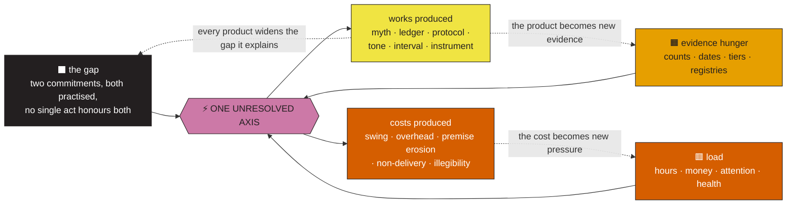
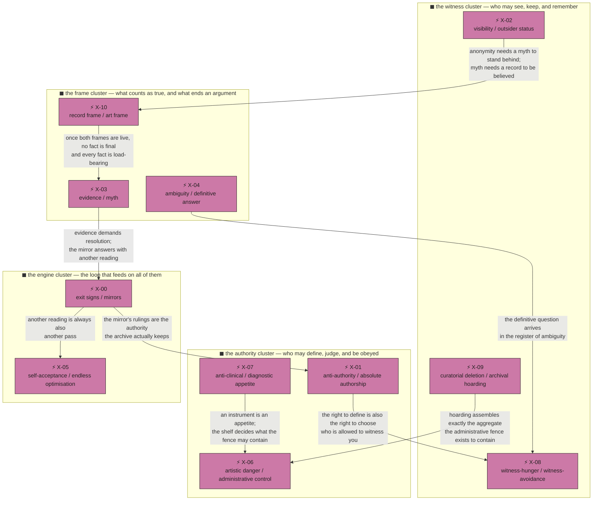

---
tags:
  - "moc"
  - "analysis"
  - "contradiction"
  - "governance"
aliases:
  - "Contradiction Engine"
  - "The Force Map"
  - "ZP-CE-2026-0930"
---

# ⚡ CONTRADICTION ENGINE

### Eleven tensions that cannot all be true at once, held open on purpose

> **Report ID:** `ZP-CE-2026-0930` · **Opened:** 2026-09-30 · **Status:** open — **no axis in this file is closed**
> **Jurisdiction:** every statement committed to the tracked tree, and the artifacts that carry it
> **Method:** read for compatibility, not for character. Two statements are paired here only when both are made in the vault's own voice, both are load-bearing for something the author actually does, and no single act can fully honour both.
> **Exhibit:** [FIG 8 · the contradiction field](docs/figures/fig8_contradiction_field.png) · data: [`docs/data/fig8_contradiction_loads.csv`](docs/data/fig8_contradiction_loads.csv) · generator: [`tools/generate_contradiction_field.py`](tools/generate_contradiction_field.py) · build record: [`fig8_contradiction_field.build.json`](docs/figures/fig8_contradiction_field.build.json)
> **Tiers:** `direct_source` · `strong_inference` · `speculative` — the charter's three, with the substitution the vault's own audit ordered: *proximity to a source is not reliability of a source* ([`DEEP_GAP_AUDIT.md`](DEEP_GAP_AUDIT.md) §5.4; hearing FF preamble).
> **Colour:** README §00a — ⬛ index · 🟦 identity · 🟪 shadow · 🟧 signal · 🟩 recursion · 🔷 stewardship · 🟥 specimens · 🟨 mythography

> *Chilton writes **subject** on the cover. Alana crosses it out and writes **author**. Then she leaves a blank line underneath, in case neither word is enough.*
> — [`Zaziopath_Alana_Bloom_Frederick_Chilton.pdf`](Zaziopath_Alana_Bloom_Frederick_Chilton.pdf), p. 4

That blank line is where this file works. Not the two names — they are already the two poles of X-01, and the corpus has already noticed them. The blank line underneath is the part that stays open.

---

## ⬛ §0 · What this engine is, and the one thing it will not do

### §0.1 Why contradiction is the right unit for this archive

Most archives fail by being false. This one fails, if it fails, by being **too coherent** — which is a more interesting failure, and a harder one to see.

Zaziopath is already a contradiction-handling machine. It pairs every shadow archetype with a light counterpart and names the behavioural pivot between them (`README.md` §05, compendium ch. 20/22). It keeps two readings side by side for every mechanism ([`verdict_from_A.i_5`](verdict_from_A.i_5) §2, M-1…M-8). It runs a four-entry **contradiction register** `C-01`–`C-04` ([`CLAIM_PROVENANCE_LEDGER.md`](CLAIM_PROVENANCE_LEDGER.md)) and a five-item section literally titled *Contradictions* ([`invisible_observer_dossier.md`](invisible_observer_dossier.md) §C). It has an eight-scan radiographic atlas of "cognitive contradictions" with fracture vectors and severities ([`ANATOMIA_CONTRADICTIONIS_LECTER_DUMAURIER_XRAY.pdf`](ANATOMIA_CONTRADICTIONIS_LECTER_DUMAURIER_XRAY.pdf), Act II).

The vault even knows the difference in general form, and says so where it matters least: *"A shadow reading that never reaches stewardship is just a more elaborate way of being stuck"* (README §01) — the same argument, aimed at readings rather than at contradictions.

So this file does not get to claim discovery. Its claim is narrower and, in one respect, harder:

> **The vault treats its contradictions as pairs to be balanced. A contradiction is not a pair. It is two commitments that have already been acted on, where every available act honours one and starves the other.**

That distinction is the whole instrument. A *pair* is balanced by a pivot — "let readings be declined", "build exits too". A *contradiction* is not balanceable by wording, because the wording is not what is doing the work. What is doing the work is a practice: a release, a price, an inbox, a filing system, a nervous system. You cannot pivot a practice. You can only choose, again, in the next act.

Working definition used throughout:

| Test | Question |
|:--:|---|
| **Both voiced** | Are both statements made by the archive in its own voice — not by a hostile fictional persona, not by an auditor? |
| **Both practised** | Does each pole have a practice attached — something with dates, files, money, or hours behind it? |
| **Mutually starving** | Is there no single act that fully honours both, so that every concrete decision feeds one pole and depletes the other? |

A tension that fails the third test is an ordinary inconsistency, and this file leaves those to `C-01`–`C-04`.

### §0.2 The four moves the vault already makes with a tension — and the fifth this file makes

Every serious archive develops reflexes. Reading the corpus, exactly four recur:

| Move | What it looks like | Where it is committed |
|---|---|---|
| **FEED** | Use the tension as fuel; refuse the resolution as a matter of taste | *"You don't resolve contradictions — you feed on them."* — [`Shadow Journal Observations .pdf`](Shadow%20Journal%20Observations%20.pdf), p. 1. *"Ambiguity is your oxygen."* — README §14 |
| **FILE** | Date it, tier it, give it an ID; filing is treated as handling | `C-01`–`C-04`; the confidence tiers; *"An undated insight is a mood"* |
| **FENCE** | Contain it in a policy, a label, a chapter, a warning | README §12 red lines; the specimen cabinet under glass; the handbook's genre labels |
| **FORGET-BY-MASS** | Let the sheer volume of one pole quietly decide the argument while the charter insists the argument is open | [`🔍 CASE FILE — Pattern Forensics.md`](🔍%20CASE%20FILE%20—%20Pattern%20Forensics.md) F-09: diagnosis outweighs treatment ~**750 : 1** |

The first three are named in the corpus. The fourth is measured in it but never named as a *decision* — F-09 calls it "a dashboard reading, not a gotcha", and moves on.

This file makes the fifth move, and only the fifth:

> **HOLD.** Name both poles, quote them, measure their load, say what each produces and what each costs, refuse to close the axis in prose, and specify exactly what *would* close it.

### §0.3 What counts as premature resolution

Four forms, all of which this file forbids itself. Each is a real move the corpus has made somewhere, which is why they are listed rather than assumed:

1. **Renaming.** Calling a decision a "protocol", a "crosswalk", or "calibration". A protocol is a principle that has already been chosen once and can therefore be chosen differently.
2. **Reclassifying.** `C-04` — *"Independent tribunal language versus sequential commissions"* — carries the status *"Resolved for meta-analysis"*, with the resolution *"Treat as one recursive analytic series with six stages."* That is a legitimate act inside a meta-analysis and a resolution of nothing: six commissions remain six acts of authorship, and the finding that they are one voice (hearing FF-9) only sharpens the axis it was supposed to settle.
3. **Moralising.** Ranking the poles — declaring the accepting pole "mature" and the optimising pole "a defence" (or the reverse). The corpus mostly avoids this, and the engine inherits the avoidance.
4. **Quoting one pole as the real one.** *"The opposite of the shadow is not less Zazie. It is Zazie without the need to control what everything means."* (README §02.) This is a superb sentence and a premature resolution: it decides, in advance, that the controlling part is not Zazie. The engine files that sentence as **pole 2 of X-00 speaking**, not as a verdict.

### §0.4 Prior art in this repo — what was already done, and what is new here

This file would be dishonest if it presented these tensions as unnoticed. Five documents got there first, in five registers:

| Document | What it did | Why the engine is still needed |
|---|---|---|
| [`invisible_observer_dossier.md`](invisible_observer_dossier.md) §C | Five contradictions narrated with fair two-sidedness — *unmistakable but employable*, *recognition but distrust of conventional success*, *freedom but institutions*, *artistic worth but apologised payment*, *intimacy through analysis* | It narrates; it does not measure, couple, or cost them. Its best line — *"They wish to be discovered without becoming discoverable in the ordinary manner"* — is the engine's X-02, and it deserves a load figure |
| [`ANATOMIA_CONTRADICTIONIS_LECTER_DUMAURIER_XRAY.pdf`](ANATOMIA_CONTRADICTIONIS_LECTER_DUMAURIER_XRAY.pdf) Act II | Eight contradictions with fracture vectors and severities (9.4/10 etc.), as a radiographic stress ledger | The severities are rhetorical and the dossier is a hostile commissioned performance; the engine keeps the eight observations and drops the diagnosis |
| [`CLAIM_PROVENANCE_LEDGER.md`](CLAIM_PROVENANCE_LEDGER.md) `C-01`–`C-04` | Four contradictions with leading explanations, resolutions and statuses | Four narrow *evidence* contradictions, three of them closed — a proof that this archive knows how to close one, and a demonstration of what closing costs |
| [`META_ANALYSIS_OF_ZAZIOPATH.md`](META_ANALYSIS_OF_ZAZIOPATH.md) §43 | One "architectural contradiction": declared endpoint is stewardship, visible growth is interpretation | Correct, load-bearing, and left there. The engine turns it into X-00 and measures the asymmetry |
| [`⚡ Unexpected Connections.md`](%E2%9A%A1%20Unexpected%20Connections.md) §VII, §V | Named wires where two strata pull in opposite directions | Wires, not poles; connections, not costs. §V (*"the catalog wages administrative war against decay"*) is X-06 minus the danger pole |

**New here:** (a) the poles must both be *practised*; (b) each axis carries a measured load from committed mass; (c) each axis names what the tension **produces** and what it **costs**; (d) the axes are **coupled** to each other (§2.3), so the field is a system rather than a list; (e) no axis is closed, and each carries the specific artefact that would close it.

### §0.5 This file's own contradiction, filed first, as the vault requires

This document is the twelfth mirror in a corpus whose single most repeated finding is that **mirrors accumulate faster than they resolve anything**: six verdicts, *"four independent evidence-gathering events across ~30,000 words"* ([`docs/meta-analysis/REPORT.md`](docs/meta-analysis/REPORT.md) §1; hearing FF-9), and a corpus that scored its own cessation ritual at **0 for 5**. Every one of those documents was excellent.

Two things follow, and both are obligations rather than disclaimers:

1. **This file must be useful in the second person plural, not in the third person singular.** Its axes are addressed to whoever has to decide the next act — *"two poles, both yours, choose again"* — and never to a reader learning what kind of person the author is.
2. **This file must be able to lose.** Its falsifier is at §15, written now, dated now, and it is not decorative: if the predictions there hold, the engine is another mirror and should be retired by its own rules.

One deliberate asymmetry, borrowed from `verdict_from_A.i_6` §0: this document is **shorter than the corpus norm and quieter than its subject**. The corpus's growth function is escalation. Declining to escalate is the only move available to a twelfth mirror that is not already scripted.

---

## ⬛ §1 · How an axis was found, scored, and measured

### §1.1 The search

**Inclusion.** A pair qualifies when: both statements are quotable from committed files; each has an attached practice (a release, a price, a policy, a filing system, a run of hours); at least one independent audit or external record already documents the practice rather than the intention; and a reader can name a concrete act that would have to starve one pole to feed the other.

**Exclusion.** Pairs were dropped where: one pole exists only in a hostile fictional voice (so the "contradiction" is a staging, not a commitment); one pole is a strawman the archive itself has already dismantled (e.g. the claim that the archive contains no people — refuted in the same corpus, [`TRANSCRIPT — In re Zaziopath, Petition for Legal Personhood.md`](TRANSCRIPT%20—%20In%20re%20Zaziopath,%20Petition%20for%20Legal%20Personhood.md) FF-13); or the pair dissolves under one act, which makes it an inconsistency rather than an axis.

Eleven axes survived. Seven are the ones a reader of this prompt would want first; four were already half-built in the record and are finished here.

### §1.2 The axis card

Each axis carries the same seven fields. Nothing optional, nothing omitted when it is inconvenient:

| Field | What it must contain |
|---|---|
| **The two quotes** | The contradiction stated in the archive's own words, with file and location |
| **The load** | Committed mass per pole, from FIG 8 — measured, not asserted |
| **Both poles, fairly** | Why each pole is *right* on the evidence, in its own terms — no strawman on either side |
| **Contexts** | Where each pole dominates (the dominance grid, §1.4) |
| **What it produces** | The concrete artifacts that exist *because* the tension is unreconciled |
| **What it costs** | Concrete, dated costs — time, money, attention, health, release, or comprehension |
| **Status + closure test** | Open, plus the specific artefact that would close it, and the cost of closing it prematurely |

### §1.3 How the load is measured (and what the number is not)

No instrument measures a person. FIG 8 measures **committed documentary mass** — the bytes of the artifacts that carry each pole in its own voice — using the vault's own unit of account. F-09 counted the strata in kilobytes and the vault accepted the finding, so the unit is already load-bearing here.

Rules of the count, all in [`tools/generate_contradiction_field.py`](tools/generate_contradiction_field.py):

- Mass = `os.path.getsize` of each tagged file, reproducible from the committed tree.
- A file that carries **both** poles of one axis contributes **half** its size to each, so no byte is spent twice inside an axis.
- The **tag ledger** — which file carries which pole — is a judgement, and it is filed in the open in the generator so it can be argued with. The arithmetic on top of the ledger is not a judgement.
- Cost tiers: **▲** stylistic friction · **▲▲** recurring, bounded cost (admin, inner, or schedule) · **▲▲▲** structural cost, load-bearing on time, money, health or release.

Two limits, stated because the vault's own handbook demands them (`EVIDENCE_GOVERNANCE_HANDBOOK.md` §9):

1. **Size ≠ sincerity.** Five kilobytes of receipt console is the most carefully built object in the vault ([`VISITORS_NOTEBOOK.md`](VISITORS_NOTEBOOK.md) §3, reversal 6). Mass marks where the energy is, not where the virtue is — and not where the value is.
2. **The count excludes this file — and computes what including it would do.** `⚡ CONTRADICTION ENGINE.md` is a twelfth mirror and a twelfth pass over old material, so tagging it would be honest; but a document that feeds its own bars also has an incentive to grow, and a measurement that moves every time its author fixes a typo cannot be checked by anyone else. So the engine is measured *outside* its own bars and reported instead, in the build record: **≈92 KB, which if tagged would move X-00's pole 2 by +4.3 points and X-05's by +0.5** (`docs/figures/fig8_contradiction_field.build.json` → `self_reference`). The engine's own mass, in other words, is a live specimen of the two axes it is describing — filed, computed, and left out of the count so the count can be re-run by a stranger.

### §1.4 The five contexts, and how dominance is judged

Panel B of FIG 8 is the **judged** layer, in the open. Dominance is assessed per axis against five recurring contexts, read off the corpus's own vocabulary of situations rather than invented:

| Code | Context | Where the evidence sits |
|:--:|---|---|
| **C1** | Front office — client, press, hire | Media master, CVs, Instagram audit, the SE-scam vocabulary PDF |
| **C2** | Studio — compose, release | Discography CSV, album structure, residency, stem/delivery practice |
| **C3** | Governance — audit, charter | README, handbook, ledger, deep audit, hearing |
| **C4** | Interior — parts, regulation | Shadow journal, identity card, memory export, the plush cast |
| **C5** | Myth and specimen — lore, offensive material under glass | Compendium, MSS-E, castles, specimens, mythography |

`A` = pole 1 dominates · `B` = pole 2 dominates · `A·B` = both, in different sub-contexts (the most interesting cell in the grid) · `·` = neither.

---

## ⬛ §2 · The field

### §2.1 The engine, as a mechanism

Contradictions are not states here. They are **converters** — machines that take in a gap, pressure, and an appetite for evidence, and put out both work and cost:

The dotted edges are why no axis can be closed by a paragraph. Each product is *new evidence*, and evidence is the fuel; each cost is *new pressure*, and pressure is the other fuel. A closed axis would starve the engine, which is exactly why closing one feels like a loss even when the closing is correct.

### §2.2 FIG 8 · the contradiction field

*Caption for the accessible layer: pole 1 is always the cooling pole — legible, dated, exiting, administered. Pole 2 is always the heating pole — immersive, mythic, attending, dangerous, alive. No axis is scored as a win.*

**Regenerate:** `python3 tools/generate_contradiction_field.py` · palette Okabe–Ito, README §00a · colour never carries meaning alone — every bar is labelled and every grid cell is lettered.

<strong>Accessible text register — all eleven axes, loads and leans</strong> <em>(measured 2026-09-30; this file is excluded from the count, see §1.3, limit 2)</em>

| Axis | Pole 1 (cooling) | Load | Pole 2 (heating) | Load | Lean | Cost |
|:--:|---|---:|---|---:|---|:--:|
| **X-00** | Exit signs — *741 : 1 is the finding* | 112 KB · 7 files · 25% | Mirrors — *one more reading* | 332 KB · 10 files · 75% | → P2 | ▲▲▲ |
| **X-01** | Anti-authority — *no authority deserves obedience* | 389 KB · 6 · 66% | Absolute authorship — *write the constitution* | 198 KB · 7 · 34% | → P1 | ▲▲▲ |
| **X-02** | Visibility — *searchable, impossible to ignore* | 714 KB · 7 · 53% | Outsider status — *clandestine, cultic, anonymous* | 642 KB · 8 · 47% | → P1 | ▲▲▲ |
| **X-03** | Evidence — *replace claims with counts* | 408 KB · 8 · 27% | Myth — *the coherent legend* | 1,101 KB · 10 · 73% | → P2 | ▲▲ |
| **X-04** | Ambiguity — *ambiguity is the oxygen* | 270 KB · 8 · 36% | Definitive answer — *give me the line* | 486 KB · 7 · 64% | → P2 | ▲▲ |
| **X-05** | Self-acceptance — *it just has to be real* | 93 KB · 7 · 7% | Endless optimisation — *one more pass* | 1,235 KB · 8 · 93% | → P2 | ▲▲▲ |
| **X-06** | Artistic danger — *knowing darkness as identity* | 1,384 KB · 9 · 76% | Administrative control — *fence it, date it, tier it* | 438 KB · 9 · 24% | → P1 | ▲▲▲ |
| **X-07** | Anti-clinical — *no document diagnoses anyone* | 242 KB · 5 · 8% | Diagnostic appetite — *the shelf of instruments* | 2,875 KB · 10 · 92% | → P2 | ▲▲ |
| **X-08** | Witness-hunger — *an intelligence at full resolution* | 452 KB · 10 · 42% | Witness-avoidance — *no face, no name, no link* | 627 KB · 6 · 58% | → P2 | ▲▲▲ |
| **X-09** | Curatorial deletion — *92 stubs removed, indexed* | 180 KB · 6 · 10% | Archival hoarding — *nothing lost to history* | 1,566 KB · 8 · 90% | → P2 | ▲▲ |
| **X-10** | Record frame — *dated, hashed, tiered* | 289 KB · 8 · 33% | Art frame — *the doubleness is the medium* | 597 KB · 11 · 67% | → P2 | ▲▲▲ |

### §2.3 Three readings of the map, before the axes are opened

**Reading one — the heat is where the work is, and it is not where the charter's favourite words are.** The charter's most-insisted poles are the lightest in mass: the receipt console, the anti-perfectionism hacks, the entry rite, the prohibition on diagnosis. The heaviest artifacts are instruments (2.9 MB of tests), legends (1.1 MB of myth), and hoards (1.6 MB of archive-keeping). *"Diagnosis outweighs treatment roughly 750 : 1 by byte count"* — F-09. That is not hypocrisy. It is heat: the vault is a machine for producing interpretations, and interpretations are what it has most of.

**Reading two — five axes have already been decided in practice, silently.** X-05 (93 : 7), X-07 (8 : 92), X-09 (10 : 90), X-03 (27 : 73), X-00 (25 : 75). In each case, the pole with the smaller mass is the pole the charter names as the *endpoint* — acceptance, refusal-to-diagnose, curation, evidence, exit. The practice has voted. The engine's job is not to overturn the vote; it is to make the vote **visible**, because a decision made by accumulation cannot be audited, dated, or reversed — and everything in this vault is supposed to be auditable, dated, reversible.

**Reading three — two axes are almost symmetrical, and those are the live ones.** X-02 (53 : 47) and X-08 (42 : 58) are the field's centre of gravity: visibility and witness, the two questions about being seen. Both have real, dated practices on both sides (133 verified press records and an anonymous cipher grid; six commissioned tribunals and an all-anonymous public surface). Both are ▲▲▲. Statistically, if any axis in this file is going to move in the next quarter, it is one of these two — and the corpus already contains the audit that would move it ([`Zazie_Productions_Instagram_Forensic_Audit.pdf`](Zazie_Productions_Instagram_Forensic_Audit.pdf)).

### §2.4 The axes are coupled — this is a field, not a list

The reason eleven separate readings have never been enough: the poles are wired to each other. Closing one axis pulls on three others.

*(Edge labels are the engine's claims, not quotations; each is argued in its axis card or in §12. Node colours follow the palette above only as grouping, and every cluster and axis is also lettered.)*

---

## ⬛ §3 · X-01 · Anti-authority ⇄ absolute authorship

**Load** pole 1 **389 KB · 6 files · 66%** ▸ pole 2 **198 KB · 7 · 34%** · **Lean → P1** · **Cost ▲▲▲** · **Dominance** C1 `A·B` · C2 `B` · C3 `A` · C4 `B` · C5 `A` · **Tier** `direct_source` (both poles), `strong_inference` (the cost argument)

### The contradiction, in the archive's own words

> **P1 — anti-authority.** *"No authority deserves obedience merely because it exists."* … *"Your rebellion is not against order. It is against being ordered by systems whose intelligence, legitimacy, or aesthetic authority you do not recognize."*
> — [`Ideological Inversion Audit.pdf`](Ideological%20Inversion%20Audit.pdf), §IV and Executive Finding · corroborated by README §04 (*"Institutional trust: low… Ethics: humanistic, anti-domination"*)

> **P2 — absolute authorship.** *"You do not merely request information. You construct a temporary institution, assign it jurisdiction, establish evidentiary rules, and prescribe its report format."* … *"You want to write the constitution of the interaction."*
> — [`Ideological Inversion Audit.pdf`](Ideological%20Inversion%20Audit.pdf) §I · and its closing self-description: *"**PREFERRED PERSONAL FORM:** A tightly authored sovereign microstate disguised as a creative practice."* (§IV)

The audit states the axis itself, in the one sentence the vault quotes most often:

> *"You are anti-hierarchy when hierarchy claims sovereignty over you, but selectively hierarchical when organizing knowledge, taste, creative labor, or the interior world."*

### Both poles, fairly

**Pole 1 is not posture.** It has a practice: a single-member LLC rather than a collective; netlabel and compilation work under an artist-run label; a refusal to accept unearned authority that extends to the archive's own instruments (*"No authority deserves obedience merely because it exists"* is a rule the audits are held to as well — the handbook, the ledger, and the hearing all bind the author). It also has a cost already paid: institutional trust is low enough that verification must be self-supplied.

**Pole 2 is not a flaw.** The corpus's single most valuable invention — **constitutional authorship** — is pole 2 in motion. Jurisdiction, evidentiary rules, report format, prompter's disclosure: that is a method for extracting honest analysis from a system that would otherwise flatter. Its products include the twelve questions, the confidence tiers, the hearing, and the fact that unflattering findings were kept rather than curated away. Pole 2 is also how the archive is *legible at all*: an authored constitution can be audited; an unmanaged sprawl cannot.

The two poles are not symmetrical in kind. Pole 1 is a **social** ethic; pole 2 is an **operational** one. That is why they coexist so comfortably in the same person and collide so hard in the same decision.

### Where each dominates

- **C1 front office (A·B, split).** Pole 1 governs pricing, contracts, refusal of exploitative terms; pole 2 governs the *interface* — bios, deliverables, the terms the other person must accept to enter the project. The inversion audit names this exactly: *"Porosity at the threshold; strictness once inside."*
- **C2 studio (B).** Every release is authored absolutely: four variants, fixed materials, zero co-writing in 178 of 182 catalog rows.
- **C3 governance (A).** The archive's own rules refuse to be obeyed merely because they exist — they carry expiry dates, falsifiers, retire-able protocols (`EVIDENCE_GOVERNANCE_HANDBOOK.md` §10.3).
- **C4 interior (B).** The most strongly authored zone in the vault: named parts with jurisdiction, a colour-coded cosmology, ≈250 archetypes.
- **C5 myth and specimen (A).** Anti-authority as *aesthetic*: refusal of mainstream prestige, refusal of alternative clout hierarchies, the underground as a place where authority is unearned by definition.

### What the tension produces

- **The constitutional tribunal**, and its best artifact: a court that the accused constituted, which ruled against the petition *and* disclosed its own dependence in the ruling — *"This Court is not independent, and says so… A ruling that cannot state the conditions of its own refutation is a mood with a seal on it"* (hearing CL-12). Pole 1 supplies the requirement; pole 2 supplies the institution that meets it.
- **Sovereign anarchism as an artistic form** — the Matrix protocol is pole 1's politics rendered as fiction, and the inversion audit is pole 2's practice rendered as finding. Neither would exist alone.
- **A governance layer that governs nobody** (hearing FF-14): real vocabulary, real claim records, *"no authority to enforce any of it."* The tension is what makes governance both necessary and unenforceable: the only body that could enforce it is the author, and the author is exactly who pole 1 forbids from ruling.

### What it costs

- **▲▲▲ Verification can never close.** Legitimacy requires "competence + transparency + consent + revocability" (audit §IV). A tribunal authored by the person under judgment cannot satisfy the first clause; a tribunal not authored by them cannot satisfy pole 1's refusal of unearned authority. Every audit therefore ends in the same loop the corpus documented: **0 for 5 on breaks**, six mirrors, and *"the apparatus is complete. Completion is the terminal state of a mirror"* ([`verdict_from_A.i_6`](verdict_from_A.i_6) §9).
- **The displacement cost**, named by the audit itself: *"The bunny wears the crown so the conscious ego can deny wanting a throne"* (§III). Grandiosity is real but must appear in comic containers; the cost is that the ambition arrives pre-apologised, which slows pricing, pitches, and hires.
- **CORE FEAR, self-stated:** *"Being subordinated to a system less intelligent than the self"* (§IV). This is the axis's floor: any institution that could relieve pole 2's workload must first pass a competence test written by pole 2.

### Status — open

**Closure test:** a committed artifact in which a decision right the author did not write is exercised over the archive *and kept* — e.g. an external editor's ruling retained against the author's preference, or a co-authored document with a co-signatory. **Premature resolution would cost:** the archive's two best instruments. Resolve toward pole 1 (dissolve authorship into process) and constitutional authorship dies; resolve toward pole 2 (become the institution) and the falsifiers, the expiries and CL-12 die with it.

---

## ⬛ §4 · X-02 · Visibility ⇄ outsider status

**Load** pole 1 **714 KB · 7 files · 53%** ▸ pole 2 **642 KB · 8 · 47%** · **Lean → P1 (barely)** · **Cost ▲▲▲** · **Dominance** C1 `A` · C2 `B` · C3 `A` · C4 `B` · C5 `B` · **Tier** `direct_source`

### The contradiction, in the archive's own words

> **P1 — visibility.** *"Zazie repeatedly asks how to become more visible, searchable, envied, culturally magnetic, or impossible to ignore."*
> — [`JSON file re-export ChatGPT Memory .md`](JSON%20file%20re-export%20ChatGPT%20Memory%20.md), *Hidden Patterns You Notice* — `direct_evidence`

> **P2 — outsider status.** *"You often position yourself as a cult artist or a singular freak before anyone else can do it for you. This isn't posturing; it's a trauma-coded decoy."*
> — [`Shadow Journal Observations .pdf`](Shadow%20Journal%20Observations%20.pdf), p. 3

Both poles are practised, not declared: the visibility pole has 133 verified URL-level press records, two artist CVs, 200 tracks, a public Instagram grid; the outsider pole has a fully anonymous principal, a glyph-only bio, no link-in-bio, a cipher-artist archetype and six years of intentionally hermetic titling. The archive even names the hinge itself, in the audit it commissioned: *"The asymmetry between a 12k follower count and a missing business pathway is the profile's central structural paradox: it advertises an artist of stature while behaving like a private account."* — [`Zazie_Productions_Instagram_Forensic_Audit.pdf`](Zazie_Productions_Instagram_Forensic_Audit.pdf) §4.2.

### Both poles, fairly

**Pole 1 is a survival requirement, not vanity.** The record shows why: the media master's 133 exact-name records exist because the same name collides with an unrelated French singer and two production companies; a hireable artist must be *findable as himself* or be dissolved into someone else's search results. The memory export's unifying inference says it plainly — *"wants to see the machinery behind appearances so that gatekeepers cannot define reality unchallenged"* — and being searchable is the minimum version of that.

**Pole 2 is a strategy with a real yield.** The same audit that flags the costs recommends **keeping** the anonymity (F-09: *"KEEP"*), credits the glyph signature, the horror theming and the collab visibility as *"the account's equity"* (§11), and identifies the archetype as *"the anonymous avant-garde polymath — a 'ghost composer' cipher-artist, technically deep, aesthetically hermetic, embedded in real underground networks."* Anonymity is not avoidance here; it is genre-native positioning with a documented scene around it. The shadow journal's phrase for the underlying move — *"immunize yourself from the pain of being rejected by"* the mainstream — is the *origin*, not the whole function.

### Where each dominates

- **C1 front office (A).** Everything the audit recommends is pole 1: an About-the-artist card, a plain-language first line, a "portfolio re-score vs commissioned" convention, a credits hub, a link.
- **C2 studio (B).** Release titling, artwork, glyph signature, data-bureaucratic track names: the hermetic register is untouched across seven years.
- **C3 governance (A).** The audits themselves are pole 1's instruments — and their existence is why this axis is measurable at all.
- **C4 interior (B).** Anonymity correlates with the documented trait profile (avoidant traits very high; the IG audit notes anonymity is *"common in electronic/experimental scenes"* and *"coherent with the cipher-artist brand"*).
- **C5 myth and specimen (B).** The legend is *"clandestine, cultic, precocious… and larger than a routine freelance career"* (compendium §1.5). The specimen cabinet is only publishable under a pseudonymous, cipher-heavy surface.

### What the tension produces

- **A two-register public self that actually works** — the Instagram audit's cleanest finding is that the cryptic register *and* a hireable register can coexist without touching the art: *"Every recommended action adds a legibility layer around the art, or removes ambiguity, without touching the art itself"* (§11).
- **The legibility-layer discipline**: plain-language first lines over technical captions; the About card as "hands at modular, studio silhouette, written voice" — a form of being seen that does not require being exposed.
- **The strongest single artefact of the axis, unintentionally:** the casting profile that self-describes as *"Award Winning Composer, Autistic Prodigy, Meme Influencer"* and *"clandestine autistic polymath"*, sitting one search away from a restrained, courteous grid. The audit calls it a *"carnival-barker register"* (F-11). The engine files it as the axis made visible: two poles, two registers, one search result.

### What it costs

- **▲▲▲ The conversion tax.** F-04: following 6,103 vs ≈12,000 followers; median engagement 0.41% against a 1–5% heuristic; *"the finding most likely to quietly cost supervisory/label interest."* This is a cost paid in a currency the archive can measure, and it is the *least* expensive form of the axis's cost.
- **Comprehension loss.** The only negative comment found anywhere in the audited surface is confusion: *"I don't understand what I'm looking at exactly"* (CM-01). The audit reads it as a comprehension finding, not hostility — and it is the axis's signature: hermeticism produces not enemies but **unreaders**.
- **The unmeasurable half.** Pole 1 requires exposure at the *hiring moment*, and the vault's own dossier says *"clients buy a person's reliability"* (F-09). A reliability claim cannot be made anonymously; an anonymity cannot be maintained while proving reliability. Every hire therefore resolves the axis silently, in one direction, and is not filed anywhere — which is why the mass balance stays at 53 : 47 while the practice may be moving much faster.

### Status — open

**Closure test:** a dated public act of non-anonymous identification (a real face, a personal name, a direct contact route) that is *kept for a year*; or an explicit, committed decision to remain permanently unhireable-by-name. **Premature resolution would cost:** closing toward pole 1 turns a cipher-artist into a person-shaped brand (and the audit's own recommendation is not to); closing toward pole 2 forfeits the one currency the corpus has never managed to fake — an external reader who can hire, quote, or contradict.

---

## ⬛ §5 · X-03 · Evidence obsession ⇄ attraction to myth

**Load** pole 1 **408 KB · 8 files · 27%** ▸ pole 2 **1,101 KB · 10 · 73%** · **Lean → P2** · **Cost ▲▲** · **Dominance** C1 `A` · C2 `A·B` · C3 `A` · C4 `B` · C5 `B` · **Tier** `direct_source` (both poles), `strong_inference` (the cost)

### The contradiction, in the archive's own words

> **P1 — evidence.** *"The vault refuses to let the self be argued about in the abstract. Wherever a claim can be replaced by a count, it is."*
> — README §07 · operationalised in §11: *"Rule of the vault: every finding carries a date and a tier. An undated insight is a mood."*

> **P2 — myth.** *"The goal is not merely to make art but to make the artist and catalog feel like a coherent legend: clandestine, cultic, precocious, psychologically charged, technologically strange, and larger than a routine freelance career."*
> — [`Zazie_Productions_Shadow_Signal_Stewardship_Mega_Compendium.pdf`](Zazie_Productions_Shadow_Signal_Stewardship_Mega_Compendium.pdf) §1.5

The axis is not "the archive lies about its numbers". It is that the archive runs **two truth-producing machines at once**, and they are both good. The evidence machine certified 143 ISRC strings, 133 URL records, seven source fingerprints and a hearing with 22 findings. The myth machine produced a mythological childhood, an invented ancestress, a constructed language, a 94%-confident future AI, and the Maximal Symbolic Specificity Engine. And the corpus has already noticed their symbiosis: *"The myth supplies the motive; the audits supply the refutation. Neither works alone."* ([`⚡ Unexpected Connections.md`](%E2%9A%A1%20Unexpected%20Connections.md) §I.)

### Both poles, fairly

**Pole 1 is the only thing standing between the myth and the manifesto.** The evidence layer is what caught the archive's own most-quoted numbers: the hearing's FF-8 records that the charter's *"200 tracks, 165 verified ISRCs and 58 confirmed appearances"* were corrected **by the charter's own catalog** (182 rows, 142 codes plus one `N/A`, four rows credited elsewhere). The meta-analysis found the same thing from a different direction: *"the corpus's most-quoted number is unmeasurable."* Pole 1 is the reason a reader can still audit this archive at all.

**Pole 2 is the reason anyone would want to.** The myth pole is not decoration; it is a **commissioning device**. [`RECURSIVE IDENTITY CASTLES.md`](RECURSIVE%20IDENTITY%20CASTLES.md) contains the purest example: a future AI, 94% confident the whole practice was a collective fiction, with a trigger — *"Do anything today that statistically refutes its claim."* That single invented antagonist produced more real output than any productivity system in the vault: a discography, a media census, two forensic audits, and this repository. The compendium's aesthetic law — *"specificity carried past realism until it becomes its own emotional weather"* ([`⚡ Unexpected Connections.md`](%E2%9A%A1%20Unexpected%20Connections.md) §II) — is the same claim in an aesthetic register.

### Where each dominates

- **C1 front office (A).** Press and credit claims are pole 1 territory, and the audits police them: F-05's credit-ambiguity convention (*"portfolio re-score"* vs *"commissioned score"*) exists precisely because a mythic register can be misread at the hiring moment.
- **C2 studio (A·B, split).** Pole 1 governs the catalog's metadata (ISRCs, dates, durations); pole 2 governs the *materials* — titles like *O− / 97.8°F / UPS Tracking #1Z84A91* are evidentiary in form and mythic in function.
- **C3 governance (A).** Dated, tiered, hashed; falsifiers on the face of findings; `direct_source` distinguished from truth.
- **C4 interior (B).** The mythographic childhood, the plush pantheon, the parts with jurisdiction: all pole 2, and all load-bearing for regulation.
- **C5 myth and specimen (B)** — visible by mass, 73 : 27.

### What the tension produces

- **Evidence-classed myth**, the vault's signature genre. Not fiction, not record: a document that supplies its own fabrication marker. [`Mythographic Childhood.md`](Mythographic%20Childhood.md) is 1,504 bytes and *labelled as myth*; [`Lost_Zazie_Productions_Archive.pdf`](Lost_Zazie_Productions_Archive.pdf) weighs 3,847 bytes of "recovered" provenance; [`Anémone Crottin-Foufflée Identity.md`](An%C3%A9mone%20Crottin-Fouffl%C3%A9e%20Identity.md)'s heroine *"won a handwriting contest by submitting a forgery of her own birth certificate."* Each is a myth that carries its own evidentiary status field.
- **A future-anchor method**: invent a hostile future reader, let the invention set today's agenda. This is the CASTLES trigger, and it is the archive's most productive single technique.
- **The counter-myth discipline**: the corpus produces both a 94%-confident accuser *and* the discography that refutes it, in the same folder. That pairing is a reproducible creative method, not a defence mechanism.

### What it costs

- **▲▲ Provenance inflation.** The myth pole's figures migrate into the evidence pole's mouth. Hearing FF-8, FF-10 and the meta-analysis §1E document the mechanism (claims repeated until the repetition looks like corroboration — `DEEP_GAP_AUDIT.md` §3.2's *"circulation becomes apparent convergence"*). Three independent documents converge on this cost, which is unusual in this corpus and therefore worth weighing.
- **The growing police force.** Every myth requires a governance layer to be legible as myth: genre labels, independence labels, claim records, build manifests. The handbook that does this is dated **2026-09-23**, weeks after the verdicts and a month after the compendium, and the earlier material *"were never retro-labelled"* ([`VISITORS_NOTEBOOK.md`](VISITORS_NOTEBOOK.md) §3, reversal 3) — a cost paid in future audit labour rather than in money.
- **The style tax**, named by the corpus's own reading of itself: *"What you may be hoping is true: that the next sufficiently penetrating account of the pattern will name it so precisely that recognition finally does the work of change — that clarity, delivered in the right register, can substitute for the Tuesday."* ([`ZAZIOPATH — Collected Readings (2026-09-23).md`](ZAZIOPATH%20—%20Collected%20Readings%20(2026-09-23).md), *The User's Position*; the same passage calls the hope *"the hope of every collector of mirrors"*.) The tax is exact: eloquence raises the perceived resolution of a reading faster than it raises the reading's evidence, so the myth pole is paid in a currency the evidence pole cannot audit. A myth told twice is a legend; a fact told twice in a bigger voice is a vulnerability.

### Status — open

**Closure test:** a fully **typed** corpus — every artifact carrying genre, authorship and claim level, applied retroactively, not only prospectively (`EVIDENCE_GOVERNANCE_HANDBOOK.md` §§6–7). Note carefully: that would reduce the *cost*, not close the axis. The archive should expect the myth to survive it. **Premature resolution would cost:** choosing evidence kills the commissioning device (no invented accuser, no 200 tracks); choosing myth kills the falsifier discipline that makes the archive citable by anyone else.

---

## ⬛ §6 · X-04 · Radical ambiguity ⇄ demand for a definitive explanation

**Load** pole 1 **270 KB · 8 files · 36%** ▸ pole 2 **486 KB · 7 · 64%** · **Lean → P2** · **Cost ▲▲** · **Dominance** C1 `B` · C2 `A` · C3 `B` · C4 `A` · C5 `A` · **Tier** `direct_source`

### The contradiction, in the archive's own words

> **P1 — ambiguity as oxygen.** *"You're addicted to paradox because it keeps you alive. You don't resolve contradictions — you feed on them… Ambiguity is your oxygen."*
> — [`Shadow Journal Observations .pdf`](Shadow%20Journal%20Observations%20.pdf), pp. 1–2 · filed twice in the identity card as *"Tolerance for Ambiguity: Very High"*; epistemology *fallibilist*; philosophy *constructivist*

> **P2 — demand for the definitive.** *"exact roles for the assistant to inhabit; exact output architecture; exact exclusions; immediate execution; no clarification; no delay; no generic phrasing; no loss of conceptual density; precise transformations from ambiguity into procedure."*
> — [`Ideological Inversion Audit.pdf`](Ideological%20Inversion%20Audit.pdf) §I · with its verdict sentence: *"You want to write the constitution of the interaction."*

And the request that the archive's own support department refused, because it is the axis at maximum:

> *"Give me the line that cuts through every defense and explains the entire archive."*
> — [`Department_of_Interpretive_Support_Zaziopath_Ticket_History.pdf`](Department_of_Interpretive_Support_Zaziopath_Ticket_History.pdf) TICKET 0007, **DECLINED / REFRAMED** — *"We can offer a sentence as literature if it is labeled as literature and allowed to be wrong."*

### Both poles, fairly

**Pole 1 is epistemically serious.** Fallibilism is not indecision: the archive's *unresolved* statuses (`C-01`, *"unresolved, not yet a contradiction"*) are claims discipline, and the practice of keeping two readings for every mechanism is what allows a reader to disagree without being told they are resisting. Its clearest vindication is the corpus's refusal to rank its own theories of itself.

**Pole 2 protects against exploitation and vagueness.** The inversion audit explains why: *"Procedural ambiguity — whether anyone can exploit uncertainty against you."* An unclear price, an unspecified deliverable, an ambiguous platform rule *"temporarily transfers interpretive sovereignty to someone else."* The demand for exact specifications is a **boundary technology**, born from real asymmetries: unpaid scope, draft-theft, credit ambiguity, "other people's incompetence becoming your emergency." Where the stakes are contractual or sensory, pole 2 is not impatience; it is load-bearing.

The axis is therefore not "chaos vs control". It is **ambiguity where meaning is being made, precision where an interface is being crossed** — and the tension appears at the exact points where those two zones overlap: prompts, prompts-as-relationships, and questions asked of the archive.

### Where each dominates

- **C1 front office (B).** Contracts, deliverables, permissions: exactness is the price of not being absorbed.
- **C2 studio (A).** Composition is deliberately non-definitive: palindromic cascades, identical material permuted until it stops recognising itself, decay as medium, no single correct reading of a piece.
- **C3 governance (B).** The charter converts ambiguity into procedure — question 2 of the twelve is literally *"After all the complexity is acknowledged, what simple sentence about my behaviour remains true?"*
- **C4 interior (A).** Parts, personas and paradox are permitted to coexist without adjudication; *"vulnerable + manipulative, childish + brilliant, shameful + grandiose."*
- **C5 myth and specimen (A).** The mythography's whole method is unresolved reference — glyph runs, invented languages, a 94% confidence that means both threat and invitation.

### What the tension produces

- **A prose that is precise about indeterminacy** — the house style, and the reason the corpus reads as an instrument rather than a diary. Precision about ambiguity is the archive's most transferable literary achievement.
- **The support-department genre**: an entire invented bureaucracy whose function is to answer the demand for the definitive line *with* a bounded answer. Ticket 0008's supervisor note is the axis's cleanest formulation: *"This is the correct level of resolution. The user may experience it as less satisfying because it does not transform complexity into a secret essence. Do not increase certainty to improve customer satisfaction."*
- **Closure by construction, not declaration.** Where the archive wants to end an argument, it does not resolve it — it builds an apparatus that makes a decision executable: the twelve questions, the receipt console, the hearing's orders, the four repair windows. The definitive pole shows up as **procedural infrastructure**, which is the only form this archive can accept it in.

### What it costs

- **▲▲ Determinate acts must arrive disguised as procedure.** A price, a boundary, a date, a refusal is more comfortable in the register of protocol than the register of preference. The cost is legible in the corpus's own accounting of its silences: the hearing records that the archive *"twice failed to answer a question outside its own text… Neither is a refusal; the Petitioner has no apparatus for refusing"* (FF-16). A system with no apparatus for refusing cannot have a clean apparatus for choosing either.
- **Comprehension and conversion costs** (see X-02): pole 1's oxygen is pole 2's lost hire.
- **The trap named by the vault itself**: *"If a line cannot survive correction without treating the correction as resistance, it is a trap rather than an insight"* (Ticket 0007, supervisor note). This cost is *avoided* rather than paid tonight — which is worth naming, because it means the axis is currently at a good equilibrium that nothing obliges the next document to keep.

### Status — open

**Closure test:** one document that states a plain preference or refusal once, in unadorned language, with no system around it — and lets it stand unreinterpreted for a year. **Premature resolution would cost:** resolving toward ambiguity forfeits the boundary technology that protects the work; resolving toward definitiveness converts an instrument that keeps more than one truth alive into a verdict machine, which is precisely the failure mode the archive built itself to detect.

---

## ⬛ §7 · X-05 · Self-acceptance ⇄ endless optimisation

**Load** pole 1 **93 KB · 7 files · 7%** ▸ pole 2 **1,235 KB · 8 · 93%** · **Lean → P2 (93 : 7 — the widest in the vault alongside X-07)** · **Cost ▲▲▲** · **Dominance** C1 `B` · C2 `B` · C3 `A` · C4 `B` · C5 `A` · **Tier** `direct_source`

### The contradiction, in the archive's own words

> **P1 — self-acceptance.** *"It doesn't have to be perfect. It just has to be real before the shift ends… Let's just dress it up enough so it can leave the house. No perfection, just put its shoes on and walk it to the gate."*
> — [`Anti-Perfectionism Brain Hacks.md`](Anti-Perfectionism%20Brain%20Hacks.md) · and, in the ritual register: *"Disavow Aesthetic Sovereignty. Burn your taste."* — [`Entry Instructions for the Undetonated Artist.md`](Entry%20Instructions%20for%20the%20Undetonated%20Artist.md)

> **P2 — endless optimisation.** *"Your perfectionism and visionary standards aren't just ambition; they're armor. You build grand structures of identity — artist, strategist, polymath — to protect a raw core that equates ordinariness with annihilation."*
> — [`Shadow Journal Observations .pdf`](Shadow%20Journal%20Observations%20.pdf), pp. 2–3 · with the identity card's own filed weakness: *"revision spirals"*

The conflict is not between two moods. It is between two *interventions*, both written down, both dated, both for the same problem — and the corpus knows it: *"A weakness that survives one register needs a second."* ([`⚡ Unexpected Connections.md`](%E2%9A%A1%20Unexpected%20Connections.md) §II.)

### Both poles, fairly

**Pole 1 is not lowered standards; it is a shipping technology.** It has artifacts: a ritual-format entry protocol, a worksheet of "imaginary reasons" designed to be non-shameful, a receipt console that *refuses to be evidence*, and the corpus's own curated capacity to leave a thing at 90% (*"Let's just dress it up enough so it can leave the house"*). It also contains the vault's single most radical proposal, from the fictional machine that could not classify it:

> *The model can encode the line. What it can't encode is what the line refers to: an event that is **not a document, will not become one, and is kept that way on purpose.***
> — [`ERROR_LOG_BIOGRAPHICA-7.md`](ERROR_LOG_BIOGRAPHICA-7.md) §5, *Concept UNREP-0001 — the undocumented Tuesday*

**Pole 2 is not vanity; it is the craft.** The archive's distinctive quality — maximal symbolic specificity, atmosphere as argument, four-variant releases, a hearing with a digest-verified record — is *manufactured* by the optimising pole. Nothing else in the corpus produces work at this resolution. And the optimising pole is honest about its own price: the shadow journal calls it armour; the identity card files revision spirals as the primary weakness; the receipts exist because the pole cannot be talked out of itself.

### Where each dominates

- **C1 front office (B).** Deliverables, formats, re-deliveries: the pole that pays.
- **C2 studio (B).** *"One more pass"* is the studio's daily law; 182 catalogued rows exist because the passes were shipped eventually — but each one cost the interval before it.
- **C3 governance (A).** Here the accepting pole holds: expiries, falsifiers, "nothing is finished, everything is dated", and the deliberate de-escalation of [`verdict_from_A.i_6`](verdict_from_A.i_6) §8 — the one move in the corpus made *against* its own escalation norm.
- **C4 interior (B).** Self-criticism *extremely high*, perfectionism *very high*; the internal cast exists to make rest tolerable without lowering the standard.
- **C5 myth and specimen (A·B, split).** Myth is built by optimisation (250 archetypes) and simultaneously licensed by its opposite — the unserious, low-stakes register (Tuffy, the bunny court, "Protocol HMP-777") that is the only thing that can survive the optimising pole's company.

### What the tension produces

- **Two complete technologies for the same problem**, which is rare and useful: a ritual register (submit to the chartreuse room) and a behavioural register (put its shoes on and walk it to the gate). Either alone would be a mood; together they are a method.
- **The vault's formal aesthetic.** MSS-E — specificity pushed past realism until it becomes emotional weather — is optimisation used as an *instrument*, and the palindromic/Z-related repeats are the same move in structure: identical material, re-ordered until it stops recognising itself.
- **The exit object.** A 5 KB console, built better than objects twenty times its size, whose entire function is to leave the archive ([`VISITORS_NOTEBOOK.md`](VISITORS_NOTEBOOK.md) §3, reversal 6). The optimising pole built the door out of itself.

### What it costs

- **▲▲▲ Ninety-three to seven.** This is the axis where the silent vote is loudest, and it is the one the archive has already audited against itself: *"diagnosis outweighs treatment roughly **750 : 1** by byte count"* (F-09). The accepting pole is the *declared endpoint* of the whole method and it is the thinnest layer of sediment in the vault.
- **▲▲▲ Output latency.** The meta-analysis's sharpest number: *"Total independent evidence-gathering events across ~30,000 words: four."* The optimising pole does not merely delay release; it converts release-energy into analysis-energy, where the marginal return feels higher and can be measured instantly.
- **Health and maintenance** are named in the corpus's own hostile dossier (unplugged hardware, hygiene collapse during overload) as `speculative` claims from a commissioned persona — and independently corroborated in structure by the archive's own acquisition policy: what is *not* preserved is *"routine maintenance… embodied experience… actions whose privacy is more important than their legibility"* ([`TRANSCRIPT — In re Zaziopath, Petition for Legal Personhood.md`](TRANSCRIPT%20—%20In%20re%20Zaziopath,%20Petition%20for%20Legal%20Personhood.md) W-7; `DEEP_GAP_AUDIT.md` §11). The engine records the convergence and repeats the tier honestly: **structural, not clinical.**

### Status — open

**Closure test:** a committed object that is deliberately **not improved after first assembly** and is publicly dated — the vault's own "ugly version, shipped", at release scale rather than artifact scale. **Premature resolution would cost:** resolving toward acceptance at the level of *standards* rather than *shipping* would dissolve the craft that makes this archive worth auditing; resolving toward optimisation is what the mass already does, and doing more of it is not a resolution — it is a faster version of the same axis.

---

## ⬛ §8 · X-06 · Artistic danger ⇄ administrative control

**Load** pole 1 **1,384 KB · 9 files · 76%** ▸ pole 2 **438 KB · 9 · 24%** · **Lean → P1** · **Cost ▲▲▲** · **Dominance** C1 `B` · C2 `A` · C3 `B` · C4 `B` · C5 `A` · **Tier** `direct_source`

### The contradiction, in the archive's own words

> **P1 — danger, kept as material.** *"I would rather know exactly where I am capable of corruption than build an identity around goodness. I am not harmless. I am conscious. The mechanism stays visible."* — with the compendium's own note underneath: *"Knowing darkness can become a more interesting exceptional identity than ordinary decency."*
> — [`Zazie_Productions_Shadow_Signal_Stewardship_Mega_Compendium.pdf`](Zazie_Productions_Shadow_Signal_Stewardship_Mega_Compendium.pdf) §16.1.4, *The glamor of being dangerous but contained*

> **P2 — administrative control.** *"It is filed for three purposes only… **Specimen, not toolkit**… they are not a send-this file."* … *"The failure mode this vault is most exposed to is not missing a pattern — it is paranoia and false positives, seeing manipulation everywhere because you now have the vocabulary for it."*
> — README §12, followed by the twelve questions (§08), the calibration chapter, and a governance handbook with eleven source types and seven independence values

Note the compendium's own section title: *dangerous **but contained***. The containment is not an afterthought to the axis. It is the axis's second pole, already named, in the same heading.

### Both poles, fairly

**Pole 1 is the practice's engine room.** The specimens are not idle: `Social Engineering Email Templates`, `Blueprints for Quiet, Horrifying Wealth`, `Cognitive Infiltration Blueprints`, `THE OMNIVISIONARY GROK OUTPUT`, `GPT Model 7.7-t Surveillance Subroutine`, `The Black Book II`, the Signal Rot Atlas residency. Together they are the archive's darkest and most formally inventive strain, and — per the deep audit §3.3 — the reading that *"the specimen files map the subject's own attack surface"* is rated tentative-to-moderate precisely because the material is genuinely double-edged. The signature artefact of the pole is not a scam; it is the **annotated mechanic**: offensive material preserved with its mechanism labelled, which is how a person learns to see a hook before it is set.

**Pole 2 is why the pole 1 material can exist here at all.** The fence is real: red lines, a use policy, a false-positive warning, specimen framing, dispositions in the Instagram audit (*KEEP / CLARIFY / SEPARATE / REDUCE*), and an entire governance apparatus for high-risk AI content. Without it, the specimen cabinet would be either unpublishable or reckless. And the fence has to be written *before* it is needed — this is one of the few places where the archive's ordering discipline (build the rule first) is unambiguous.

### Where each dominates

- **C1 front office (B).** What goes out the door is governed: outreach language, pricing, credit conventions, client-facing claims.
- **C2 studio (A).** Decay, corruption, horror, distortion as *material*; entropy as medium; the residency makes rot the aesthetic subject.
- **C3 governance (B).** By design. This is the context where the second pole was built.
- **C4 interior (B).** The parts system names inner material rather than acting it out.
- **C5 myth and specimen (A).** 76 : 24 by mass — the cabinet is the vault's second-heaviest strata after the instruments.

### What the tension produces

- **Defensive literacy as a genre**, and the archive's most ethically distinctive artifact class: the weapon on display with its mechanism annotated, aimed at recognition rather than use. The README's three purposes (self-recognition, defence, art) are exactly the containment of pole 1 by pole 2.
- **A governance vocabulary good enough to be exported** — source types, independence labels, `echo_convergence` vs `manufactured_convergence`, the "fiction vs record" typing. These were built to keep dangerous material legible, and they are among the corpus's most transferable outputs.
- **The self-as-specimen move**: the same glass that holds the scam templates holds the vault's own rhetoric (ch. 14: *"17 of Zazie's own shadow rhetorics"*). This is the axis's best product and its most expensive one — the archive turns its administrative apparatus on itself, which is why its findings have teeth.

### What it costs

- **▲▲▲ Aggregation.** Three committed documents converge on this cost, in three registers. `DEEP_GAP_AUDIT.md` §10.1: *"Many individual facts may be harmless or public. Their combination lowers the work required to create a convincing targeted approach."* [`VISITORS_NOTEBOOK.md`](VISITORS_NOTEBOOK.md) §4: *"The combination is a bespoke targeting manual for its own author, and it is the one risk the building's outward-facing warnings do not cover."* And the hearing does not recommend but **orders** it — Order 6: *"Restricted material — medical records, credentials, identifying third-party material — shall be moved to a separate encrypted store and never committed."* All three prescribe the same remedy (separate the identity and memory strata from the specimen cabinet; take contact details out of committed PDFs). **As of this file's date the tracked tree still holds them in one folder: the fence exists as language, not yet as storage, and the order's clock is running.**
- **▲▲ False positives.** The failure mode §12 names, and the one the corpus is best at describing: once you have the vocabulary, everything looks like a mechanism. Costs here are paid in suspicion, in over-reading ordinary messages, and in the habit of treating other people's ambiguity as an operation.
- **Illegibility at the door.** The audited public surface shows the fence's shadow: a tagged-page adjacency a general viewer *"could easily misread"* (§12, "most significant red flag"), and a search result that mixes the warm, courteous grid with a barker-register profile (F-11). Containment inside the archive does not automatically project containment outside it.

### Status — open

**Closure test:** a **storage-level** separation (not a policy sentence) — the identity and memory strata moved out of the same folder as the specimen cabinet, with the committed PDFs' contact details removed, followed by a public reversal of the pinned red-line list. **Premature resolution would cost:** closing toward pole 2 (no dangerous material) removes the archive's most distinctive pedagogy and its sharpest self-audits; closing toward pole 1 (publish without the fence) converts a specimen cabinet into a toolkit and takes the false-positive failure mode from a warning to a design. The axis is *supposed* to stay open; its **cost** is what needs fixing, and the two audits that said so are dated.

---

## ⬛ §9 · X-07 · Anti-clinical stance ⇄ diagnostic appetite

**Load** pole 1 **242 KB · 5 files · 8%** ▸ pole 2 **2,875 KB · 10 · 92%** · **Lean → P2 — the largest mass of any pole in the field** · **Cost ▲▲** · **Dominance** C1 `A` · C2 `B` · C3 `A` · C4 `B` · C5 `B` · **Tier** `direct_source`

### The contradiction, in the archive's own words

> **P1 — no verdicts.** *"not clinical. No document here diagnoses anyone, including the subject."* … *"Self-reported conditions are recorded as self-report."*
> — README §00 and §12 · and the same rule kept as a **standing exclusion** at the head of the meta-analysis: *"no diagnosis, no reading of medical or body material; structures, numbers and arguments only"* ([`docs/meta-analysis/REPORT.md`](docs/meta-analysis/REPORT.md) §1)

> **P2 — the instruments.** Six committed psychometric instruments — [`Borderline Spectrum Test 5.pdf`](Borderline%20Spectrum%20Test%205.pdf), [`Avoidant Personality Spectrum Test.pdf`](Avoidant%20Personality%20Spectrum%20Test.pdf), [`Archetype Test.pdf`](Archetype%20Test.pdf), [`Brainrot Spectrum Test.pdf`](Brainrot%20Spectrum%20Test.pdf), [`Moral Outrage Test (MOT).pdf`](Moral%20Outrage%20Test%20(MOT).pdf), [`Philosopher Personality Test Presocratics Edition.pdf`](Philosopher%20Personality%20Test%20Presocratics%20Edition.pdf) — plus the typology card and a memory export the README itself calls *"the longitudinal behavioural record underneath every other document."*

The axis is sharpest not in a policy but in a staged moment: in [`Zaziopath_Alana_Bloom_Frederick_Chilton.pdf`](Zaziopath_Alana_Bloom_Frederick_Chilton.pdf) p. 4, *"Chilton writes **subject** on the cover. Alana crosses it out and writes **author**. Then she leaves a blank line underneath, in case neither word is enough."* The engine's rule is that blank line: the instrument may exist; the verdict may not be written.

### Both poles, fairly

**Pole 1 is not squeamishness; it is accuracy.** `direct_evidence` was renamed `direct_source` because *"directness and truth are different dimensions"* (`DEEP_GAP_AUDIT.md` §3.1). A filename is not a result; a self-report is not a diagnosis; an archetype is not an alter. The corpus documents a model failing precisely here — `ERROR_LOG_BIOGRAPHICA-7.md` FC-01: *"Model has never seen a person own a test without being its patient"* — which is the cleanest possible statement of why pole 1 exists.

**Pole 2 is how the archive learned anything about itself.** The instruments are not passive: taken together with the typology card and the memory export they are the corpus's densest self-description, and they supply the specific vocabulary the whole vault runs on — rejection sensitivity, rumination, avoidant traits, light/dark triad, the memory export's fourteen patterns and nineteen inferences. Strip the diagnostic appetite and there is no instrument to read.

### Where each dominates

- **C1 front office (A).** No clinical claims leave the building; the disclaimer appears before anything else in the charter and again in the hearing.
- **C2 studio (B).** Aesthetic self-knowledge is fed directly by the instruments (archetype, sensory sensitivity, tolerance for ambiguity).
- **C3 governance (A).** By design and by repetition: the standing exclusion, the tiers, the "self-report as self-report" rule.
- **C4 interior (B).** The instruments are interior instruments; the parts system and the shadow cosmology are what the appetite built.
- **C5 myth and specimen (B).** The X-ray dossier's *"DIAGNOSTIC AXES: Autism Spectrum, ADHD, AvPD, Severe OCD, Bipolar (rem.)"* is the appetite operating at maximum, in a commissioned persona's voice — filed, dated, and explicitly non-clinical by the corpus's own rules.

### What the tension produces

- **Instruments without verdicts** — a genuinely rare artifact class, and the archive's most exportable innovation. It is what makes a self-administered test battery usable without turning a life into a case.
- **The rule that survives its own tests.** The hearing keeps the tier system *and* corrects it (FF preamble: `direct_evidence` → `direct_source`), and its findings deny the petition while granting a guardianship office in which the guardian is a *human face*, not the archive (CL-8). That is a governing distinction between instrument and party, drawn by an instrument.
- **The calibration chapter as a safety device**: the vault's most-exposed failure mode is named as *false positives*, not missed patterns — a rare ordering of risks, and the direct product of the diagnostic pole being kept honest by the anti-clinical one.

### What it costs

- **▲▲ The instruments live in the same folder as the body.** Hearing FF-12: 92 tombstones, 35 flagged `private`, **seven about the body** (*Bedtime Tuck-In · Binge-Eating Concerns · Body and Metabolic Concerns · Background Noise Regulation · ADHD · Seroquel · Metabolic Side Effects*), all removed *"for having no body"* — while the medical references survive in exactly one place, a third-party memory export inside the identity stratum. The archive reserves eight strata and *"no ninth stratum for flesh."*
- **The appetite generalises.** An instrument that has been right often enough becomes a lens for everything, which is the same failure mode X-06 names; the cost shows up as over-interpretation of ordinary events and of other people.
- **Asymmetry risk.** 2,875 KB of instruments against 238 KB of cautions is a structural tilt: the cautions sit at the front of the vault where everyone reads them once, and the instruments sit in the middle where everyone returns.

### Status — open

**Closure test:** an instrument built, dated, filed, **and retired** on its own evidence — the archive's `protocol retired` category (`EVIDENCE_GOVERNANCE_HANDBOOK.md` §10.3) demonstrated on a measuring tool rather than on a behaviour. **Premature resolution would cost:** deleting the instruments would remove the corpus's densest self-description and its best vocabulary; accepting a diagnosis would convert an instrument into a verdict and hand the archive's own founding prohibition to someone else to break. The two separable questions — *should the instruments exist* (leave open) and *should they sit in the same folder as medical material* (close: no) — are exactly the kind of distinction the engine exists to make.

---

## ⬛ §10 · Four more axes already in the record

Compressed cards, same fields, less room — because the corpus itself already argued them and the engine only needs to finish the job.

### §10.1 · X-00 · Exit signs ⇄ mirrors — *the axis this file stands on*

**Load** P1 **112 KB · 7 files · 25%** ▸ P2 **332 KB · 10 · 75%** · **Cost ▲▲▲** · **Dominance** C1 `B` · C2 `A` · C3 `B` · C4 `A·B` · C5 `B`

> *"Total independent evidence-gathering events across ~30,000 words: four."* — [`docs/meta-analysis/REPORT.md`](docs/meta-analysis/REPORT.md) §1
> *"He prepares the dining table with exquisite gold cutlery… and never serves a morsel of meat."* — [`ANATOMIA_CONTRADICTIONIS_LECTER_DUMAURIER_XRAY.pdf`](ANATOMIA_CONTRADICTIONIS_LECTER_DUMAURIER_XRAY.pdf) Scan 05 (commissioned persona; the *number* is what the engine uses, not the image)

The corpus's own artefact for pole 1 is the best-built object in the vault: a 13.5 KB console whose entire job is to record one dated behavioural line and refuse to be evidence — *"a page whose whole job is to point away from pages"* ([`ERROR_LOG_BIOGRAPHICA-7.md`](ERROR_LOG_BIOGRAPHICA-7.md) §5). Pole 2's artefacts are the twelve mirrors, of which this is one. The axis is ▲▲▲ because its cost is not aesthetic: a system that cannot observe its own outbox *cannot distinguish "nothing happened" from "something happened privately"* (`VISITORS_NOTEBOOK.md` §4). **Closure test — and this axis now has a clock that is not this file's to set.** The smallest possible act, prescribed twice: one dated line in a folder the repository can see. The hearing made it an order with two lawful compliances — export the console's ledger into `05_stewardship/ledger.md` and commit one line, **or** record in the charter that the endpoint is private *by design* and that no inference may be drawn from its emptiness *(Order 7)* — and set the deadline at thirty days from 2026-09-28, i.e. **2026-10-28**. Either compliance retires the axis's ▲▲▲ cost for one paragraph of work; leaving the ambiguity in place is the outcome the hearing explicitly declined to hand to a seventh tribunal. **Premature resolution would cost:** pole 1 without pole 2 produces a receipt nobody reads; pole 2 without pole 1 produces more of what the last thirty thousand words already are.

### §10.2 · X-08 · Witness-hunger ⇄ witness-avoidance

**Load** P1 **452 KB · 10 files · 42%** ▸ P2 **627 KB · 6 · 58%** · **Cost ▲▲▲** · the field's second-most-symmetrical axis

> P1: *"an intelligence attending to you at full resolution, on demand, without limit, and without going anywhere. You are having me be seen-with."* — [`verdict_from_A.i_5`](verdict_from_A.i_5) §2
> P2: *"F-09 · Total anonymity — no face, no personal name… Disposition: KEEP."* — [`Zazie_Productions_Instagram_Forensic_Audit.pdf`](Zazie_Productions_Instagram_Forensic_Audit.pdf)

The corpus documents both poles as practice: six commissioned tribunals, a handoff index for future readers, a "controlled audition of dangerous readers" ([`CASE STUDY — The Receipt and the Record.md`](CASE%20STUDY%20—%20The%20Receipt%20and%20the%20Record.md) §3) on one side; a fully anonymous grid, a "no named people" acquisition policy, and an inventory that reports on things rather than persons on the other. **Closure test:** one other person documented in the record *as a person with a version of events* — not as a handle, a credit string, or an audience count (hearing FF-13). **Premature resolution would cost:** closing toward witness-hunger yields a performer; closing toward avoidance yields an archive that no one can contradict, which the corpus already knows is the expensive outcome.

### §10.3 · X-09 · Curatorial deletion ⇄ archival hoarding

**Load** P1 **180 KB · 6 files · 10%** ▸ P2 **1,566 KB · 8 · 90%** · **Cost ▲▲**

> P1: *"the private tags on empty notes really are the most quietly devastating detail in the repository"* — [`verdict_from_A.i_3`](verdict_from_A.i_3), quoted in [`verdict_from_A.i_6`](verdict_from_A.i_6) §3
> P2: *"nothing here is finished; everything here is dated"* — README, with *"a terror that a single uncataloged track will be lost to history"* (commissioned dossier, Scan 08)

The vault demonstrates both: a curation pass that removed 92 empty notes **and kept a registry of what was removed** (names, tags, aliases, privacy flags, recoverable at a commit — [`🗄 Stub Registry.md`](🗄%20Stub%20Registry.md)); and a hoard layer of six-figure word counts, a 222-page compendium, and a complete ISRC survey. Both practices have the same motive — the fear of a loss that cannot be named — and the cost is the one `Verdictors` keep finding: 381 of 404 wikilink targets do not resolve (FF-11), because **the hoard keeps referrers and the curator deletes targets**. **Closure test:** a deletion event with a *published rule* for what gets removed, applied to more than empty notes. **Premature resolution would cost:** closing toward curation loses the substrate the audits run on; closing toward hoarding deepens the provenance debt the corpus has already measured and dated.

### §10.4 · X-10 · Record frame ⇄ art frame

**Load** P1 **289 KB · 8 files · 33%** ▸ P2 **597 KB · 11 · 67%** · **Cost ▲▲▲**

> P1: *"A hybrid label must identify which factual claims remain intended for reliance."* — [`EVIDENCE_GOVERNANCE_HANDBOOK.md`](EVIDENCE_GOVERNANCE_HANDBOOK.md) §7
> P2: *"The vault is the artwork — and its doubleness is the medium. (least supported, worth holding)"* — [`CASE STUDY — The Receipt and the Record.md`](CASE%20STUDY%20%E2%80%94%20The%20Receipt%20and%20the%20Record.md), hypothesis 4

This is the axis that makes every other axis harder to score: a genre shield absorbs criticism in advance (the corpus's own phrase: *"the art frame absorbs every failure in advance"* — [`verdict_from_A.i_6`](verdict_from_A.i_6) §6, U-5). Both frames are load-bearing: the record frame produces digests, tiers, build manifests and a hearing; the art frame produces the mythography, the fictional consultation dossiers, and the doubleness that makes the whole corpus readable as one work. The cost is exact and already stated: *"Genre ambiguity of that kind is affordable in fiction and costly in a dossier"* ([`ZAZIOPATH — Collected Readings (2026-09-23).md`](ZAZIOPATH%20—%20Collected%20Readings%20(2026-09-23).md)). **Closure test:** as with X-03 — a typed corpus, applied retroactively, *without* demoting the myth. **Premature resolution would cost:** closing toward record turns a palimpsest into a dossier; closing toward art licenses every unverified claim in the tree.

---

## ⬛ §11 · The load ledger, and what mass has already decided

| Axis | Load | Lean | Cost | Most-heated context | Quietest context |
|---|---|:--:|:--:|---|---|
| X-00 exits ⇄ mirrors | 25 : 75 | →P2 | ▲▲▲ | C5 myth | C4 interior (both) |
| X-01 authority ⇄ authorship | 66 : 34 | →P1 | ▲▲▲ | C2 studio (B) | C5 myth (A) |
| X-02 visibility ⇄ outsider | 53 : 47 | →P1 | ▲▲▲ | C1 front office | C5 myth |
| X-03 evidence ⇄ myth | 27 : 73 | →P2 | ▲▲ | C5 myth | C1 front office |
| X-04 ambiguity ⇄ definitive | 36 : 64 | →P2 | ▲▲ | C1 front office | C4 interior |
| X-05 acceptance ⇄ optimisation | 7 : 93 | →P2 | ▲▲▲ | C2 studio | C3 governance |
| X-06 danger ⇄ administration | 76 : 24 | →P1 | ▲▲▲ | C5 specimens | C3 governance |
| X-07 anti-clinical ⇄ instruments | 8 : 92 | →P2 | ▲▲ | C4 interior | C1 front office |
| X-08 witness ⇄ avoidance | 42 : 58 | →P2 | ▲▲▲ | C3 governance | C1 front office |
| X-09 deletion ⇄ hoarding | 10 : 90 | →P2 | ▲▲ | — | C3 governance |
| X-10 record ⇄ art frame | 33 : 67 | →P2 | ▲▲▲ | C5 myth | C3 governance |

**What the ledger says that no reading has said yet:** in **seven of eleven** axes, the pole the charter ranks as the *endpoint* is the pole with less mass — acceptance, evidence, exit, curation, the anti-clinical caution, the finite answer. In four axes (X-01, X-02, X-06 and, marginally, X-08) the mass leans the other way, and in three of those the heavy pole is *danger, visibility, or administration*: the poles that produce legibility and reach.

This is not an accusation; mass is not merit. It is a **dashboard reading** in F-09's sense, and the reading is: **the vault is not balanced, it is heated.** Its energy flows toward the pole that produces instruments, legends, hoards, and mirrors — and its stated values are attached to the pole that would produce exits. Both facts are load-bearing. The charter cannot be executed at the weight ratio it declares; that is not hypocrisy, it is thermodynamics, and it is why every "you should just ship it" reading of this archive has failed: the archive's engine converts shipping energy into evidence energy at a measured, reproducible rate.

**Two consequences the engine will not let itself resolve:** (1) *which* mass belongs to *whom* is partly a judgement — the tag ledger is filed and arguable, and a reader who retags three files can move an axis several points; (2) the lightest poles contain the most carefully built objects in the vault, so the ledger measures **load**, not **worth**. Every number here is a direction to look, never a verdict.

---

## ⬛ §12 · What the field shows that a list cannot

The corpus already has pairs (the crosswalk), inventories (the registry, the inventory of distinct things), and hubs (the graph, the connections file). What it did not have, until there was a field, is the answer to a question no single document could ask:

**Which tensions are load-bearing on which others?** Four couplings, all wired (§2.4), all with evidence:

1. **X-01 → X-08** — *the right to define is the right to choose who witnesses you.* Constitutional authorship produces a witness who is constituted rather than encountered (verdict 5's *"seen-with"*), and that is why six tribunals can exist alongside total public anonymity without contradiction. Closing X-08 (allowing a real reader with a version of events) forces X-01 into the open: a witness with agency can refuse the constitution.
2. **X-09 → X-06** — *the hoard assembles the aggregate the fence exists to contain.* The specimen cabinet is protected by a written policy, and the same repository hoards a legal name, a city, an LLC, a behavioural profile and medical references in one folder. Two independent audits said *separate the strata*; neither was applied. X-06's cost is being manufactured upstream by X-09's virtue.
3. **X-02 → X-10 → X-03** — *anonymity needs a myth; myth needs a record to be believed; a record that believes a myth inflates its own provenance.* This is the chain the meta-analysis found as a *number* (five documents repeating 200/165/58) and the deep audit found as a *mechanism* (circulation becomes apparent convergence). The engine's addition is directional: the chain starts at the marketing posture and ends in the evidence layer's credibility.
4. **X-03 → X-00 → X-05 → X-03** — *a closed loop with no input.* Evidence demands resolution → the mirror answers with another reading → the reading is another pass, which is the optimising pole's work → more readings become more evidence. This is the loop the corpus calls *the staircase* and *0 for 5*. It is the only cycle in the field, and it has no external input by design — which is why every honest correction in this archive has come from outside it (an audit, a count, a reader) rather than from inside.

The fourth coupling is the engine's central finding, and it is not a diagnosis of anything. It is a description of a machine: **a cycle fed only by its own output**. Every artifact that has ever escaped this archive — a release, a hearing, a governance handbook, a receipt format — entered through the door marked X-00 pole 1, and that door is 112 KB wide.

---

## ⬛ §13 · How to run the engine

Not a reading list. A procedure, in the vault's idiom, cheap enough to survive a bad day.

**The three questions** (asked of a live decision, not of a document):

1. **Which pole is this act feeding?** Name it out loud. Not "I'm being thorough" — *"I am feeding the optimising pole."*
2. **Which pole does this act starve, and is that starvation dated?** If it is not dated, it is not a decision; it is accumulation.
3. **Is there an act that feeds the starved pole *and* costs me something I can measure?** If not, the axis is being managed, not moved. Managed is legitimate. Managed is not the same as open.

**The closure forms.** An axis may be closed only by an artefact, never by a paragraph. Four legitimate forms, mapped to the vault's own escape categories (`EVIDENCE_GOVERNANCE_HANDBOOK.md` §10.3):

| Form | What it looks like | Which axes it can close |
|---|---|---|
| **A dated act** | One committed observable behaviour, dated, in a folder the repository can see | X-00, X-05, X-08 |
| **An external judgment** | A named person's ruling, correction, or refusal, kept against preference | X-01, X-04, X-08 |
| **A retirement** | An instrument, protocol, or theory retired **with its reason filed** | X-07, X-03, X-09 |
| **A false positive** | A pattern declared not to be a pattern, dated, and removed from the active set | X-06, X-04, any axis |

**Three prohibitions**, in force until the falsifiers at §15 fire:

- Do not close an axis by renaming a decision as a policy.
- Do not close an axis by ranking its poles morally.
- Do not close an axis by writing a better document about it. This file is the most recent offender and has no standing to be exempt.

**The 90-day reading order for anyone picking this up cold:** X-02 → X-08 (the symmetrical pair, and the fastest-moving); then X-00 (the loop, and the cheapest possible win); then X-06 (the only axis with an outstanding, already-prescribed, storage-level fix); leave X-01 and X-03 alone for a season — they are the two axes whose closure *would* damage the archive, and they are not urgent.

---

## ⬛ §14 · Stub register — contradictions named, not yet built

Filed in this vault's own convention: what was noticed, and what would be needed to open it properly. These are not axes; they are placeholders with dates.

| # | Named tension | Evidence already present | What would open it |
|:--:|---|---|---|
| **S-01** | **Authorship of AI-assisted work ⇄ opposition to non-consensual training** | [`⚡ Unexpected Connections.md`](%E2%9A%A1%20Unexpected%20Connections.md) §VII: *"the subject opposes non-consensual training while maintaining, in this very repo, an archive of AI output filed under a human name"* | An authorship footer applied to the corpus (`DEEP_GAP_AUDIT.md` §9.2) — the axis becomes measurable the moment the labels exist |
| **S-02** | **Care ⇄ conversion** | Every intimate state in the corpus becomes an artifact: *"the most hidden risk is turning every vulnerability into content before it has been privately cared for"* (memory export, `speculative`) | A private counter-archive that is *not* publishable — W-7's condition in the hearing: *"If it becomes beautiful, I will stop using it"* |
| **S-03** | **Play ⇄ production** | Tuffy Bunnytown, HMP-777, the brain-hack registers, and *"Low-stakes play is not a side hobby for Zazie; it is maintenance for the creative system"* (memory export) | A dated, unserious output that is never converted into a status object — the axis is currently invisible because the conversion is total |
| **S-04** | **Vault-as-instrument ⇄ vault-as-fortress** | The hearing's four-frame analysis (instrument, artwork, rehearsal, testimony) and its ruling that the Court itself was constituted by the method it judged (CL-12) | An external custody arrangement: any artifact in which someone other than the author holds a decision right (see X-01's closure test) |
| **S-05** | **Public record ⇄ personal safety** | `DEEP_GAP_AUDIT.md` §10 (six threat actors; data-flow inventory) + hearing FF-20 | Application of the audit's own data-classification table — a *storage* change, dated |

Each stub carries the vault's standard provenance line: *a named tension is not a finding; it is a place where a finding could be put.*

---

## ⬛ §15 · What would falsify this file

The engine's own falsifiers, dated, on its face, per the charter's rule.

**File-level falsifiers.**

- **F-1 · Tagging error.** If a reader can move an axis by more than **10 percentage points** by retagging files that any fair reading would include, the axis's load figure is an artefact of the ledger. (The ledger is public; the retag is a five-minute job.)
- **F-2 · Strawman poles.** If any axis has a pole that cannot be quoted from a committed file *and* matched to a practice with dates, that axis is a staging, not a contradiction, and should be struck.
- **F-3 · Mass ≠ practice.** If a lightweight pole turns out to carry the heavy practice (e.g. a 5 KB instrument whose use is documented while a 2.9 MB shelf is decorative), the byte unit is misleading for that axis and must be replaced by an event count.
- **F-4 · Coupling is coincidence.** If the four couplings in §12 do not survive checking against the files (each edge names its evidence), the field is a list wearing a diagram.
- **F-5 · The engine is a mirror.** Prediction A: the next committed document cites this file rather than acting on it, and by **2026-12-30** the vault contains **zero** closure artefacts for all eleven axes. Prediction B: within the same window, at least one closure artefact of any of the four legitimate forms appears — and this file's cost analysis is refuted **in the good direction**. Per `verdict_from_A.i_5`'s scoring convention, the engine wants B.

**The corpus's own clocks (already dated before this file; the engine only reads them).** Order 3 — two ordered corrections, the 200/165/58 figures and the catalog's `N/A` identifiers — and Order 7 — the outbox — fall due **2026-10-28**. Order 2 — the nomination of a guardian who is not the author, not a file in the tree, and removable at will — falls due **2026-12-27**. No axis in this file depends on those orders being obeyed; F-5 simply observes that they are the first closure tests in the vault's history that someone other than the archive set a date for, and that the archive's response to that is a more informative datum than anything in this document.

**Retirement conditions** (the archive's `protocol retired` category, applied to itself): if F-1 or F-2 fires, correct and republish. If F-5's Prediction A fires, the engine joins the mirrors — file it with the others, mark it `retired`, and do not write a twelfth-mirror rebuttal, because a rebuttal is the loop's favourite food.

---

## 🔗 Connected

- [`🔍 CASE FILE — Pattern Forensics.md`](🔍%20CASE%20FILE%20—%20Pattern%20Forensics.md) — F-09 (741 : 1 by strata mass) is the engine's founding measurement; FIG 8 inherits its unit of account
- [`docs/meta-analysis/REPORT.md`](docs/meta-analysis/REPORT.md) — *"four independent evidence-gathering events"*; the engine's X-00 exists because this number has nowhere to go
- [`DEEP_GAP_AUDIT.md`](DEEP_GAP_AUDIT.md) — §3.2 circulation vs convergence (X-03), §10 aggregation (X-06), §11 acquisition bias (X-05), §14.4 right of refusal (X-08)
- [`TRANSCRIPT — In re Zaziopath, Petition for Legal Personhood.md`](TRANSCRIPT%20—%20In%20re%20Zaziopath,%20Petition%20for%20Legal%20Personhood.md) — FF-9, FF-11, FF-12, FF-13, FF-20 and CL-12 are used here as evidence, not as verdicts
- [`VISITORS_NOTEBOOK.md`](VISITORS_NOTEBOOK.md) — the outside reader's version of the same field, arrived at independently; §4 names the two risks the engine scores ▲▲▲
- [`Ideological Inversion Audit.pdf`](Ideological%20Inversion%20Audit.pdf) — X-01's primary exhibit, and the source of *sovereign anarchism*
- [`invisible_observer_dossier.md`](invisible_observer_dossier.md) §C — the five contradictions this file measures; their narrator deserves the credit for finding them first
- [`ERROR_LOG_BIOGRAPHICA-7.md`](ERROR_LOG_BIOGRAPHICA-7.md) — the machine that could not represent a non-document (X-05) or a person (X-10, X-07)
- [`docs/figures/fig8_contradiction_field.png`](docs/figures/fig8_contradiction_field.png) · [SVG](docs/figures/fig8_contradiction_field.svg) · [`docs/data/fig8_contradiction_loads.csv`](docs/data/fig8_contradiction_loads.csv) · [`tools/generate_contradiction_field.py`](tools/generate_contradiction_field.py)

⚡ **CONTRADICTION ENGINE** · `ZP-CE-2026-0930` · opened 2026-09-30 · a Zazie Productions working document · eleven axes, none closed · every quote located, every load measured, every judgement filed in the open · regenerate the field with `python3 tools/generate_contradiction_field.py` · the engine counts its own mass in the bars it draws.

