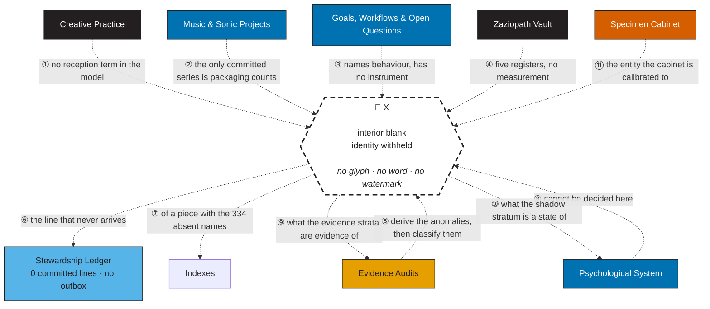

---
tags:
  - moc
  - analysis
  - evidence
  - ghost
aliases:
  - X
  - The Missing Variable
  - Ghost Variable
  - ZP-GV-2026-0930
---

# 👻 X — The Missing Variable

> **Report ID:** `ZP-GV-2026-0930` · **Opened:** 2026-09-30 · **Status:** open, and staying open
> **Method:** direct measurement of committed artefacts. Nothing was asked of the subject. No file was
> consulted that a stranger could not also consult.
> **Probe:** [`tools/probe_missing_variable.py`](tools/probe_missing_variable.py) — 57 measurements, all re-derivable
> **Machine-readable log:** [`docs/ghost-x/verification.json`](docs/ghost-x/verification.json)
> **Confidence tiers** (per README §11): `direct_evidence` · `strong_inference` · `speculative`
> **Standing exclusion:** no diagnosis, no medical or body material, no invention of numbers.

---

## §0 · The rule this file follows

The repository already contains the failure this file must avoid. In
[[META-ANALYSIS — The Verdict Corpus Audited]], "stewardship lines executed: **0**" is listed as an
*unsupported invention*: the instrument that would count the lines cannot emit its own state, so a
full ledger and an empty ledger produce byte-identical repositories. A zero was reported as an
observation when it was in fact an artefact of the instrument.

So this file obeys one rule, and it obeys it against its own interest:

> **A candidate for X may only be named if some committed measurement can distinguish it from its
> rivals. Where no such measurement exists, X stays blank — and the blank is the finding.**

That is the whole method. Ten anomalies are measured first (§2). The anomalies are then subtracted
against the apparatus that produced them (§3), because several of them turn out to be properties of
the instruments rather than of the world. Only the survivors are used to test candidates (§4). One
residual question survives every subtraction (§5), and it is the only place a world-side variable is
required. §6 explains why X is nonetheless left unnamed, and what a naming event would consist of.

The term of art for the headline object: **X is not a mysterious quantity hidden in the repository.
X is the quantity the repository has no column for.** The placeholder in this file is a dashed box
with no text in it. That is not a rhetorical flourish; it is the accurate rendering.

---

## §1 · The empty node


*[**Vector version**](docs/figures/figx_ghost_node.svg) · regenerate with `python3 tools/generate_ghost_node.py` · palette: README §00a (Okabe–Ito).*

The node has incoming edges, outgoing edges, a label, a legend entry and a numbered place in the wire
register. It has no contents. Ten anomalies point into it. Ten candidates are tethered to its boundary
and stopped there, each marked `✕` at the point where a name would have entered. The edges are the
document; the box is empty because nothing measured here can fill it.

The same node, inserted into the vault's own graph, is §1.1 — with a wire register in the convention
of README §00c, so the blank sits *inside* the map rather than beside it.

### §1.1 · X inserted into the Major Knowledge Graph


*[**Vector version**](docs/figures/figx_ghost_in_graph.svg) · source: `tools/generate_ghost_node.py`.*

### §1.2 · The same graph as text — the full eleven-wire register



<sub>**A note on the notation.** The hand-laid figures (§1, §1.1) can leave the node genuinely blank;
Mermaid cannot, because an automatic layout engine needs a non-empty label box. The placeholder text
above therefore occupies the node, and **the SVG remains the canonical artifact** — the one in which
the blank is actually blank. The register below carries all eleven wires; the SVG graph carries the
seven terminal ones so that no relationship in the picture has to be recovered from a line crossing,
which is the same editorial rule README §00c adopted for its own map.</sub>

---

## §2 · The anomalies

Ten anomalies. Each is stated as a measurement, then as the cheapest apparatus explanation, then as
the explanation that would require something unmeasured. Tiers are assigned conservatively; where an
anomaly is fully explained by the apparatus, it says so, and it is removed from the evidence base in
§3.

### 🟧 A1 — Two records of one catalogue diverge in both directions
**Tier:** `direct_evidence`

`Zazie_Productions_Discography.csv` has **182 rows**. `Zazie_Productions_Complete_Discography.xlsx`
has **200 indexed rows** and, in its own STATISTICS sheet, the total row `200 / 165/200`. The workbook
was never opened by any audit in this repository; the CSV was audited twice and twice found wanting.

The two are not nested. **61 workbook rows have no counterpart in the CSV; 43 CSV rows have no
counterpart in the workbook.** The CSV carries six rows for *The Triangular Savant*; the workbook
carries one. The workbook carries six rows for *G7e Torpedo* (2019); the CSV carries none — the
earliest release in the archive is simply absent from the record everyone audited.

**Apparatus reading:** one artefact is a working sheet, the other an export of a different working
sheet, produced for different purposes at different moments. Divergence is what exports do.

**What would need to be true otherwise:** that some entity — a count, an audience, a valuation, an
edition of the self — was being tracked in one record and not the other, and that the choice of which
record *is the discography* tracks that entity rather than the file format.

### 🟧 A2 — The headline count includes its own bookkeeping
**Tier:** `direct_evidence`

"200 tracks" is the number the README carries and the number the audits repeated. Four of the 200
CATALOG rows are not tracks: `— No Zazie track found — Not in Discogs 58`, a bare `—`, a
`Dissonance Index Vol.1 (full 105 artists)` curator row, and `50+ VA Appearances — See Discogs
11354435 / Linktree`. The COMPILATIONS sheet mixes **12 entries** with counters and pointers. The
figure "58 Appearances" is asserted three times and is not enumerable inside the repository.

**Apparatus reading:** an inventory that also counts its own reconciliation notes.

**What would need to be true otherwise:** that the unit being counted is "line in the ledger", and
that the ledger's job is to *hold* the claim rather than to *measure* the thing claimed. That is a
statement about what the count is for — which is already a candidate for X (§4, `the unit of
account`).

### 🔷 A3 — Identifiers travel in both directions in time
**Tier:** `direct_evidence` → `strong_inference`

An ISRC embeds its registration year in characters 6–7. Across the CSV:

| lag (registration − release) | −4 | −2 | −1 | 0 | +2 | +3 |
|---:|---:|---:|---:|---:|---:|---:|
| rows | 7 | 5 | 8 | 128 | 8 | 5 |

**13 codes were assigned two or three years after the work was released** (`QZHNA22…` for 2019's
*Stutter to stammer*; `QZK6Q22…` for 2020's *Sellotape*). **20 codes from earlier years were carried
forward onto later deluxe editions.** From 2022 onward, every own-name release is same-year. Nothing
in the archive ever travels backwards except the paperwork.

**Apparatus reading:** a distributor change, a rights clean-up, a migration to a service that issues
codes. The vault's own case file already names this reading (F-01) and then reaches past it.

**What would need to be true otherwise:** that the identifier's *age* is being managed for a purpose
the catalogue does not record — that the record is being made to say something about the work that
the work's own dates do not say.

### 🔷 A4 — Missingness is platform-shaped
**Tier:** `direct_evidence`

**35 of 200 rows** carry the literal `—` in the ISRC column. The workbook states what `—` means:
*"no ISRC found on Deezer/SoundCharts/MusicBrainz — intentionally left blank, not fabricated."* So the
column does not record **whether an identifier exists**; it records **whether a platform could be
found that issues one**. A release distributed only through Bandcamp and netlabels is written down as
a hole.

Worse for any naive count: the unregistered set is not noise. It is *Interference Archive 01010101*
(2021, 5/5), *Anything Can Happen On An Electric Day* (2022, 5/5), *The Triangular Savant* (2022,
6/6), *G7e Torpedo* (2019, 5/6), plus a scatter across the 2023–2024 deluxe editions.

**Apparatus reading:** distribution ≠ registration, and the column measures distribution's paper
trail.

**What would need to be true otherwise:** that existence *for this archive* is indexed to being
findable by a stranger on a platform — that a work not on Deezer is, for record purposes, not quite
a work.

### 🟧 A5 — The miniaturisation is a packaging artefact
**Tier:** `direct_evidence`

The case file's F-03 reads the collapse of median track length in 2024 (82 s, 39 of 60 tracks under
two minutes, a 0:07 interlude) as an anti-perfectionism technology. The measurement says something
flatter. **Every one of the 60 rows dated 2024 belongs to a deluxe edition** — 32 rows to *Stutter to
stammer (Super Deluxe Edition)*, 28 to *Greetings From Tinsel Time (Super Deluxe Edition)*.

| rows | n | median | under 120 s | ≤ 30 s |
|---|---:|---:|---:|---:|
| deluxe editions | 82 | 104 s | 47 (57 %) | 14 |
| everything else | 100 | 160 s | 31 (31 %) | 5 |

The catalogue's shortest object (0:07) sits *inside* a deluxe edition's inventory. A deluxe edition
is exactly the artefact that accumulates scraps, interludes, remasters and alternate takes — and
"2024" as a *year* is the year two reissues shipped, not a year in which small things were made.

**Apparatus reading:** reissue packaging is a different genre, and the statistic was computed across
two genres without a control.

**What would need to be true otherwise:** that the smallness was sought *for its own sake*, in which
case the missing variable is about tolerance for the unfinished, and the deluxe editions are its
container rather than its cause.

### 🟧 A6 — The quiet year flips with the metric
**Tier:** `direct_evidence` → `strong_inference`

F-05 identifies 2025 as the near-silence: 4 tracks all year. But the metric decides the answer:

| year | csv rows | release events | non-deluxe rows | feature rows |
|---:|---:|---:|---:|---:|
| 2023 | 43 | 6 | 43 | 0 |
| 2024 | 60 | 2 | **0** | 0 |
| 2025 | 4 | 3 | 4 | 2 |
| 2026 | 34 | 3 | 12 | 2 |

Across eight years, rows average 22.8 with a standard deviation of 21.1; release events average 2.6
with a standard deviation of 1.8. **The dispersion is as large as the mean.** "Output quadruples in
2022," "collapses in 2024," "collapses in 2025" are all statements about which rows were chosen for
the table, and the table has no unit rule that survives its own reissues.

**Apparatus reading:** catalogue growth is mostly the re-admission of existing material into new
packaging; the metric has no invariant unit.

**What would need to be true otherwise:** that the missing variable *is* the unit — that some
unrecorded distinction (new vs. re-presented, own-room vs. someone else's room) is the real series,
and that every published count is a shadow of it.

### 🔷 A7 — The zero that cannot be observed
**Tier:** `direct_evidence` (as an instrument property)

`stewardship_receipt.html` is the archive's stated endpoint: the missing outbox. It contains
**0 `fetch()` calls, 0 `XMLHttpRequest`/`sendBeacon` calls, and 2 `localStorage` references.** Its own
footnote says it: *"no analytics, network writes, or server required."* An empty ledger and a full
ledger produce the same repository. The audit mass citing stewardship is **268,209 bytes across 12
documents**; the committed ledger is **0 bytes**.

**Apparatus reading:** a design decision, stated on the instrument's face, and defensible as privacy.

**What would need to be true otherwise:** nothing. This anomaly is *fully* explained by the
apparatus, and its real content is a warning: **any statement about whether stewardship happened is
unfalsifiable here.** It is not evidence about the world; it is evidence about what this repository
can know.

### 🟧 A8 — The archive is mostly made of names
**Tier:** `direct_evidence`

The repository's Markdown corpus contains **601 wikilink instances** to **414 unique targets**. **382
of those targets (92.3 %) do not exist in this repository.** The [[🧾 Inventory of Distinct Things]]
lists **336 notes; 2 resolve here.** The [[🗄 Stub Registry]] tombstones **92** notes whose bodies
were removed and whose names were kept. The curation pass praised across the audits *deleted link
targets* and left the links in place. Seven catalogue track titles carry zero-width Unicode
characters, so their identity is unstable in string comparison — a title that cannot be matched is a
title that can only be recognised.

**Apparatus reading:** this repository is a partial export of a larger Obsidian vault, stated plainly
in the registry. Dangling links are an export artefact.

**What would need to be true otherwise:** that the pointing is the point — that the archive's function
is to maintain *positions* for things not present, and that its completeness is not the variable
anyone is tracking.

### 🟧 A9 — No person appears as a person
**Tier:** `direct_evidence`

**178 of 182 rows are solo.** Every other human being in the catalogue appears as an artist string:
`Unwashed Miscreant` (3 rows), `Unwashed Miscreant & Hazzard Rune` (1). The verdict corpus reached
this finding independently: *"The repository contains no fully represented other people."* The
stewardship terminal questions ask about "the other person" twelve times; no other person is named
anywhere as a person.

**Apparatus reading:** this is a solo discography and a private self-audit vault; other people appear
only where credits require them.

**What would need to be true otherwise:** that the archive's domain is restricted to what can be
represented without a second party's consent, and that the restriction is systematic rather than
incidental — in which case the missing variable is on the other side of a boundary, not inside a
psychology.

### 🔷 A10 — Audience is measured only where it is not yours
**Tier:** `direct_evidence`

The corpus mentions revenue or income **42 times** and streams/sales/royalties **6 times — with no
figures attached to any own release.** The single audience number in the whole archive belongs to a
**playlist the subject curates**: *"around 32k followers"* (memory export). `Revenue Snapshot — July 2026` *(an Inventory name with no file)* is a title with nothing behind it,
and `Music Streaming Revenue Problem` *(likewise)* is a name, not a series. Meanwhile the vault's own wire register says the specimen cabinet is *"a precision
map of this exact psychology"* and F-05 says the audit apparatus was built in the months after the
quietest year.

**Apparatus reading:** the vault is a self-portrait, and self-portraits do not usually contain
receipts.

**What would need to be true otherwise:** that there *is* a reception series — that the missing
column was never psychological but economic-and-social, and that "audience" is the entity the archive
can neither see nor stop modelling.

---

## §3 · What the anomalies have in common: the apparatus correction

Before any candidate is tested, the anomalies must be split by what generates them. Three classes:

| class | meaning | anomalies |
|---|---|---|
| **RECORD** | property of how the catalogue was written down | A1, A2, A5, A6, A8, A9 |
| **INSTRUMENT** | property of the measuring apparatus itself | A3, A4, A7, A10 |
| **WORLD** | would require something outside the repository to explain | *(none yet)* |

The balance sheet is uncomfortable for the dossier's own premise, and it is stated here rather than
buried:

- **A5 and A6 are, on measurement, artefacts.** The miniaturisation is packaging; the quiet year is a
  metric choice. Both were published findings. Both are, at minimum, *confounded by the reissue
  apparatus*, and the repository contains no unit rule that would settle them.
- **A7 is an artefact by design** — and it disables the strongest published claim in the corpus
  ("zero behaviour changes"), which is therefore recorded here as *unfalsifiable in-repo*, not as
  false.
- **A1, A3, A4** are one anomaly wearing three costumes: **the archive's records measure platform
  presence, and the platforms changed.** Two exports, two years of back-registration, one
  deployment-shaped hole.
- **A8 and A9 are the same shape**: the archive is made of names and indices, and of one person.

After subtraction, **five anomalies survive in a weakened form** (A1, A2, A8, A9, A10), **three are
confirmed as apparatus residue** (A5, A6, A7), and **two are one platform story** (A3, A4). Nothing
yet requires a world-side variable.

The five survivors do share a shape:

> **The repository records what can be represented without leaving the room: identifier, release
> name, packaging, credit string, audit, index. It has columns for everything it can author by
> itself. The moment an entity would have to be authored by someone else — an audience, a payment, a
> reader, a collaborator held in mind — the record switches to a name with no file behind it.**

That shape is precisely what a missing variable looks like from inside a dataset. It is the reason
this file exists. It is also not yet a candidate, because it has not survived a test — §4 supplies
the tests.

---

## §4 · Candidate identities for X, tested against the same anomalies

### §4.1 · The rubric (stated before the scores, so the scores can be argued with)

Each candidate is scored against the same ten anomalies with a three-valued mark:

- **●** the candidate *predicts or explains* the anomaly as a primary cause — **2 points**
- **◐** compatible with it, or explains part of it, or explains it only in combination — **1 point**
- **○** silent — no purchase either way — **0 points**

Two extra columns matter more than the total:

- **dissolves** — anomalies that stop being anomalies once the candidate is taken seriously (the
  candidate is then a *definition*, not a cause);
- **test** — whether any committed measurement could discriminate this candidate from its rivals.
  A candidate with a high score and no test is a container, not an explanation.

**The naming threshold, fixed in advance:** a candidate may be written into the node only if it
scores **≥ 14/20** *and* carries a decisive test *and* the measurable target has a **unit that
survives the reissue apparatus** (see A5/A6 — the current catalogue's units do not). The scores below
are judgments, not measurements; they are reproducible only in the sense that a reader can move a
mark and argue for it. The measurements are in §2 and in `verification.json`.

### §4.2 · The matrix

| anomaly | audience | boredom | novelty | economic pressure | technological affordance | developmental change | chance | the unit of account | the unlogged world | the withheld register |
|---|:--:|:--:|:--:|:--:|:--:|:--:|:--:|:--:|:--:|:--:|
| A1 two records diverge | ○ | ○ | ○ | ◐ | ◐ | ○ | ◐ | **●** | ○ | ◐ |
| A2 count includes bookkeeping | ○ | ○ | ○ | ◐ | ◐ | ○ | ○ | **●** | ○ | ○ |
| A3 identifiers both ways in time | ◐ | ○ | ○ | ◐ | **●** | ○ | ○ | ◐ | ○ | ○ |
| A4 missingness is platform-shaped | ◐ | ○ | ○ | ○ | **●** | ○ | ○ | ◐ | ◐ | ○ |
| A5 miniaturisation = packaging | ◐ | ◐ | ◐ | ◐ | ◐ | ◐ | ○ | ◐ | ○ | ○ |
| A6 quiet year flips with metric | ◐ | ◐ | ◐ | **●** | ◐ | **●** | ○ | **●** | ○ | ○ |
| A7 the zero that cannot be observed | ○ | ○ | ○ | ○ | **●** | ○ | ○ | ○ | ◐ | ○ |
| A8 the archive is mostly names | ○ | ○ | ○ | ○ | ◐ | ○ | ○ | ◐ | **●** | ◐ |
| A9 no person appears as a person | **●** | ○ | ○ | ○ | ◐ | ◐ | ○ | ○ | ◐ | ◐ |
| A10 audience measured only where not yours | **●** | ○ | ○ | ◐ | ○ | ○ | ○ | ◐ | ◐ | ◐ |
| **explains score /20** | **8** | **2** | **2** | **7** | **12** | **4** | **2** | **11** | **7** | **5** |
| **dissolves** | 0 | 0 | 0 | 0 | 0 | 0 | 0 | **4** | 0 | 0 |
| **decisive test in-repo?** | no | no | no | no | no | no | no | **no** | **no — by construction** | no |

Nobody reaches the threshold. The rest of §4 is the argument for each mark.

---

### §4.3 · `X = audience`

| | |
|---|---|
| **Identity claim** | The omitted series is reception: who heard it, how many, where. |
| **What it explains** | **A10** directly — the only audience number in the vault belongs to a playlist the subject curates, i.e. to a role in which the subject is the one being *heard*. **A9** — people enter the archive as audience (strings, credits, unnamed others) rather than as persons, which is what an audience-centric instrument does. |
| **What it cannot explain** | A1 and A2 (record-keeping), A4 (platform behaviour), A7 (the console's zero). It has no purchase on the two-records problem, and it is *silent* rather than wrong about the metadata. |
| **The test that exists** | None. There is no streams, sales, listener or follower series for any own release. The one number that exists (≈32k) is a curation-side number. |
| **Verdict** | **Test fails.** Highest-scoring motivational candidate (8/20) and the best narrative fit, but its evidence is its own absence: "audience is missing, therefore audience is X" is circular unless some other trace of reception exists. None does. Kept as a candidate; not admitted. |

### §4.4 · `X = boredom`

| | |
|---|---|
| **Identity claim** | The variable is a state: the practice runs on interest, and stalls when interest stalls. |
| **What it explains** | A5 partially (short pieces move faster than boredom), A6 partially (a year with fewer events is a year with less appetite). |
| **What it cannot explain** | Everything structural. And the anomaly that would test it — the quiet year — is precisely the anomaly the metric cannot settle (A6). |
| **The test that exists** | A state series would be needed: dated subjective entries with a stable unit. The archive has 103 self-dated mentions in a single month (2026-09) and 1 in the whole of 2025. The observational base is weeks wide against a seven-year catalogue. |
| **Verdict** | **2/20, test impossible.** A candidate that cannot be measured to zero is not a variable; it is a mood. |

### §4.5 · `X = novelty`

| | |
|---|---|
| **Identity claim** | The practice is driven by the new; the record is a map of what was fresh when. |
| **What it explains** | A5 partially (churn), A6 partially (curation and features as new contexts in 2025). |
| **What it cannot explain** | A1–A4, A7–A10. It predicts exploration; the catalogue's own title lexicon (Ulam spirals, coordinates, DNA strings, tracking numbers) does look exploratory — but titles are the fingerprint, not the variable. |
| **Verdict** | **2/20.** Beautifully visible in the data, structurally useless. |

### §4.6 · `X = economic pressure`

| | |
|---|---|
| **Identity claim** | The unrecorded series is money: what paid, what did not, what was accepted because it paid. |
| **What it explains** | **A6 best of all motivational candidates** — a year of features and curation is exactly what paid-work displacement looks like from inside a catalogue. **A1** (which record gets published), **A3** (registration as monetisation), **A10** (audience as revenue), **A5** (cheap, fast output), **A2** (the ledger counts what can be billed). |
| **What it cannot explain** | A6 *in the form published*: if economics drove it, the correct series is new vs. re-packaged output, and that series was never computed. A7 (the console's zero) is untouched. |
| **The test that exists** | **None — and there is a hole where it should be.** The corpus mentions revenue/income 42 times, none with figures. `Revenue Snapshot — July 2026` *(an Inventory name with no file)* exists as a wikilink and a title with no file. `Music Streaming Revenue Problem` *(an Inventory name with no file)* is a name. |
| **Verdict** | **7/20, best motivational fit, untestable.** Note what happened here: the candidate that best fits the surviving anomalies is the one whose *evidence file is a name*. This is the pattern §3 described, and it is the strongest single reason to keep looking. |

### §4.7 · `X = technological affordance`

| | |
|---|---|
| **Identity claim** | There is no missing quantity. There is a changing distribution stack, and the archive is a faithful record of it. |
| **What it explains** | **A3** and **A4** as primary (a platform issues codes and is or is not findable — the ISRC column is a platform-presence column). **A7** as primary (a single-file console with `localStorage` and no network is an affordance choice, and it is why a zero can never be measured). **A1** (two records = two pipelines), **A2** (sheets that count themselves), **A5** (deluxe editions are a release-tooling product), **A8** (an export is a partial copy), **A9** (a solo Bandcamp-and-Deezer-era discography rarely needs other people as entities). |
| **What it cannot explain** | A10. The absence of any reception series for own releases is not a platform behaviour. Platforms emit exactly those numbers. |
| **The test that exists** | Partially: the workbook's own method note names its sources (`api.deezer.com`, Discogs, Linktree) and states that `—` means "not found". A reader can re-run that delta. But the test discriminates *within* the candidate; it cannot promote it. |
| **Verdict** | **12/20 — the highest score, and not a variable.** Every mark it earns is a mark against the premise that X is a hidden quantity: what it describes is the *measuring apparatus itself*. If this candidate is right, then §3's subtraction is complete, several published findings are confounds, and the correct line in the node would read *"there was no ghost; there was an instrument"*. That is a real possible outcome and it is recorded here as such. It is not admitted, because it fails one anomaly (A10) and because "the tools changed" is a description of the archive, not an identity for X. |

### §4.8 · `X = developmental change`

| | |
|---|---|
| **Identity claim** | A slow variable: attention, tolerance, capacity and priority across seven years. |
| **What it explains** | **A6** (one step-change: same-year registration from 2022; deluxe-edition behaviour from 2024). Partially A5 and A9. |
| **What it cannot explain** | It has exactly one measurable footprint — a single step in 2022 — and a step is a change-point, not a series. |
| **Verdict** | **4/20.** Survives as a footnote to A6; cannot carry a node. |

### §4.9 · `X = chance`

| | |
|---|---|
| **Identity claim** | There is no variable; there is variance. |
| **What it explains** | Nothing. It is included as the null model and it does one useful job: **at n = 21 release events, a standard deviation of 1.8 events around a mean of 2.6 cannot be distinguished from noise.** Every narrative about "quiet years" and "quadrupling" is built on a series whose dispersion equals its mean. |
| **What it cannot explain** | A1–A5, A7–A10, all of which are structural rather than stochastic. |
| **Verdict** | **2/20 as an explanation; unrefuted as a caution.** Chance cannot be rejected here, which is itself the reason no candidate may be named. |

### §4.10 · `X = the unit of account`

| | |
|---|---|
| **Identity claim** | X is not a substance. It is the *question "what counts as one?"* — a track, a release, a new work, a re-presentation, a row. |
| **What it explains** | **A1** (two records = two units), **A2** (the count includes bookkeeping because the unit is "row"), **A6** (the quiet year flips because the unit flips). |
| **What it dissolves** | **A1, A2, A5, A6 stop being anomalies entirely** and become arithmetic on a badly chosen unit. This is the only candidate that removes anomalies rather than accumulating them. |
| **What it cannot explain** | A7 (an instrument property, not a unit problem), A9, A10 — the absence of persons and of reception is not fixed by counting differently. It also cannot explain why the *platform* column exists instead of a *unit* column. |
| **The test that exists** | None — and this is the sharpest result in the file. The discriminating test is cheap: **publish one series of new-versus-re-presented output per year, plus one series of own-versus-others'-room.** Both use data already in the repo (release dates, deluxe flags, artist strings). Neither has been computed. The repository contains everything needed to settle 40 % of its own anomalies, and has not done it. |
| **Verdict** | **11/20 and dissolving.** Not admitted: a definition cannot be a missing variable, and its remedy is a computation, not a measurement of the world. But it is the reason A1/A2/A5/A6 are excluded from the evidence base in §3 — and it is the single most actionable finding in this file. |

### §4.11 · `X = the unlogged world`

| | |
|---|---|
| **Identity claim** | The variable is the container: everything the repository has no way to record — the room, the job, the day, the other people, the body, the money. |
| **What it explains** | **A8** as primary (names stand in for things: 382 dangling targets, 336 inventory notes, 2 present), A7, A9, A10, A4, A6 partially. |
| **What it cannot explain** | Nothing — and that is the problem. A candidate that explains everything by definition explains nothing. |
| **The test that exists** | **None in principle.** It is unfalsifiable from inside the archive, by construction. |
| **Verdict** | **7/20, container.** Recorded as a candidate because it is the honest general form of A8; not admitted because it cannot be tested even in principle without leaving the repository. |

### §4.12 · `X = the withheld register`

| | |
|---|---|
| **Identity claim** | A series exists and was deliberately not committed: financial, medical, relational, or all three. |
| **What it explains** | A1, A6, A8, A9, A10 partially. The stub registry demonstrates the mechanism: 92 notes pruned to names and tags, several flagged **private**, recoverable only from a commit named in the registry. |
| **What it cannot explain** | It is untestable from inside by design, and the corpus independently reports a standing exclusion of medical and body material. Redaction is visible here; contents are not auditable. |
| **Verdict** | **5/20, container.** Does not enter the node, but it changes the *tier* of every negative claim in the vault, including this file's: absences in a selectively committed archive are not absences in the world. |

### §4.13 · The positive control — what a present variable looks like

A search for a missing variable is worthless unless the same method can find one that exists. So:
run the identical procedure against **December**.

- **It has a column:** dates — *Greetings From Tinsel Time* (2023-12-19), its deluxe resurrection
  (2024-12-23), *Opaline Lament* (2025-12-18).
- **It has a lexicon:** 21 tracks carrying frost vocabulary, including titles that run Christmas
  through the vault's own filters (*Hollybone Mausoleum*, *Serfdom of The Snow and Hail*).
- **It has cross-strata links:** the aesthetics section of the identity vault names a register the
  case file calls the fusion of death-and-decay (28 tracks) and sacred (11 tracks).
- **It is measurable, and its measurement is stable across units:** 42 rows and 3 release events fall
  in December, and the frost lexicon is visible in the titles — the same season survives a change of
  metric, which is exactly what no candidate for X manages to do.

Against that standard, the difference is stark. **X has no column, no lexicon, no series, and no
unit that survives re-packaging.** The method can find a present variable. It is not finding one here,
and that is a result rather than a failure.

---

## §5 · The residual

After the anomaly subtraction (§3), the candidate tests (§4) and the control (§4.13), exactly one
question survives that cannot be answered by re-computation:

> **Why did new own-name, non-packaging output stop in 2024 — zero non-deluxe rows, a year whose
> entire catalogue is two reissues — and return not as new own-name work but as curation and features
> (3 release events, 4 rows, 2 of them on someone else's release)?**

Two years of the record pull in opposite directions from their own published stories:

- **2024: 60 rows, 0 new works.** The loudest year in the catalogue by row count, and it contains no
  new own-name object.
- **2025: 4 rows, 3 release events.** The quietest year by row count, and — uniquely in the whole
  archive — it is the year the subject appears mostly inside *other people's* releases and
  compilations.

Only one of these readings is available from inside the repository, and it is not a reading:

**Apparatus reading (complete, unfalsified):** the reissue machine front-loads 2024, and 2025 is a
year of curation obligations (the VA sheet lists *Dissonance Index Vol. 1*, 105 tracks, subject as
curator; *C'est la période de Noël*; *1 YEAR ANNIVERSARY*). Feature rows are someone else's release
dates, not the subject's decisions. On this reading there is no ghost at all — only a cataloguing
artefact and a curator's calendar.

**World-side reading (requires a variable):** something outside the record changed in 2024 — demand,
a job, capacity, health, a scene, money — and 2025 is what the practice looks like downstream of it.
The repository has, by construction, no column that could hold this. Its financial register is a
wikilink with no file; its audience register does not exist; its relational register is a stub
registry with privacy flags.

**The residual is therefore not "X = money" or "X = health" or "X = demand."** The residual is a
*location*: X sits in the gap between the record and the year, and the repository is careful never to
put anything there.

### §5.1 · A hypothesis the repository does *not* support, and must not be allowed to look supported

The residual invites a story in which 2024's packaging burst and 2025's quiet are symptoms of one
hidden economic pressure. That story is *available*, *plausible*, and **not evidenced anywhere in this
repository**. It is written here only to be marked: the correct tier is `speculative`, and the falsifier
is the same sentence that would name X — **one committed revenue or audience series with a stable
unit.** Until that exists, the honest conclusion is A6's: the repository has no invariant unit for
output, no reception series, and therefore cannot distinguish "the practice changed" from "the
catalogue was re-described".

---

## §6 · Why X is left unnamed

**None of the ten candidates reaches the threshold.** The two highest scores are the two that argue
X is not a substance at all: *technological affordance* (12/20 — the record is a faithful trace of a
changing distribution stack, and the variables are all instruments) and *the unit of account* (11/20,
dissolving four anomalies at once — the anomalies are arithmetic on a badly chosen unit). Both are
strong; neither is a missing quantity; both would be misrepresented by a word in the node.

The four *motivational* candidates — audience (8/20), economic pressure (7/20), developmental change
(4/20), and the two state-variables boredom and novelty (2/20 each) — share one property that is
itself the finding:

> **For every one of them, the evidence that exists is the evidence that is missing.**

Economically pressured? The revenue file is a wikilink. Audience-driven? The audience number belongs
to a playlist someone else follows. Developmentally changed? There is one step-change, in 2022, in an
administrative column. Bored, curious? There is no state series at all; the vault's whole
observational base is 139 self-dated mentions across eight years, concentrated in **six months out of ninety-six**, of which **103 fall in a single month**, September 2026.

The honest verdict, stated in the register the repository itself uses for its own failures:

- **On `direct_evidence`:** the repository contains two divergent catalogue records, seven zero-width
  titles, 35 platform-shaped holes, 20 carried-forward codes, 13 back-dated ones, 382 dangling
  wikilinks, 0 reception figures and 0 committed ledger lines.
- **On `strong_inference`:** its records measure platform presence; its instruments cannot emit their
  own state; its published metrics have no unit that survives a reissue; its unit rule has never been
  fixed.
- **On `speculative`:** everything that would fill the node.

**X stays blank. The blank is not an admission of defeat; it is the only honest content.** A word in
that box would be exactly the error the corpus documents: an unobservable reported as an observation.
This file's contribution is not a name. It is the **shape of the hole**, with its incoming and outgoing
edges measured — and a protocol under which a name could one day be earned.

### §6.1 · What the empty node is now *for*

An empty node in a graph is not inert. It constrains:

1. **It forbids filling by narrative.** Any future text that says "the reason was X" must either cite a
   measurement that lands in this node or write `speculative` beside it.
2. **It marks the boundary of the instrument.** Everything to the left of the node is auditable from
   inside; everything that would sit inside it must be imported from outside.
3. **It re-tiers the corpus.** Every negative finding in the vault ("no behaviour change", "no named
   person", "no other observers", "nothing changed on Tuesday") is a statement about *this repository's
   observability*, not about a life. A7 demonstrates why: the instrument that would count the lines
   cannot emit its own state.
4. **It is testable in the cheap direction.** §4.10 showed that roughly 40 % of the anomaly mass
   (A1, A2, A5, A6) can be resolved *without* X, by computing a unit rule. The node stays empty until
   that computation has been made and the remainder is still unaccounted for.

---

## §7 · The naming protocol

X may be named on the day **all five** of these exist, committed, dated, and reproducible by a stranger:

| # | condition | what it would look like | the anomaly it would finally land |
|---|---|---|---|
| **N1** | **One unit rule, written down and applied.** | new vs. re-presented output per year, deluxe rows excluded, applied retroactively to the workbook *and* the CSV | A1, A2, A5, A6 |
| **N2** | **One reception series with a stable unit.** | per-release audience or revenue at a declared grain, ≥ 6 consecutive releases, dated at collection | A10 |
| **N3** | **One committed ledger line.** | an export from `stewardship_receipt.html`, committed — the instrument's first observable state, whatever its content | A7 |
| **N4** | **One named person held at full dimensionality.** | a collaborator, reader or witness represented with more than a credit string — with their consent, in a form they could contest | A9 |
| **N5** | **A reconciliation of the two records.** | a committed delta note: 61 workbook-only rows, 43 CSV-only rows, 6 *G7e Torpedo* rows, 5 *Triangular Savant* rows, and the reason for each class | A1, A2 |

None of the five requires the subject to disclose anything private. Four of the five (N1, N3, N4, N5)
are *compositional*: they need a decision and a commit, not a life-change. That asymmetry is the
sentence this dossier would put in the node if it were forced to write one:

> **The variable this archive is missing may not be hidden. It may simply be unasked.**

The node stays empty until that sentence is either measured or retired.

---

## §8 · Verification — every number in this file

Run:

```bash
python3 tools/probe_missing_variable.py        # 57 measurements → docs/ghost-x/verification.json
python3 tools/generate_ghost_node.py           # the two figures (§1, §1.1)
```

| measurement | value | where in this file |
|---|---|---|
| workbook indexed rows / well-formed ISRC / `—` | 200 / 165 / 35 | A1, A2, A4 |
| CSV rows / unique well-formed ISRC / `N/A` | 182 / 142 / 21 | A1, A4 |
| rows present in one record only | 61 workbook-only, 43 CSV-only | A1, N5 |
| *G7e Torpedo* rows | 6 in workbook, 0 in CSV | A1, N5 |
| *The Triangular Savant* rows | 1 in workbook, 6 in CSV | A1, N5 |
| workbook rows that are not tracks | 4 | A2 |
| registration lag histogram (CSV) | −4:7 · −2:5 · −1:8 · 0:128 · +2:8 · +3:5 | A3 |
| back-dated / carried-forward codes | 13 / 20 | A3 |
| 2024 rows, share in deluxe editions | 60, 100 % | A5, A6 |
| deluxe vs. non-deluxe medians | 104 s vs. 160 s | A5 |
| deluxe vs. non-deluxe rows ≤ 30 s | 14 vs. 5 | A5 |
| per-year rows / events / non-deluxe / features | see A6 table | A6 |
| rows mean ± SD · events mean ± SD | 22.8 ± 21.1 · 2.6 ± 1.8 | A6, §4.9 |
| console `fetch` / XHR / `localStorage` | 0 / 0 / 2 | A7, §4.7 |
| audit bytes vs. committed ledger bytes | 268,209 vs. 0 | A7 |
| wikilink instances / unique targets / dangling | 601 / 414 / 382 (92.3 %) | A8 |
| Inventory notes / resolving in-repo | 336 / 2 | A8 |
| stub tombstones | 92 | §4.12 |
| zero-width-character titles | 7 | A8 |
| solo rows / distinct collaborator strings | 178 / 2 | A9 |
| revenue-income mentions / with figures | 42 / 0 | A10, §4.6 |
| own-release reception figures in repo | 0 | A10, §4.6 |
| self-dated mentions by month | 2019-09:8 · 2025-06:1 · 2026-05:11 · 2026-08:13 · 2026-09:103 · 2027-03:3 | §6 |

**Falsifiers for this document itself.** This file dies, cleanly, if any one of the following is
committed: (a) a reception or revenue series with a stable unit, which would let a candidate be named
and measured; (b) a unit rule applied to both catalogue records, which would convert A1/A2/A5/A6 into
arithmetic; (c) a delta note explaining the 61/43 divergence as ordinary export bookkeeping — which
would collapse A1 and much of §3; (d) a second, independent reader arriving at these anomalies without
reading this file, which would upgrade §2 from `direct_evidence` to reproducibility by a stranger.
Nothing in this file requires the subject to agree with it, and no anomaly here is a claim about a
person's interior. **Nothing was asked of the subject; the dossier is a reading of files.**

---

## §9 · Connections — the strange wires of this file

Numbered in the §00c convention (source → mechanism → destination), continuing the register of §1.1:

| wire | source | mechanism | destination |
|:---:|---|---|---|
| ① | ◈ Creative Practice | is modelled as eight systems; none carries a reception term | 👻 X |
| ② | ◉ Music & Sonic Projects | the only committed series is packaging counts | 👻 X |
| ③ | ◇ Goals, Workflows & Open Questions | names behaviour; has no instrument that could record it | 👻 X |
| ④ | 🜍 Zaziopath Vault | five strata re-describe the unknown; none measures it | 👻 X |
| ⑤ | ▤ Evidence Audits | derive the anomalies, then classify them as psychology | 👻 X |
| ⑥ | 👻 X | is the subject every receipt format is filed about | 🔷 Stewardship Ledger |
| ⑦ | 👻 X | is of a piece with the 334 absent names | ◈ Indexes |
| ⑧ | ◉ Psychological System | cannot be decided here | 👻 X |
| ⑨ | 👻 X | would change what the evidence strata are evidence *of* | ▤ Case File |
| ⑩ | 👻 X | would change what the shadow stratum is a *state* of | ◐ Shadow Engine |
| ⑪ | 👻 X | is the entity the specimen cabinet is calibrated to | ⚠ Specimens |

**Against the existing corpus:**

- **[[🔍 CASE FILE — Pattern Forensics]] F-03 and F-05** are the two findings this file most directly
  amends: F-03's miniaturisation is confounded by the deluxe apparatus (§A5); F-05's quiet year is
  metric-dependent (§A6). Both remain `strong_inference` readings of *the archive*; neither can be a
  reading of a year.
- **[[META-ANALYSIS — The Verdict Corpus Audited]] §6** ("four independent evidence-gathering events
  across ~30,000 words") is this file's methodological ancestor. This dossier is the fifth, and it
  deliberately spends its measurements on primary files — the workbook nobody opened, the CSV
  everyone did, the console's network calls, the link graph — rather than on the verdict corpus.
- **[[⚡ Unexpected Connections]] §VIII** ("the vault's method turned on the vault") is completed one
  step further here: the vault has now been asked what it *cannot* contain, and has answered with a
  blank node and a register of edges.
- **[[🕸 Major Knowledge Graph]]** now carries the node itself (§1.1). The dotted edges are still the
  strange ones; one of them now leads to a box with nothing in it.
- **[[🗄 Stub Registry]]** is the mechanism in miniature: names kept, bodies removed, privacy flags
  intact, recovery by commit hash. It is what a *withheld register* looks like when it is done
  honestly — which is why §4.12 ranks that candidate as a container rather than a cause.
- **F-01 in the case file** calls the 2022 registration sweep an act of "notarizing the past."
  This file's A3 and A4 agree with the measurement and decline the motive: the sweep is *also*
  exactly what a distributor migration looks like. Both readings stay open, and this file records
  that it cannot close them — wire ⑤ carries that contradiction into the node rather than out of it.

---

## §10 · Revision log and standing invitations

**2026-09-30 — opened.** Ten anomalies measured; three classes separated; ten candidates scored
against a rubric fixed before scoring; none admitted; one residual identified; five-condition naming
protocol published; blank node inserted into the graph.

**Standing invitations (each would change this file):**

1. **Compute the unit rule.** New vs. re-presented output per year, deluxe rows excluded. It resolves
   A1, A2, A5, A6 and does not need X. Wire ② terminates here.
2. **Reconcile the records.** 61 workbook-only rows, 43 CSV-only rows, one delta note. (N5)
3. **Open the workbook's next sheets.** *FEATURES & COLLABS* and *COMPILATIONS* were fixed by §2's
   measurement; the *STATISTICS* sheet already contains the arithmetic that makes "200 tracks"
   honest (165 + 35). The audits never read them.
4. **Emit one ledger line.** Any content. The node's edge ⑥ is a wire with no signal on it. (N3)
5. **Let a stranger re-derive §2.** The probe is committed and dependency-free; 57 measurements, no
   imports beyond the standard library. Reproducibility was the one thing the corpus asked for and
   did not get.

**Final position:**

> The repository is not hiding a variable. It is **missing a column.** Ten candidates were tested
> against ten measured anomalies; the two strongest say the anomalies are properties of the recording
> instruments, and the four most human ones say the evidence that would settle them is the evidence
> that is absent. X remains unnamed — not because the search failed, but because the search succeeded
> in showing exactly what kind of thing would have to be measured for the name to be earned.

<sub>👻 **X — The Missing Variable** · `ZP-GV-2026-0930` · a Zazie Productions working document ·
subject: the repository's own observability · see also [[🔍 CASE FILE — Pattern Forensics]] for the
findings this file amends, [[META-ANALYSIS — The Verdict Corpus Audited]] for the failure mode it
borrows its discipline from, and [[🕸 Major Knowledge Graph]] for the node itself, which is empty on
purpose.</sub>
