---
tags:
  - "moc"
  - "practice"
aliases:
  - "Major Knowledge Graph"
---

# 🕸 Major Knowledge Graph

The practice graph (below, unchanged) plus the vault strata added 2026-09-02 — the AI recursion lab, the specimen cabinet, the mythography, the evidence audits, and the cross-currents between them. The dotted edges are the strange ones; follow those first. Prose versions of the strange edges live in [[⚡ Unexpected Connections]].

```mermaid
graph TD
    CP["Creative Practice"] --> PSY["Psychological System"]
    CP --> MUSIC["Music & Sonic Projects"]
    CP --> FILM["Film & Audiovisual Projects"]
    CP --> TECH["Technology & Creative Systems"]
    CP --> COLLAB["Collaboration Systems"]
    CP --> BIZ["Business & Curation"]
    CP --> THINK["Thought Experiments & Deep Thinking"]
    CP --> GOALS["Goals, Workflows & Open Questions"]

    PSY --> INNER["Inner System"]
    INNER --> GRAND["Grandiose Protector"]
    INNER --> RUM["Rumination Child Part"]
    INNER --> VULN["Vulnerable Child Part"]
    PSY --> OCDN["OCD / Intrusive Thought"]
    PSY --> SHAME["Shame and Repair"]
    PSY --> REG["Grounding and Regulation"]

    MUSIC --> DISC["Releases and Sound Works"]
    MUSIC --> METHODS["Granular / Spectral / Found Sound"]
    MUSIC --> SIM["AI-Music Similarity Investigation"]

    FILM --> SCORE["Film Scoring Practice"]
    FILM --> CUES["Cue Sheets and Spotting"]
    FILM --> STEMS["Stem Strategy and Delivery"]
    FILM --> PROJECTS["Film Project Constellation"]

    TECH --> COMMAND["Creative Command Center"]
    COMMAND --> SECOND["Local Second-Brain Workspace"]
    TECH --> LOCALAI["Local AI"]
    TECH --> CODE["Creative Coding"]
    CODE --> VORTEX["Vortex AV Engine"]
    CODE --> ART2SOUND["Graphic Art to Soundscapes"]

    COLLAB --> DIRECTOR["Director–Composer Communication"]
    COLLAB --> BRIEF["Client Brief Translation"]
    COLLAB --> BOUND["Collaborative Boundaries"]
    COLLAB --> HANDOFF["Delivery and Handoff"]
    COLLAB --> NETWORK["International Artist Network"]

    BIZ --> CURATION["Curatorial Practice"]
    BIZ --> RATES["Pricing and Rate Confidence"]
    BIZ --> SERVICES["Creative Services"]
    BIZ --> NETLABEL["Netlabel and Compilation Work"]

    THINK --> SIGNAL["Signal Decay and Memory"]
    THINK --> HORROR["Psychological Horror"]
    THINK --> INTERFACE["Haunted Interface"]
    THINK --> AUTHOR["Curation and Authorship"]
    THINK --> ETHICS["AI Ethics"]

    GOALS --> FINISH["Finish Ambitious Work"]
    GOALS --> SUSTAIN["Sustainable Creative Career"]
    GOALS --> RIGHTS["Protect Creative Rights"]
    GOALS --> NEXT["One Clear Next Action"]

    %% ── vault strata · added 2026-09-02 ─────────────────────
    VAULT["🜍 Zaziopath Vault"] --> REC["AI Recursion Lab"]
    VAULT --> SPEC["Specimen Cabinet"]
    VAULT --> MYTH["Mythography"]
    VAULT --> EVID["Evidence Audits"]
    VAULT --> INDEX["Indexes"]

    INDEX --> INV["🧾 Inventory of Distinct Things"]
    INDEX --> REG["🗄 Stub Registry"]
    INDEX --> UX["⚡ Unexpected Connections"]
    INDEX --> MEGA["MEGA-UNIVERSE"]

    REC --> META["meta-experiment — the recursion staircase"]
    REC --> GREY["greyhat — the obsessions profile layer"]
    REC --> MEM["ChatGPT memory export — the longitudinal record"]
    REC --> GPT["GPT 7.7-t — mutual surveillance fiction"]
    REC --> GROK["Omnivisionary Grok output"]
    REC --> CTR["Counterference Engine"]

    SPEC --> SOCENG["Social Engineering Email Templates"]
    SPEC --> WEALTH["Blueprints for Quiet, Horrifying Wealth"]
    SPEC --> INFIL["Cognitive Infiltration Blueprints"]

    MYTH --> MSSE["MSS-E — the specificity engine"]
    MYTH --> VESP["Dr. Caligo Vespertine"]
    MYTH --> CASTLES["Recursive Identity Castles"]
    MYTH --> ENTRY["Entry Instructions for the Undetonated Artist"]
    MYTH --> SOV["Sovereign Interface Protocol"]
    MYTH --> LANG["glocht · Twelve-Lung · Anémone — constructed species"]
    MYTH --> HYPO["Hypostasis in Amber — palindrome cascade"]
    MYTH --> PSYOPS["Personal Branding as Class War Psy-Ops"]

    EVID --> DISCX["Discography — 200 tracks, 165 ISRCs"]
    EVID --> MEDIA["Media Master — 133 verified records"]
    EVID --> IG["Instagram Forensic Audit"]

    %% ── cross-currents · the dotted edges ───────────────────
    MEM -.->|"achievement reconstruction"| EVID
    CASTLES -.->|"hoax claim refuted by identifiers"| EVID
    REC -.->|"tribunals interrogate"| PSY
    SPEC -.->|"attack surface of"| PSY
    MYTH -.->|"fuel for"| CP
    GPT -.->|"machine memory, two directions"| MEM
    SOCENG -.->|"same craft, aimed outward"| PSYOPS
    EVID -.->|"decay prevention"| SIGNAL
    REG -.->|"tombstones"| INV
```

#diagram #moc
