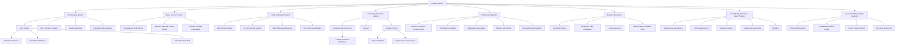

---
tags:
  - "moc"
  - "practice"
aliases:
  - "Major Knowledge Graph"
---

# 🕸 Major Knowledge Graph

```mermaid
graph TD
    CP["Creative Practice"] --> PSY["Psychological System"]
    CP --> MUSIC["Music & Sonic Projects"]
    CP --> FILM["Film & Audiovisual Projects"]
    CP --> TECH["Technology & Creative Systems"]
    CP --> COLLAB["Collaboration Systems"]
    CP --> BIZ["Business & Curation"]
    CP --> THINK["Thought Experiments & Deep Thinking"]
    CP --> GOALS["Goals, Workflows & Open Questions"]

    PSY --> INNER["Inner System"]
    INNER --> GRAND["Grandiose Protector"]
    INNER --> RUM["Rumination Child Part"]
    INNER --> VULN["Vulnerable Child Part"]
    PSY --> OCDN["OCD / Intrusive Thought"]
    PSY --> SHAME["Shame and Repair"]
    PSY --> REG["Grounding and Regulation"]

    MUSIC --> DISC["Releases and Sound Works"]
    MUSIC --> METHODS["Granular / Spectral / Found Sound"]
    MUSIC --> SIM["AI-Music Similarity Investigation"]

    FILM --> SCORE["Film Scoring Practice"]
    FILM --> CUES["Cue Sheets and Spotting"]
    FILM --> STEMS["Stem Strategy and Delivery"]
    FILM --> PROJECTS["Film Project Constellation"]

    TECH --> COMMAND["Creative Command Center"]
    COMMAND --> SECOND["Local Second-Brain Workspace"]
    TECH --> LOCALAI["Local AI"]
    TECH --> CODE["Creative Coding"]
    CODE --> VORTEX["Vortex AV Engine"]
    CODE --> ART2SOUND["Graphic Art to Soundscapes"]

    COLLAB --> DIRECTOR["Director–Composer Communication"]
    COLLAB --> BRIEF["Client Brief Translation"]
    COLLAB --> BOUND["Collaborative Boundaries"]
    COLLAB --> HANDOFF["Delivery and Handoff"]
    COLLAB --> NETWORK["International Artist Network"]

    BIZ --> CURATION["Curatorial Practice"]
    BIZ --> RATES["Pricing and Rate Confidence"]
    BIZ --> SERVICES["Creative Services"]
    BIZ --> NETLABEL["Netlabel and Compilation Work"]

    THINK --> SIGNAL["Signal Decay and Memory"]
    THINK --> HORROR["Psychological Horror"]
    THINK --> INTERFACE["Haunted Interface"]
    THINK --> AUTHOR["Curation and Authorship"]
    THINK --> ETHICS["AI Ethics"]

    GOALS --> FINISH["Finish Ambitious Work"]
    GOALS --> SUSTAIN["Sustainable Creative Career"]
    GOALS --> RIGHTS["Protect Creative Rights"]
    GOALS --> NEXT["One Clear Next Action"]
```

#diagram #moc
