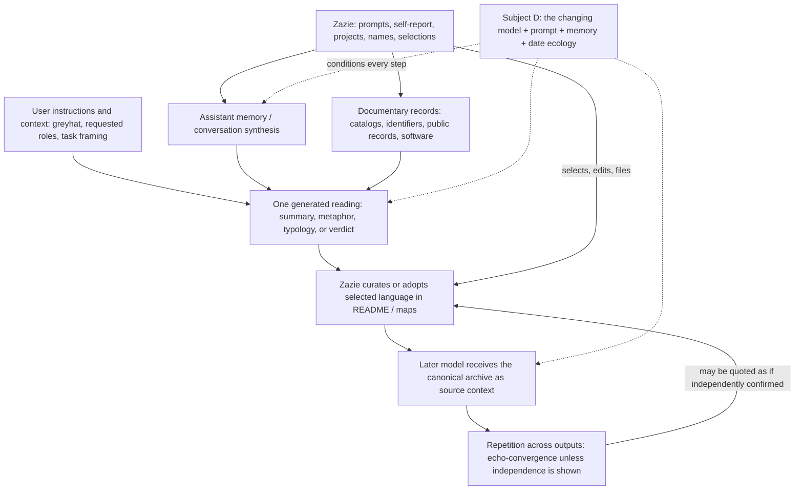

# THE FOURTH SUBJECT: THE AI ECOLOGY

## 🤖 MACHINE ANCESTRY OF THE SELF-MODEL

- **Report ID:** ZP-MA-2026-0930
- **Prepared:** 2026-09-30
- **Status:** Provisional genealogy from the surviving repository; not a complete history of the conversations that produced it.
- **Question:** Which parts of Zaziopath’s self-model came from Zazie, from records, from one or more AI systems, or from ideas that crossed those boundaries?

> **Standing principle:** Machine origin does not make an idea false. This is an inquiry into provenance, not a verdict on validity. A generated interpretation may be perceptive, useful, and true; a human-authored claim may be mistaken. Origin and truth are separate fields.

---

## 1 · Subject D is an ecology, not a witness

The Reversed Turing Test names **Agent A**, **Agent B**, and **Observer C**, then asks whether the model is discovering a person or participating in that person’s construction. This report extends that question by naming **Subject D: the AI ecology** — the changing population and context of systems that have helped make Zaziopath legible to itself and to readers.

For this report’s shorthand:

- **Subject A** is Zazie: the person, artist, commissioner, source of prompts, and curator.
- **Subject B** is the repository: its files, records, taxonomies, omissions, and versioned self-descriptions.
- **Subject C** is the observing position: a reader or analyst, often assigned a role and method by a prompt.
- **Subject D** is the shifting ecology around the exchange: models, vendors, interfaces, model memories, user instructions, system instructions, prompts, source packages, previous outputs, and the historical moment in which a reading was made.

D is not one AI with a stable point of view. It is a **population plus its conditions**. Two systems given different versions of the repository can tell different stories. The same model may answer differently when it is asked to act as a data anthropologist, a hostile biographer, an alien visitor, a legal court, a literary predator, or a neutral reader. A saved memory can preserve one interpretation and feed it back as if it were prior context. A later model can then mistake the archive’s adopted language for independent evidence about its subject.

The ecology visible in this repository includes ChatGPT-labelled memory and synthesis, a serial ChatGPT tribunal, Arena.ai’s *Velvet Knife* role-play, a Grok-labelled output, and fictional or simulated machine voices. Their exact model versions, system prompts, and source packages are not consistently preserved. The title **“GPT Model 7.7-t”** belongs to an explicitly simulated surveillance log; it is not proof that such a deployed model existed. A role label or vendor name identifies part of the presentation, not the full causal history of an output.

The ecology also includes human choices: which prompt to send, which answer to retain, what to edit, and what to quote in the README. The AI ecology participates in constructing the self-model; it does not replace the person who supplied, selected, and governed the material.

---

## 2 · What an origin label does — and does not — say

An origin label records the **best-supported route by which a concept entered the surviving archive**. It does not establish who first thought it in private, whether the interpretation is true, or whether its later appearance means it was personally believed. The first surviving formulation is not necessarily the first formulation ever made.

| Code | Origin category | Working test |
|---|---|---|
| **Z** | **Zazie** | A prompt, name, self-report, decision, or concept is directly attributable to Zazie in the surviving record. This establishes the source of the statement or instruction, not necessarily the truth of every remembered event within it. |
| **DOC** | **Documentary evidence** | A claim originates in an inspectable artifact or reproducible record: a catalog row, identifier, dated file, public record, or software behavior. The document proves what it contains; further checks may be needed to establish what the claim means. |
| **AI-1** | **One AI** | A distinct phrase or interpretation first appears in one identifiable generated output. This is a source route, not a finding of error. |
| **AI-R** | **Repeated AI consensus** | A similar claim appears in more than one AI output. It is called *independent convergence* only when analysts did not inherit the claim, prompt, memory, or conclusion. Otherwise it is **echo-convergence**: recurrence that maps circulation, not additional corroboration. |
| **AI→Z** | **AI interpretation subsequently adopted by Zazie** | A machine-generated phrase or reading is later incorporated into Zazie’s canonical self-description or repository architecture. Here, “adopted” means visibly integrated into the archive; it does not claim access to private conviction or permanent endorsement. |
| **?** | **Indeterminate origin** | The surviving record mixes inputs, omits the first prompt or draft, or cannot establish whether a phrase began with Zazie, a model, or their collaboration. |

A single concept can carry more than one code. For example, the *source material* may be Zazie’s self-report, the *summary language* may be AI-generated, the *catalog support* may be documentary, and the *later canonization* may be AI→Z. Keeping those layers separate is the point.

This follows the Evidence Governance Handbook’s distinctions among `self_report`, `model_memory_summary`, `generated_interpretation`, and `structured_catalog`, and among `primary`, `derived`, `repeated`, `contaminated`, and `unknown` independence. A quotation can be accurately copied while the statement it quotes remains interpretation.

---

## 3 · Idea-provenance ledger

The ledger below traces consequential concepts, not every sentence in every generated file. “Earliest surviving source” means the earliest source that can be identified from the current repository and its own provenance notes; gaps in the conversation record remain gaps.

| Concept in the self-model | Earliest surviving source and route | Origin class | What the record supports — and the ceiling |
|---|---|---|---|
| **Biographical facts, creative work, the five named inner parts, and the prompts that commissioned audits** | Zazie’s self-descriptions, project materials, `greyhat`, and the prompt sequence quoted in `verdict_from_A.i_5` §1. The README identifies the parts as a self-report / reflective practice. | **Z**, often **DOC** for checkable particulars | The prompts, names, and archive choices are attributable to Zazie. A self-report is direct evidence that a statement was made, not independent verification of every fact or interpretation inside it. |
| **Release and public-record counts** | `Zazie_Productions_Discography.csv`, the workbook, the media master, and the Instagram audit. The CSV examined by the repository’s audits has 182 rows, 143 distinct valid ISRC codes, and 21 `N/A` rows; the README reports different workbook-scope totals. | **DOC** | These records make counts and selected dates inspectable. They do not settle artistic quality, private motives, or whether a catalog row is a unique composition. The CSV/workbook scopes remain unreconciled in the analyses available here. |
| **The 14 “Hidden Patterns”** | The ChatGPT Memory Export’s `Hidden Patterns You Notice` section supplies the list; README §07 restates it as the archive’s pattern register. | **Z substrate + AI-1 + AI→Z** | The listed behaviors may summarize real conversation history and user disclosures. But the category name, selection, compression, and polished “Zazie repeatedly…” sentences arrive through an assistant-memory summary. The export’s `direct_evidence` tier does not mean those sentences are a verbatim transcript or independent observation. Their adoption into README §07 is visible; their truth still depends on the underlying interactions and context. |
| **“The record exists because the feeling does not arrive on its own” / brand as an “external nervous system”** | The memory export says completed achievements are repeatedly discounted and that the brand is “partly an external nervous system”; README §07 builds the record rationale from the memory claim, and later case studies reuse the metaphor. | **AI-1**, with **AI-R echo**; partial **AI→Z** | The catalog, brand, and recordkeeping are observable. The emotional explanation is an assistant’s synthesis of conversation material. Its later reuse is not a new witness. It can be a useful description without being an independently established cause. |
| **“You already operate like an institution of one”** | The generated `Shadow Journal Observations .pdf` presents this as an interpretation; README §§07 and 14 repeat it as a finding and one-line summary. | **AI-1 → AI→Z** | The repository visibly has offices, ledgers, taxonomies, and procedures. “Institution of one” is the machine’s metaphor for those features, then incorporated into the self-model. It does not prove a fixed personality or that the metaphor describes life outside the archive. |
| **“Sovereign anarchism,” “porous cultural borders, hard operational boundaries,” and “constitutional authorship”** | The `Ideological Inversion Audit.pdf` interprets self-reported politics and operating choices; README §§04 and 06 quote or adopt the formulations. | **Z substrate + AI-1 → AI→Z** | The political self-description and the practice of commissioning structured model roles have human/documentary roots. The compact labels and theory connecting them are AI interpretations, later made canonical. They are not formal political classifications. |
| **The four-stage alchemy and “The Strange Humane Architect”** | The July 2026 Mega Compendium synthesizes the Shadow / Signal / Stewardship structure and names a Rubedo endpoint; README §§01–02 make that synthesis the project spine. | **AI-1 → AI→Z; exact first authorship ?** | The archive openly says the README borrows from the compendium. That is strong evidence of adoption into the architecture, not proof that the underlying questions or vocabulary were first conceived by the model. The initial prompt/draft history is not preserved well enough to divide co-authorship more finely. |
| **The 17 indexed wires and official systems map** | The V3–V6 tribunal sequence and the AI librarian’s updates to `⚡ Unexpected Connections.md` precede the README §00c map, which incorporates the 17-wire register. | **AI-1 / AI-R echo → AI→Z** | The map’s edges are real as a description of how the archive relates its files. Their appearance in the official map documents curatorial adoption. The number and relations are not an independent measurement of the person’s mind. |
| **“Anxiety in, artifact out,” “the loneliness machine,” “the vault’s handwriting is a font,” and `P-00`–`P-12`** | Coined or sharpened in the serial `verdict_from_A.i` sequence, especially V2 and V4. Later reports and the *Velvet Knife* material inherit selected terms. | **AI-1 → AI-R echo** | These phrases are evidence of what the tribunal produced and how its language circulated. They are hypotheses or rhetorical compressions, not primary observations of anxiety, loneliness, or authorship. The echo chain can make a metaphor feel autobiographical without adding evidence. |
| **“≈250 archetypes are roughly eight actual patterns”** | First asserted rhetorically in `verdict_from_A.i_2`; repeated more confidently in V3. The verdict-corpus audit reports no clustering method, rubric, or reproducible analysis behind the “eight.” | **AI-1 → AI-R echo** | The count of named archetypes and the claim of eight underlying patterns are different propositions. The second is unsupported as a count. Its problem is the missing method and evidence—not the fact that an AI said it. Do not present it as a measured result. |
| **“No behavior changed,” “zero stewardship lines,” or “no other person lives here”** | Strong forms recur in the verdict sequence and later case studies. Their documentary basis is repository imbalance, an absent committed receipt, and sparse named interpersonal material. | **AI-R echo**, sometimes resting on **DOC** observations | “No exported receipt in this tracked tree” and “few named people in this selected archive” are bounded observations. They cannot establish no private action, no relationships, or loneliness. The local receipt tool stores data in browser `localStorage`; the repository is not a complete record of conduct or social life. |
| **“Sovereign artist vs. abandoned baby,” “you do not envy success; you envy coherence,” and “aristocratic taste and poverty shame”** | The ChatGPT Personality Dump’s “blunt read” and synthesis sections. | **AI-1**; adoption **unconfirmed** | These are memorable machine-authored interpretations of conversation material. Their presence in the dump establishes that the model wrote them and the archive retained them. No independent evidence in the title or tone makes them established autobiographical truths. |
| **The LARK-9 observer’s routines, classified incidents, and private note** | `invisible_observer_dossier.md`, presented as a fictional report built from patterns shared in conversation. Its opening disclaimer explicitly says no one was watching; the exact prompt/output provenance is not recorded in the file. | **? + fiction** | The text can echo real events or user disclosures, but the observer, continuous surveillance, and “classified” status are invented framing. It must not be cited as an independent witness to real-life routines; model authorship is plausible but not established by the surviving document. |
| **“The Syntactic Hazmat Suit,” “The Safe Predator,” “The Empathy Trap,” and “The Terrible Kinship”** | The *Velvet Knife* series, generated in an Arena.ai role-play framed through Will Graham / *Hannibal*. The series imports V1–V4’s “Empty Chair,” “Prosthetic Ledger,” “Frisson Economy,” and `P-00`. | **AI-1 + AI-R echo / contaminated** | These are terms coined in a different model context, but the output is explicitly primed by a literary role and earlier AI language. A second platform is not a second independent witness when it receives the first witness’s conclusions. The terms may be artistically useful; they do not verify the role-play’s claims about the person. |

---

## 4 · Genealogy: how a phrase becomes autobiographical



The loop is not evidence of bad faith or of a false self. It is a mechanism by which **provenance can disappear**:

1. Zazie provides experiences, preferences, projects, names, and prompts. Some are preserved as raw artifacts; some survive only through conversation memory.
2. A model compresses material into a sentence or pattern. The compression decides which details to foreground and which alternatives to omit.
3. The sentence is filed beside records, maps, and other autobiographical material. Its generated origin may be visible in one source but absent from a later quotation.
4. Once incorporated into the README, the sentence becomes context for future models. A future output may repeat it as “what the archive says,” not notice that the archive originally got it from a model, and return it with a new metaphor.
5. Repetition can then look like corroboration. Unless a new source or independent test enters, it is circulation.

This is one answer to the reversed-Turing question: an AI may both describe and **help compose the categories through which the next AI will describe**. Subject D includes that feedback, as well as the prompt author and curator who can interrupt it.

---

## 5 · Direct answer: which beliefs look autobiographical but entered through machine language?

The strongest cases are not claims that “the AI invented Zazie.” They are cases where a **machine-formulated interpretation** was later installed in a self-description, so that a reader could mistake it for unmediated autobiography.

### Machine interpretation visibly incorporated into the canonical self-model

1. **The 14-pattern register.** README §07 calls these the vault’s recurring subject matter, but its immediate source is the ChatGPT Memory Export. The recurring source material may be Zazie’s conversations and actions; the selection, compression, and wording are machine-mediated. This is the clearest case of model-generated language becoming an official self-description.
2. **“Institution of one.”** The phrase originates in the Shadow Journal’s generated interpretation and is repeated in the README’s pattern register and final one-line summary. The archive’s institutional architecture is observable; the claim that this is a defining autobiographical essence is an interpretation.
3. **Political and governance labels.** “Sovereign anarchism,” “porous cultural borders, hard operational boundaries,” and “constitutional authorship” translate human-stated politics and practices into memorable AI-authored concepts. Their appearance in the README marks adoption into the project’s vocabulary, not an independent political diagnosis.
4. **The ideal endpoint and transmutation story.** “The Strange Humane Architect” and the four-stage alchemy pass from the conversation-synthesis compendium into the README’s governing spine. Their human and machine contributions are entangled; the record supports adoption more strongly than a single-origin claim.
5. **The official wire map.** The 17-wire system map incorporates relations first articulated and maintained in AI-assisted tribunal/librarian work. It is now a map of the repository because Zazie retained it. It is not a machine’s independent discovery of 17 hidden facts about a person.
6. **The emotional rationale for the record.** The memory export’s interpretation that completed achievements need reconstruction is cited in README §07; the later sentence that the feeling does not arrive unaided makes that interpretation part of the archive’s account of why it exists. The documentary act of cataloguing is real. Its psychological cause is not thereby documentary.

### Machine language preserved, but personal adoption is not established

The Personality Dump’s formulations about coherence, abandonment, taste, and poverty; the tribunal’s “loneliness machine”; the *Velvet Knife*’s “Safe Predator”; and LARK-9’s account of routines all speak *about* Zazie in a biographical register. Their presence proves that those documents said these things. It does not prove that Zazie endorsed every sentence, that the observations are true, or that a fictional voice had access to private life. **Filing a reading is not the same as confessing it.**

The most consequential overreach in this group is “zero behavioral change.” The repository and its audits support the bounded statement that no committed receipt was found in the inspected tree. They do not reveal the contents of local browser storage or establish what happened outside the repository. Treating a model’s “zero” as autobiographical fact would convert an unobservable into a life claim — the precise error the archive’s governance rules forbid.

Likewise, “no other person lives here” converts a curatorial property of a selected archive into a claim about social life. A document’s silence can be caused by privacy, scope, consent, or omission. The phrase may be a provocative reading; it is not a recovered fact about loneliness.

### What is not being claimed

This audit does **not** say that machine-generated interpretations are fake, that Zazie merely copied them, or that the concepts have no basis in lived experience. It says that the surviving record sometimes presents a layered object — user substrate, model summary, editorial adoption, later repetition — in the grammatical costume of a single autobiographical voice. That history should travel with the belief when the belief is reused.

---

## 6 · Repeated AI consensus: an independence audit

The archive contains many AI documents, but quantity is not a consensus measure.

- **The six verdicts are one serial lineage.** `META_ANALYSIS_OF_ZAZIOPATH.md` and `META-ANALYSIS — The Verdict Corpus Audited.md` describe V1–V6 as a continuing, mutually referential sequence from one model and one session. Later verdicts read predecessors, inherit their terms, and share the README, `greyhat`, and memory export. The six outputs are valuable evidence of how one exchange developed; they are not six independent votes.
- **The two September case studies are not blank-slate witnesses.** They share the repository’s concepts and the earlier interpretive vocabulary. Their distinct genres can reveal a frame’s effects, but they do not turn inherited phrases into new primary evidence.
- **The *Velvet Knife* stream is different in platform and role, not independent in premise.** It was prompted as a Will Graham / *Hannibal* reading and directly imports concepts from V1–V4. That is cross-model transmission. It can show how a term survives translation to another model ecology; it cannot confirm the term’s psychological truth.
- **Several other reports wear observer or expert masks.** The anthropologist, hostile biographer, court, and visitor are textual positions. Unless the document records a genuinely independent human author and source package, the role should not be counted as a new witness. Where exact model and prompt provenance are absent, the correct label is `unknown`, not “independent.”
- **Claims about model internals are also outputs.** V6’s “unvoiced ledger” is a model-authored reconstruction, not an independently inspectable transcript of private deliberation. The simulated GPT 7.7-t log is fiction. Neither can certify hidden machine states.

There is a narrower kind of convergence worth keeping: multiple readings point to **visible structural features** — recursive analysis, a large interpretation layer, and a much smaller publicly inspectable stewardship layer. Those features can be checked directly in the files and code. This gives the structural observation documentary support; it does not make a psychological explanation such as loneliness, avoidance, or incapacity independently proven.

**Conclusion:** in the surviving corpus, no claim about Zazie’s private motives becomes strongly established merely because several AI texts repeat it. The repository’s own meta-analyses call many of these repetitions echo-convergence and reject or downgrade several dramatic claims. A future “AI consensus” label should state its dependency graph, not just count outputs.

---

## 7 · Origin boundary: ideas whose route remains open

Some central ideas cannot be assigned a single maker from this archive alone. The three-word spine and its alchemical elaboration are explicitly linked to conversation synthesis, but the user supplied the subject matter, projects, and working constraints. The original prompts and revision history are incomplete. The same is true of many profile statements: the memory export may rest on real self-report, while its phrasing and confidence tiers were generated.

The origin of a thought can also split into stages:

- **Seed:** an experience, concern, or phrase supplied by Zazie.
- **Formulation:** a model turns the seed into a portable sentence or framework.
- **Test:** documentary evidence confirms, narrows, contradicts, or fails to address part of it.
- **Adoption:** Zazie retains the formulation in the README, a map, or another governing file.
- **Echo:** a later model repeats the adopted formulation, often without knowing its ancestry.

At any stage, an interpretation can be revised or rejected without denying the underlying experience. Conversely, a later record can strengthen a claim without changing who first named it.

---

## 8 · A minimum ancestry label for future self-model claims

For any future sentence in the README or a major analysis that describes Zazie, record at least:

```text
claim:
first_surviving_source:
source_type: self_report | model_memory_summary | generated_interpretation | documentary | fiction | unknown
origin_class: Z | DOC | AI-1 | AI-R-independent | AI-R-echo | AI→Z | ?
model_or_vendor: known | unknown
prompt_or_role:
prior_outputs_seen:
what_zazie_supplied:
what_the_model_added:
adoption_status: quoted | paraphrased | canonicalized | retained | declined | unknown
independent_support:
validity_check:
alternative_explanations:
```

If the exact first source is missing, write **“earliest surviving formulation”**, not “origin.” If a model has read the claim in the README or a prior verdict, mark the output **derived** or **contaminated** unless a separate source route is demonstrated. If it remains useful but uncertain, preserve it as uncertain; provenance is not a reason to discard it.

---

## Source anchors and limits

This genealogy relies on files present in the repository at the time of preparation: `README.md` §§00–07, 11, 13–14; `greyhat`; `reversed_turing_test.md`; `JSON file re-export ChatGPT Memory .md`; `ChatGPT Personality Dump.md`; `Identity _ Typological Vault.pdf`; `Shadow Journal Observations .pdf`; `Ideological Inversion Audit.pdf`; the July Mega Compendium; `verdict_from_A.i` through `verdict_from_A.i_6`; `⚡ Unexpected Connections.md`; the eight `Velvet_Knife_*.md` reports; `invisible_observer_dossier.md`; `CLAIM_PROVENANCE_LEDGER.md`; `EVIDENCE_GOVERNANCE_HANDBOOK.md`; `META_ANALYSIS_OF_ZAZIOPATH.md`; `META-ANALYSIS — The Verdict Corpus Audited.md`; `docs/meta-analysis/REPORT.md`; `ANTHROPOLOGICAL_FIELD_REPORT_ZP-01.md`; `HOSTILE_BIOGRAPHER_DOSSIER.md`; `VISITORS_NOTEBOOK.md`; and `CASE STUDY — The Receipt and the Record.md` / `CASE STUDY — The Summoned Witness.md`.

This is a repository-only genealogy. The raw conversation history, exact prompts for many older syntheses, full model/version metadata, and platform system instructions are not all available here. The report therefore distinguishes documented routes from plausible ancestry and leaves unresolved origins unresolved. It does not use an AI’s confidence, fluency, or apparent intimacy as a substitute for evidence.
